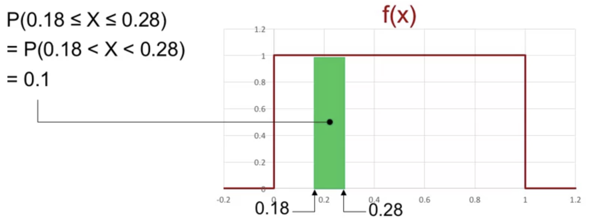
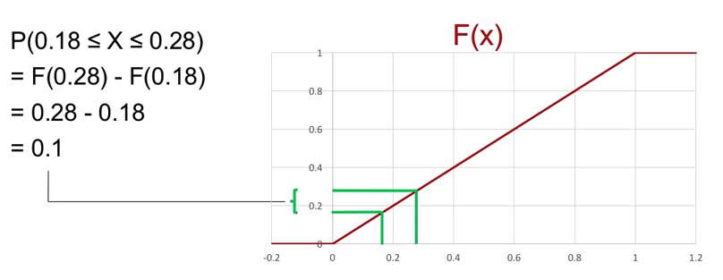
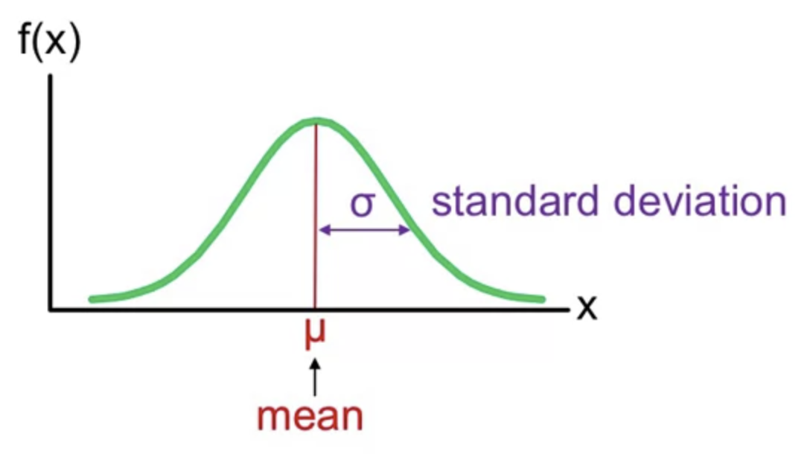
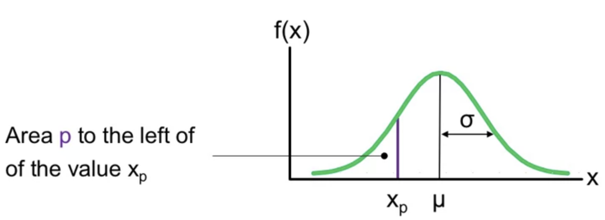
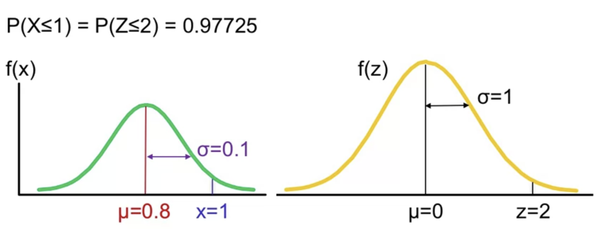
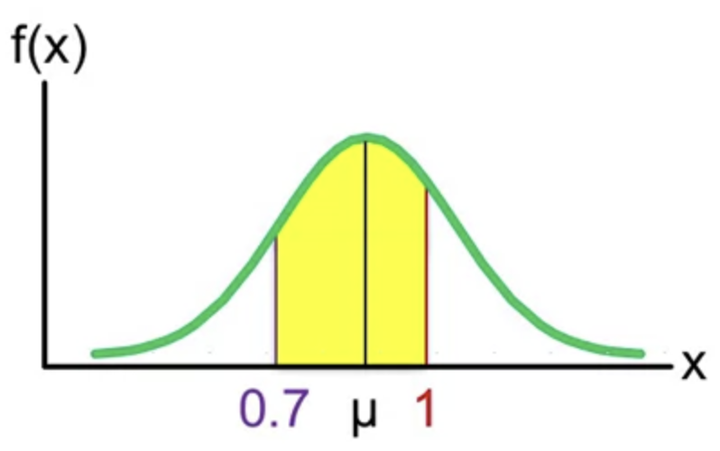

# Continuous Random Variables

## Continuous Random Variables

A continuous random variable X can take on a continuum of possible values.

Example:
- a time to finish a task
- the lengths of the item, the thickness, the width
- stock price

The probability of a random variable taking on a value $x$, is **zero**.

In discrete random variables, we have single numbers, and they have probabilities. We can't do that with continuous random variables.

## Probability density function (PDF)

Let's look here at this illustration.:

- $X$ is a continuous random variable
- The whole area has a width of $1$, it has a height of $1$, so the whole area is $1 \times 1$.
- The probability that $X$ can take a value between $0,18$ and $0,28$ is determined by the area underneath the curve (the green area). This has a width of $0.1$ and a height of $1$. So, this is now $10\%$ of the whole area.
- The area underneath the curve is calculated using integral. An integral from a point a to the same point is always equal to zero.
- The function $f(X)$ that we need to describe the curve is called a probability density function (PDF).

PDF has the following properties:

- it needs to be greater equal zero for all elements
- the entire area underneath the curve has to be one. That means, the probability of the sample space, everything that's possible, always must be one.

## Cumulative distribution function (CDF)

The cumulative distribution function $F$ at a point $x_0$ is the area under the graph of $f$ up to $x_0$

$$
F(x_0) = P(X \leq x_0) = \int_{-\infty}^{x_0}f(x)dx
$$

$$
F(b) - F(a) = \int_{a}^{b}f(x)dx
$$

## Central Limit Theorem (CLT)

*The probability distribution of a sum of independent random variables of comparable variance tends to a normal distribution as the number of summed random variable increase.*

The CLT states that if you add a large number of random variables, the distribution of the sum will be approximately normal under certain conditions.

## Normal Distribution

The density function of normal distribution is bell shaped, it's symmetric around the mean, $\mu$. And the spread is determined by the standard deviation, sigma $\sigma$.

The density function:

$$
f(x) = \frac{1}{\sigma\sqrt{2\pi}}
  e^{-\frac{1}{2}\left(\frac{x-\mu}{\sigma}\right)^{\!2}}
$$

For continuous distributions such as a normal distribution, probabilities are areas underneath the curve. And we calculate those with the **cumulative distribution function**.

### Calculate probability of a Normal Distribution in Excel

$$
P(X \leq x) = F(x) = \text{NORM.DIST(}x, \mu, \sigma, \text{TRUE)}
$$

- `TRUE` or `1` always means we're working with the cumulative distribution function.

### Inverse of a Normal Distribution in Excel

$$
x_p = \text{NORM.INV}(p, \mu, \sigma)
$$

- $p$: probability

It spits out the value $x_p$, so that to the left of $x_p$, i have the probability $p$. And to the right of $x_p$, i have the probability $1 - p$.

## Standardized normal distribution

Any normal distribution can be transformed into the standardized normal distribution (also called the z-distribution) which has a mean $0$ and the standard deviation $1$.

While data points are referred to as $x$ in a normal distribution, they are called $z$ or z-scores in the z-distribution.

A z-score is a standard score that tells you how many standard deviations away from the mean an individual value:

$$
\begin{align*}
P(X \leq x) &= P(Z \leq z) \qquad z = \frac{x-\mu}{\sigma}\\
  &= \text{NORM.S.DIST(}z, \text{TRUE)}
\end{align*}
$$

## Example

A company makes or builds pillars and elevated roadways in Florida. Florida has a lot of swamp, so you can't put a street on the ground. Instead, you have to put a solid foundation into the swamp, put up a pillar and then put the road on top.

The construction of these pillars is the key to make a safe road. So after pillar is constructed, it is measured and tested in various ways. There's one particular parameter called $x$.

$x$ has an average value of $0.8$ ($\mu$), the variation is about $0.1$ ($\sigma$)

The pillar is classified as a failure if $x$ is one or larger.

**How likely is it that there's a failure in the pillar if they use a normal distribution?**

$$
\begin{align*}
P(X \geq 1) &= 1 - P(X \leq 1) \\
  &= 1 - F(1) \\
  &= 1 - \text{NORM.DIST(}1, 0.8, 0.1, \text{TRUE)} \\
  &= 0.02275 \\
  &\approx 2.3\%
\end{align*}
$$

**What is the probability that $x$ between $0.7$ and $1$?**

$$
\begin{align*}
P(0.7 \leq X \leq 1) &= P(X \leq 1) - P(X \leq 0.7) \\
  &= P(Z \leq 2) - P(Z \leq -1) \\
  &= \text{NORM.S.DIST(}2, \text{TRUE)} \\
  &\qquad - \text{NORM.S.DIST(}-1, \text{TRUE)} \\
  &\approx 0.97725 - 0.15866 \\
  &= 0.81859
\end{align*}
$$

**What is the value of $x$ so that the probability of a failure only $0.1$ percent?**

$$
\begin{align*}
&P(\text{failure}) &= 0.1\% \\
&\Rightarrow P(X \gt x) &= 0.1\% \\
&\Rightarrow 1 - P(X \leq x) &= 0.001 \\
&\Rightarrow P(X \leq x) &= 0.999 \\
\end{align*}
$$

$$
\begin{align*}
x &= \text{NORM.INV}(0.999, 0.8, 0.1) \\
  &\approx 1.109
\end{align*}
$$

## Check a random variable has Normal Distribution

Reference: [6 ways to test for a Normal Distribution](https://towardsdatascience.com/6-ways-to-test-for-a-normal-distribution-which-one-to-use-9dcf47d8fa93)

### Histogram

### Box Plot

### QQ Plot

### Kolmogorov Smirnov test

### Lilliefors test

### Shapiro Wilk test
