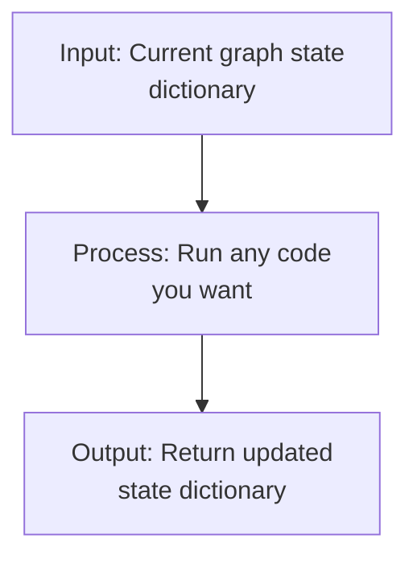
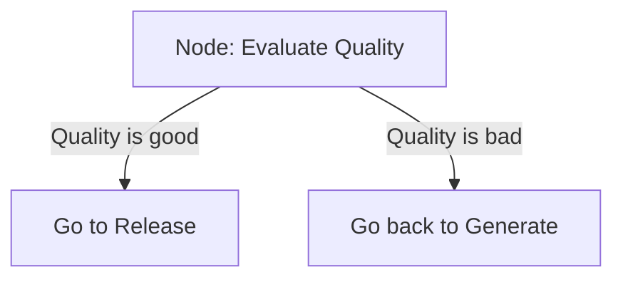
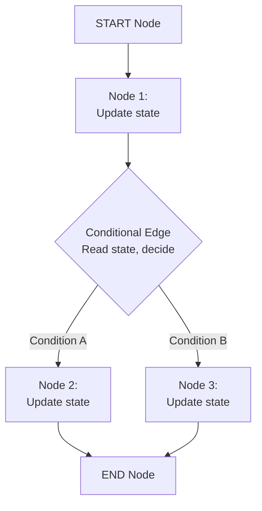
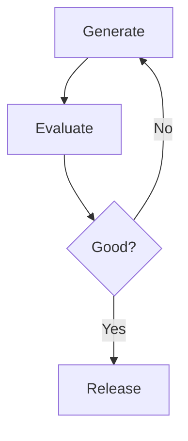
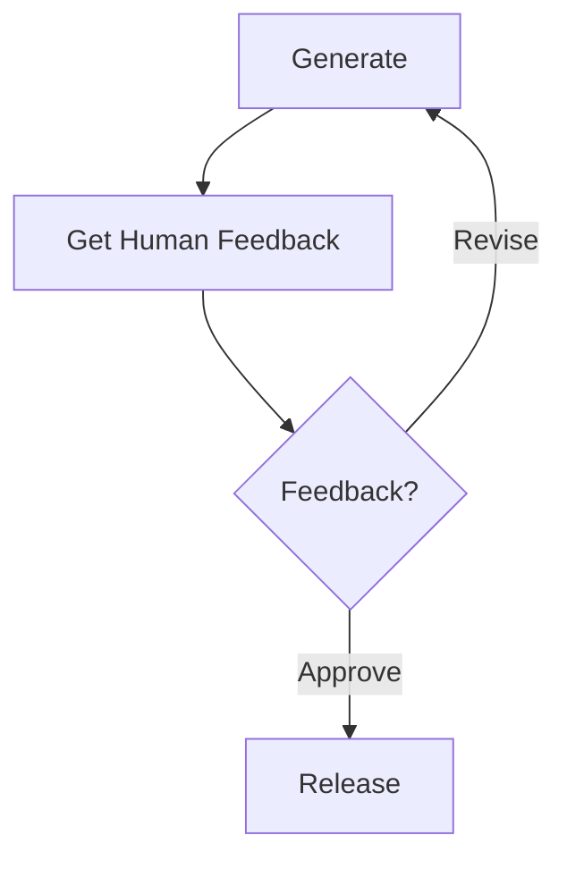
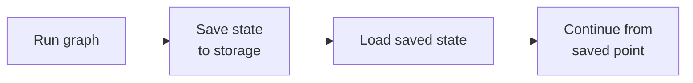

# Components

Core Components of LangGraph.

## Nodes

**What they are:** Python functions

**What you can put in them:**
- Regular Python code (deterministic logic)
- LLM calls
- Agent calls
- Database queries
- API calls
- Anything you want

**Key Point:** Nodes always take state as input and return updated state as output.

### Built-in Nodes

**START Node**:
- Entry point for graph execution
- Doesn't do anything
- Just marks where execution begins

**END Node**:
- Exit point for graph execution
- Doesn't do anything
- Marks where execution ends

## Edges

**What they are:** Connections between nodes

**Purpose:** Define the flow from one node to another

**Types:**
- Static edges: Always go from Node A to Node B
- Conditional edges: Decision-based (based on state)

## Conditional Edges

**What they are:** Smart edges that make decisions

**How they work:** Look at the current graph state and decide which node to go to next

This is where **LLMs make intelligent decisions** about the flow.

## State

**What it is:** A dictionary that holds all the information the graph needs

**What it contains:**
- Chat history
- LLM responses
- Node execution results
- Intermediate calculations
- Any temporary data

**Accessibility:**
- Available to every node in the graph
- Available at every edge
- Can be persisted to storage

## Execution Flow

Each node updates the state, and each conditional edge uses the current state to make decisions. This creates intelligent, adaptive flows.

## Advanced Flows

### Cyclic Graphs (Loops)

**What they are:** Ability to loop back to previous nodes

**Why it matters:** 
- Enables iterative refinement
- Core to agentic behavior
- Hard to do in LangChain, easy in LangGraph

### Human-in-the-Loop

**How it works:**
- Graph execution pauses at a node
- Asks for human feedback or input
- Uses that feedback to decide next step via conditional edge
- Resumes execution

### Persistence

**What it does:** Save and restore graph state

**How it works:**

**Benefits:**
- Pause execution and resume later
- Fault tolerance (if system crashes, resume from last state)
- Time travel (replay from a saved state)
- Better user experience
