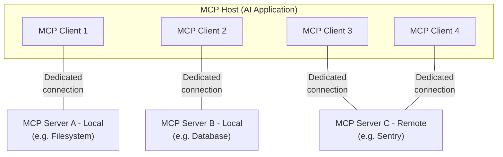

# Architecture

MCP Architecture Overview

## Introduction

MCP follows a client-server architecture where:
- An MCP host (AI application) establishes connections to one or more MCP servers.
- The MCP host accomplishes this by creating one MCP client for each MCP server.
- Each MCP client maintains a dedicated connection with its corresponding MCP server.

MCP consists of two layers working together: the **data layer** (JSON-RPC protocol defining what is communicated) and the **transport layer** (how it's communicated).

## Participants

- **MCP Host** – AI application (Claude Code, Claude Desktop) that coordinates and manages MCP clients
- **MCP Client** – Component that maintains a connection to an MCP server and fetches context for the host
- **MCP Server** – Program that provides context (local or remote)

**Example**: Visual Studio Code acts as MCP host. When it connects to the Sentry MCP server and the filesystem server, it instantiates two MCP client objects—one for each connection.

## Data layer

The data layer implements a **JSON-RPC 2.0 based exchange protocol** that defines the message structure and semantics.

This layer includes:

- **Lifecycle management**: Handles connection initialization, capability negotiation, and connection termination between clients and servers
- **Server features**: Enables servers to provide core functionality including tools for AI actions, resources for context data, and prompts for interaction templates from and to the client
- **Client features**: Enables servers to ask the client to sample from the host LLM, elicit input from the user, and log messages to the client
- **Utility features**: Supports additional capabilities like notifications for real-time updates and progress tracking for long-running operations

## Transport layer

The transport layer manages communication channels and authentication between clients and servers.

It handles connection establishment, message framing, and secure communication between MCP participants.

MCP supports two transport mechanisms:

- **Stdio transport**: Uses standard input/output streams for direct process communication between local processes on the same machine, providing optimal performance with no network overhead.
- **Streamable HTTP transport**: Uses HTTP POST for client-to-server messages with optional Server-Sent Events for streaming capabilities. This transport enables remote server communication and supports standard HTTP authentication methods including bearer tokens, API keys, and custom headers. 

:::info
MCP recommends using OAuth to obtain authentication tokens.
:::

The transport layer abstracts communication details from the protocol layer, enabling the same JSON-RPC 2.0 message format across all transport mechanisms.

## References

- https://modelcontextprotocol.io/docs/learn/architecture