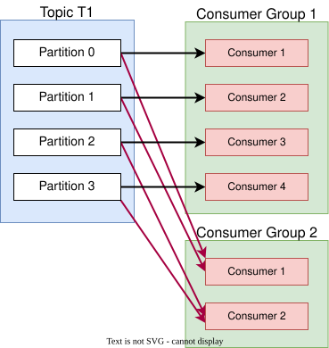

# Consumers

## Introduction

Consumers subscribe to Kafka topics and read messages sequentially from partitions using a **pull model** (brokers don't push data to consumers).

### Consumer Groups

A consumer group is a collection of consumers that work together to read from a topic.

Each partition is assigned to only one consumer in the group, allowing the group to collectively process all partitions. 

If you have more consumers than partitions, extra consumers remain on standby.

Multiple consumer groups can read from the same topic simultaneously, each maintaining its own offset position.

### Consumer Offsets

Kafka stores the offset position of each consumer group in an internal topic (`__consumer_offsets`).

After processing messages, consumers commit offsets to record progress.

If a consumer crashes, it resumes from the last committed offset.

**Commit strategies:**
- **At Least Once**: Commit after processing (risk: reprocessing if consumer fails, requires idempotent processing)
- **At Most Once**: Commit before processing (risk: message loss if processing fails)
- **Exactly Once**: Process without duplication (use transactional API for Kafka-to-Kafka, or idempotent consumers for external systems)

### Message Deserialization

Kafka delivers data as binary bytes (both key and value).

Consumers use **Deserializers** to convert bytes into objects (JSON, Avro, Protobuf, etc.).

That means consumers must know the expected format in advance.

### Message Processing

Within a consumer group, each message is processed by only one consumer (workload distributed across consumers).

When multiple consumer groups subscribe to the same topic, each group receives a copy of every message.

### Partition assignment

Each partition is consumed by exactly one consumer, but a consumer can consume multiple partitions, enabling parallel processing.

For example, let's say you have:
- 4 partitions
- 2 consumers in a group

Kafka might assign:
- Consumer 1 → Partitions 0 and 1
- Consumer 1 → Partitions 2 and 3

