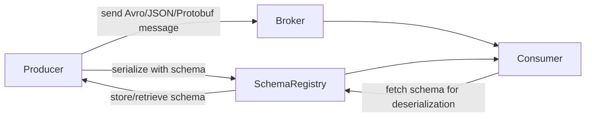
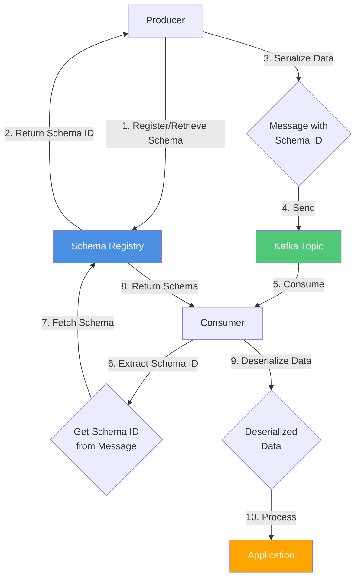

# Schema Registry

## Overview

Schema Registry is a service that manages and stores schemas for data serialization formats like Avro, JSON Schema, and Protobuf.

It's commonly used with Kafka to ensure data compatibility and evolution.

:::info
A schema defines the structure of message data. It defines allowed data types, their format, and relationships
:::



## How it works

**Producer**:

1. Registers or retrieves schema from Schema Registry
2. Gets unique schema ID for the registered schema
3. Serializes data using the schema
4. Creates message with schema ID + serialized data
5. Sends message to Kafka topic


**Consumer**:

1. Consumes message from Kafka topic
2. Extracts schema ID from message header
3. Fetches schema from Schema Registry using schema ID
4. Deserializes message data using the retrieved schema
5. Processes the deserialized data




## Apache Avro

Apache Avro is a data serialization framework that provides data structures, remote procedure call (RPC), compact binary data format.

Avro schemas are defined in JSON format.

You can either send a schema with every message or storing it in Schema Registry for use by consumers and producers.

### Key Features

- Supports complex nested data types
- Can generate classes for statically typed languages


### Modes

Avro provides three different approaches for working with data, each with its own trade-offs:

- Generic Mode: where you use AVRO just to validation, but don't do codegen
- Specific Mode: where you use an avsc file and the codegen tool to generate code
- Reflection Mode: the inver of Specific mode, based on a class create an avsc file

### Types

Primitive types:
- null
- double
- float
- int
- long
- boolean
- string
- bytes

```json
{
  "type": "record",
  "name": "User",
  "namespace": "com.example",
  "fields": [
    { "name": "username", "type": "string" },
    { "name": "age", "type": "int" },
    { "name": "isActive", "type": "boolean" },
    { "name": "score", "type": "float" }
  ]
}
```

Avro provides several complex types for representing structured data:
- record
- enum
- array
- map
- union
- fixed

```json
{
  "type": "record",
  "name": "Address",
  "fields": [
    {"name": "street", "type": "string"},
    {"name": "city", "type": "string"},
    {"name": "zipcode", "type": "string"}
  ]
}
```

```json
{
  "type": "enum",
  "name": "Status",
  "symbols": ["ACTIVE", "INACTIVE", "PENDING", "SUSPENDED"]
}
```

```json
{
  "type": "array",
  "items": "string"
}
```

```json
{
  "type": "map",
  "values": "int"
}
```

```json
["null", "string", "int"]
```

```json
{
  "type": "fixed",
  "name": "UUID",
  "size": 16
}
```
