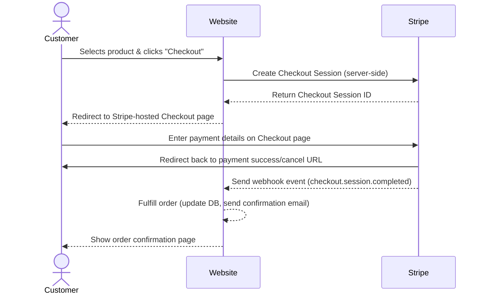

import { PackageManagerTabs } from '@theme'

# Stripe

Integrate Stripe payment gateway into a NestJS application.


## Payment Flow Overview



The Stripe integration follows this flow:

1. **User initiates checkout**. User clicks "Buy Now" on a product
2. **Create a checkout session**. Backend creates a Stripe checkout session with product details
3. **Redirect to Stripe**. User is redirected to Stripe's hosted checkout page
4. **Payment processing**. User enters payment information on Stripe's secure page
5. **Redirect to app**. User is redirected back to your application
6. **Webhook notification**. Stripe sends webhook events to your backend
7. **Post-payment processing**. Backend performs business logic after payment (marking the product as sold, sending confirmation emails, etc.)


## Stripe Account Setup

### Create a Stripe Account

Visit [stripe.com](https://stripe.com) and sign up for a free account. No payment information is required to get started.

### Obtain API Keys

Once logged in:

1. Navigate to **Developers** → **API keys**
2. You'll see two types of keys:
   - **Publishable Key** - Used on the client-side (frontend)
   - **Secret Key** - Used on the server-side (backend) - **Keep this secure!**

3. Copy your **Secret Key** for backend use

> [!CAUTION]
> Never commit your secret key to version control. Always use environment variables.


## Installing Dependencies

Install the Stripe SDK for Node.js:

<PackageManagerTabs command="install stripe" />

For TypeScript support, types are included in the package.


## Create a Stripe client

Add Stripe configuration to your `.env` file:

```env
STRIPE_SECRET_KEY=sk_test_your_secret_key_here
STRIPE_SUCCESS_URL=http://localhost:3000
STRIPE_CANCEL_URL=http://localhost:3000
```

Initialize Stripe client as a provider so it can be injected anywhere in NestJS application.

```ts
import { Module } from '@nestjs/common';
import { ConfigModule, ConfigService } from '@nestjs/config';
import Stripe from 'stripe';

@Module({
  imports: [ConfigModule],
  providers: [
    {
      provide: Stripe,
      useFactory: (configService: ConfigService) =>
        new Stripe(configService.getOrThrow('STRIPE_SECRET_KEY')),
      inject: [ConfigService],
    },
  ],
})
export class CheckoutModule {}
```
- `provide: Stripe` → tells NestJS that whenever a `Stripe` object is requested, this is how to create it.
- `useFactory` → factory function that returns a new `Stripe` client instance.
- `inject: [ConfigService]` → allows the factory function to receive an instance of `ConfigService`.


## Create a checkout section

Implement a service to handle checkout sessions and webhook events.

```ts title="checkout.service.ts" {9,19,21,35,36}
import { Injectable } from '@nestjs/common';
import { ConfigService } from '@nestjs/config';
import Stripe from 'stripe';
import { ProductsService } from '../products/products.service';

@Injectable()
export class CheckoutService {
  constructor(
    private readonly stripe: Stripe,
    private readonly productService: ProductsService,
    private readonly configService: ConfigService,
  ) {}

  async createSession(productId: number) {
    const product = await this.productService.getProduct(productId);
    
    return this.stripe.checkout.sessions.create({
      metadata: {
        productId: productId.toString(),
      },
      line_items: [
        {
          price_data: {
            currency: 'usd',
            unit_amount: Math.round(product.price * 100),
            product_data: {
              name: product.name,
              description: product.description,
            },
          },å
          quantity: 1,
        },
      ],
      mode: 'payment',
      success_url: this.configService.getOrThrow('STRIPE_SUCCESS_URL'),
      cancel_url: this.configService.getOrThrow('STRIPE_CANCEL_URL'),
    });
  }
}
```

- `private readonly stripe: Stripe`: injects the Stripe client into the service.
- `metadata` → Adds a `metadata` object to the session, storing the product ID for internal tracking.  
- `success_url` → Sets the url where Stripe will redirect the customer after successful payment.  
- `cancel_url` → Sets the url where Stripe will redirect the customer if checkout is canceled.  


## Redirect to Checkout page

> [!NOTE]
> Instructions in this section are applied to the web app (built with Next.js).

Install Stripe JavaScript library to your web app:

<PackageManagerTabs command="install @stripe/stripe-js" />

Add Stripe public key to your `.env` file:

```bash
NEXT_PUBLIC_STRIPE_PUBLIC_KEY=pk_test_your_publishable_key_here
```

> [!INFO]
> Use the `NEXT_PUBLIC_` prefix to expose this variable to the client.

Initialize Stripe Client:

```typescript
import { Stripe, loadStripe } from "@stripe/stripe-js";

let stripePromise: Stripe | null = null;

const getStripe = async () => {
  if (!stripePromise) {
    stripePromise = await loadStripe(
      process.env.NEXT_PUBLIC_STRIPE_PUBLIC_KEY!
    );
  }
  return stripePromise;
};

export default getStripe;
```

Create a Server Action for to get checkout session from backend:

```typescript
"use server";

import { post } from "@/app/common/util/fetch";

export default async function checkout(productId: number) {
  return post("checkout/session", { productId });
}
```

Create "Buy Now" button:

```typescript title="app/buy-now.tsx"
"use client";

import checkout from "./actions/checkout";
import getStripe from "./stripe";

interface BuyNowProps {
  productId: number;
}

export default function BuyNow({ productId }: BuyNowProps) {
  const handleCheckout = async () => {
    // 1. Call backend to create Stripe session
    const session = await checkout(productId);
    
    // 2. Get initialized Stripe instance
    const stripe = await getStripe();
    
    // 3. Redirect to Stripe Hosted Checkout
    await stripe?.redirectToCheckout({ sessionId: session.data.id });
  };

  return (
    <button
      onClick={handleCheckout}
    >
      Buy Now
    </button>
  );
}
```


## Process webhook events

Stripe sends various events during the checkout process:

- `checkout.session.completed` - Payment successfully completed
- `charge.succeeded` - Charge was successful
- `payment_intent.succeeded` - Payment intent succeeded
- `payment_intent.created` - Payment intent created

We primarily listen for `checkout.session.completed` to mark products as sold.

### Implement webhook endpoint

```ts title="checkout.controller.ts" {9}
import { Body, Controller, Post } from '@nestjs/common';
import { CheckoutService } from './checkout.service';

@Controller('checkout')
export class CheckoutController {
  constructor(private readonly checkoutService: CheckoutService) {}

  @Post('webhook')
  async handleCheckoutWebhooks(@Body() event: any) {
    return this.checkoutService.handleCheckoutWebhook(event);
  }
}
```

```ts title="checkout.service.ts" {38-52}
import { Injectable } from '@nestjs/common';
import { ProductsService } from '../products/products.service';
import Stripe from 'stripe';

@Injectable()
export class CheckoutService {
  constructor(
    private readonly stripe: Stripe,
    private readonly productService: ProductsService,
  ) {}

  async handleCheckoutWebhook(event: any) {
    if (event.type !== 'checkout.session.completed') {
      return;
    }

    const session = await this.stripe.checkout.sessions.retrieve(
      event.data.object.id,
    );
    await this.productService.update(parseInt(session.metadata.productId), {
      sold: true,
    });
  }
}
```


### Test Webhooks in local

1. Install [Stripe CLI](https://docs.stripe.com/stripe-cli/install)
    ```bash
    brew install stripe/stripe-cli/stripe
    ```
2. Authenticate CLI
    ```bash
    stripe login
    ```
    This opens a browser window to authorize the CLI with your Stripe account.
3. Start your local server
4. Forward Webhooks to local server
    ```bash
    stripe listen --forward-to localhost:3001/checkout/webhook
    ```

To view Active Listeners, in your Stripe Dashboard:
1. Go to **Developers** → **Webhooks**
2. Click **Local listeners** tab
3. See your active local webhook endpoints


### Configure Production Webhook Endpoint

1. Go to **Developers** → **Webhooks** in Stripe Dashboard
2. Click **Add endpoint**
3. Enter your production URL: `https://your-domain.com/checkout/webhook`
4. Select events to listen for: `checkout.session.completed`
