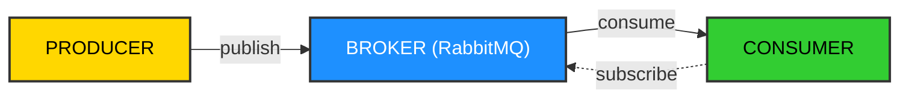

# RabbitMQ

This document is for version 4.2.2.

## Introduction

RabbitMQ is an open-source message broker that originally implemented the [Advanced Message Queuing Protocol](./rabbitmq/amqp.mdx) (AMQP).

RabbitMQ has plugins that support other protocols like Streaming Text Oriented Messaging Protocol (STOMP), Message Queuing Telemetry Transport (MQTT), and others.


## Use cases

- Message queuing and pub/sub messaging
- Background task scheduling
- Load distribution across multiple servers
- Seamless component integration in distributed systems


## Erlang

RabbitMQ is written in Erlang, a functional programming language, designed to build massively scalable real-time systems with high availability requirements..

Erlang's runtime system has built-in support for concurrency distribution and fault tolerance.


## Queuing model

- **Producer/Publisher** — sends messages (can be written in any language)
- **Consumer** — receives and processes messages
- **RabbitMQ Broker** — handles message routing between producers and consumers

Once a message is consumed, it's removed from the queue (unlike Kafka, which retains messages)




## Comparison

| Attribute        | RabbitMQ                                | Kafka                                      | AWS Kinesis                                                                 |
|------------------|-----------------------------------------|--------------------------------------------|------------------------------------------------------------------------------|
| Released         | June 2007                               | January 2011                               | November 2013                                                                |
| General purpose  | Message broker (queue)                  | Message bus (stream processing - log)      | Message bus (stream processing - log)                                       |
| Message replay   | No                                      | Yes                                        | Yes                                                                          |
| Consumer model   | Dummy consumer / Push model             | Smart consumer / Pull model                | Smart consumer / Pull & Push models                                          |
| Data throughput  | High- (No quoted throughput)            | Highest (No quoted throughput)             | High+ (1 shard: 1 MB/s input, 2 MB/s output, or 1000 records per second)     |
| Data consistency | Highest (ACKs)                          | High-                                      | High+                                                                        |
| Persistence      | No limit                                | No limit                                   | Up to 7 days                                                                 |
| Maintenance      | High-                                   | Highest                                    | Very Low                                                                     |
| Cost             | Relatively small                        | Relatively normal                          | Highest                                                                      |
| Open Source      | Yes                                     | Yes                                        | No                                                                           |

| Attribute       | RabbitMQ                                                                 | Kafka                                                                 |
|-----------------|---------------------------------------------------------------------------|------------------------------------------------------------------------|
| Distribution    | Many consumers per queue, but message is consumed only once              | Consumers distributed by topic partitions, message can be consumed by many consumers |
| Availability    | Highly available                                                         | Highly available, but Zookeeper is needed to manage cluster state      |
| Performance     | High                                                                     | Very high – higher throughput                                          |
| Replication     | Queues are not replicated by design                                      | By design                                                              |
| Protocols       | Standard queue protocols like AMQP, STOMP, HTTP, and MQTT                | Binary serialized data                                                 |
| Storage type    | Queue                                                                    | Log                                                                    |
| Acknowledgments | Sophisticated                                                            | Basic                                                                  |
| Routing         | Very flexible (exchange, binding keys)                                   | Message is sent to the topic by a key                                  |


## Running RabbitMQ

You can run RabbitMQ using Docker for local development:

```sh
docker run -it --rm --name rabbitmq -p 5672:5672 -p 15672:15672 rabbitmq:4-management
```


## References

- [Installing RabbitMQ](https://www.rabbitmq.com/docs/download#Installing-RabbitMQ)