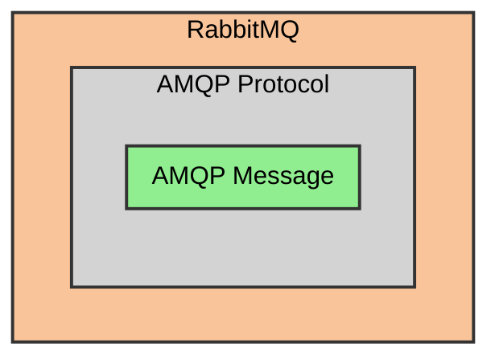
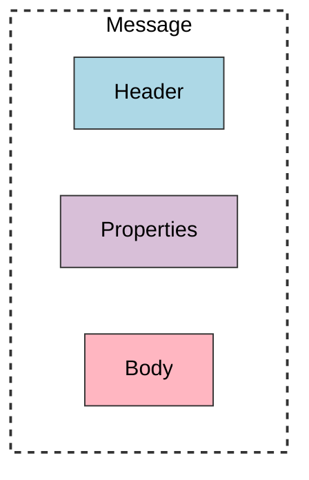

# AMQP

Overview of the AMQP protocol.

## Introduction

AMQP is an open standard protocol operating at the application layer of the OSI model.

It's designed for asynchronous communication between applications.

AMQP standardizes the behavior of the messaging publisher and consumer, systems supporting AMQP (like IBM MQ or Apache ActiveMQ) can theoretically be swapped with RabbitMQ.

Platform and technology independent with SDKs available in virtually any programming language

## AMQP Message

AMQP messages consist of three components:
- **Headers & Properties**: metadata as key-value pairs
  - **headers** are AMQP-specified
  - **properties** can contain application-specific information
- **Body/Payload** — the actual message content as a sequence of bytes

Maximum message size is **2GB**, though large messages should be avoided

Message is sent per frames: ~**131KB** by default.
