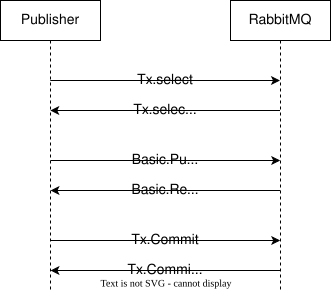
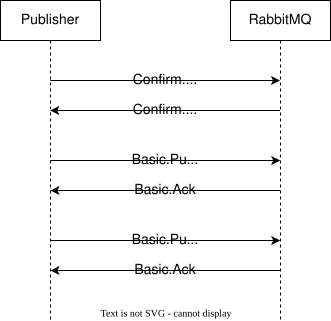

# Data Safety

Main mechanisms for ensuring data safety.

## The Problem

Networks fail in unpredictable ways, and without proper safeguards, messages can be lost. Acknowledgements on both consumer and publisher side are important for data safety.

In RabbitMQ, there're three safety features:
- Consumer Acknowledgments: One of ACK, nACK (RabbitMQ extension for Reject to reject multiple messages at once), Reject (defined in AMQP protocol)
- Transactions: Safe batching feature (batching Acks)
- Publisher Confirms: Broker to send confirmation once message is safely stored

## Consumer Acknowledgments

**Automatic Acknowledgment (Default):**
- RabbitMQ sends message to consumer and immediately removes from queue
- Consumer doesn't guarantee it will process the message
- **Risk**: Message lost if consumer crashes before processing
- **Benefit**: Fast, no overhead

**Manual Acknowledgment Types:**
- **Positive Acknowledgment** — Consumer processed message successfully; RabbitMQ removes it
- **Negative Acknowledgment (nAck)** — Consumer couldn't process; controlled by `requeue` parameter:
  - `requeue=true` — Message returned to queue for retry
  - `requeue=false` — Message discarded or sent to DLX
- **Batch nAck** — RabbitMQ extension allowing rejection of multiple messages at once

## Transactions

Transactions are an AMQP native protocol feature available on both consumer and publisher sides.

**Consumer Transaction Flow:**
1. Consumer sends `tx.select` to start transaction
2. Consumer receives and processes messages
3. Consumer sends `tx.commit` to accept all messages OR `tx.rollback` to reject all
4. Consumer must send `basic.cancel` to make rolled-back messages available to other consumers

**Publisher Transaction Flow:**
1. Publisher sends `tx.select` to start transaction
2. Publisher publishes all messages (not visible to consumers yet)
3. Publisher sends `tx.commit` to make all messages available OR `tx.rollback` to discard all
4. All-or-nothing guarantee: messages delivered as complete package or not at all

**Advantages:**
- Atomic delivery of message batches
- Strong consistency guarantees
- Suitable when entire set of messages must be processed together

**Disadvantages:** Transaction decrease performance, ~250x throughput reduction (consider "publisher confirms" or smart acknowledgment implementation)

## Publisher Confirms

RabbitMQ extension for reliable publishing to make sure published messages have safety reached the broker.

**How It Works:**
1. Publisher sends `confirm.select` to switch channel to confirmation mode
2. Publisher publishes messages
3. For each message, RabbitMQ sends acknowledgment with AMQP `delivery-tag` field contains the sequence number of confirmed message
4. Negative acknowledgments rare but must be handled with republish logic

**Key Differences from Transactions:**
- No `tx.commit`/`tx.rollback` needed
- Per-message confirmations (not all-or-nothing)
- Better performance than transactions

## Data Safety Checklist

To make sure your system is reliable and to avoid losing messages due to any unpredicted network issues:

1. **Infrastructure Setup:**
   - Create durable queues
   - Create durable exchanges
   - Send persistent messages (`delivery-mode=2`)

2. **Consumer Side:**
   - Use manual acknowledgments (not automatic)
   - Send positive acknowledgment only after successful processing
   - Use negative acknowledgment with appropriate `requeue` value

3. **Transactions:** Use only for atomic multi-message delivery (all-or-nothing) and cannot be sent as one message (throughput drops ~250x)

4. **Publisher confirms:** Enable confirms mode and retry in case of nAck returned
