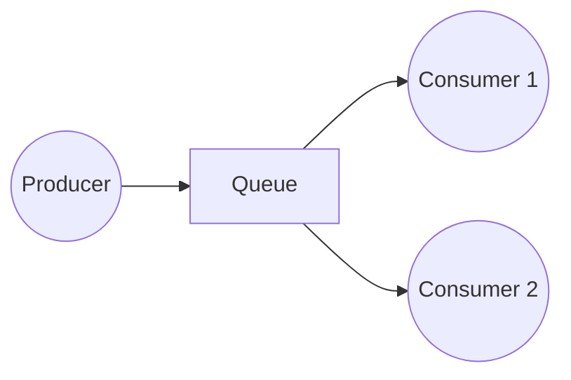
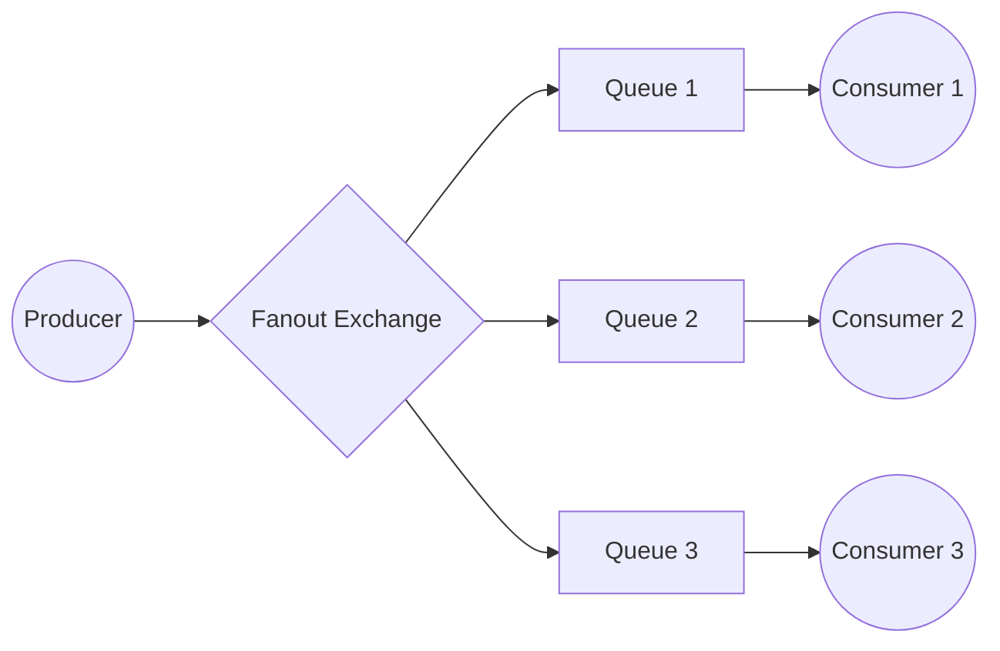

# Patterns

## Work Queue

**Use Cases:**
- Distributing time-consuming tasks among multiple workers/consumers
- Scaling infrastructure to handle variable loads

**Set up:** create multiple consumers read from the same queue simultaneously, enabling parallel processing and faster message consumption.

**Characteristics:**
- **Round-robin dispatching**: RabbitMQ sends messages sequentially to consumers by default
- **Single consumer guarantee**: Each message goes to only one consumer
- **Indefinite retry**: If clients die or negatively acknowledge with requeue=true, RabbitMQ keeps sending to other consumers (unless TTL or Dead Letter Exchange configured)
- **Monitor queue size**: If all workers are busy, queues fill up and slow down RabbitMQ
- **Batch processing** — RabbitMQ may send multiple messages to a consumer; each requires separate acknowledgement

## Publish/Subscribe (fanout)

**Use Cases:**
- Sending news to mobile applications
- Broadcasting geo-tracking data to multiple downstream systems
- Transmitting logs to different outputs
- News feed systems where all clients receive the same updates

**Set up:** 
1. Create **multiple queues**, one queue per consumer
2. Create a **fanout exchange** that broadcasts messages to all bound queues
3. Create **bindings** to connect exchange to each queue
4. Send messages to exchange, which will distribute them to all queues

