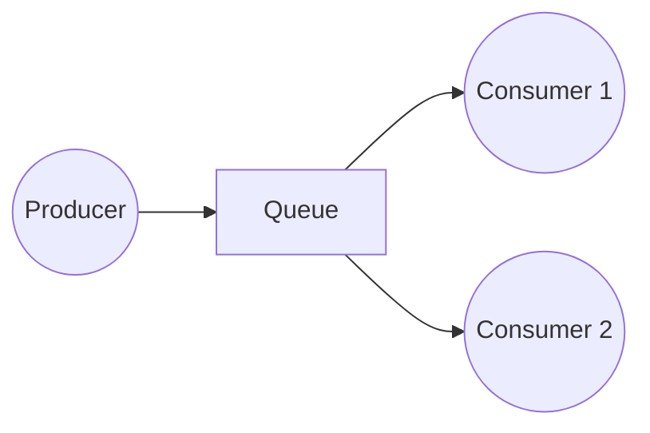
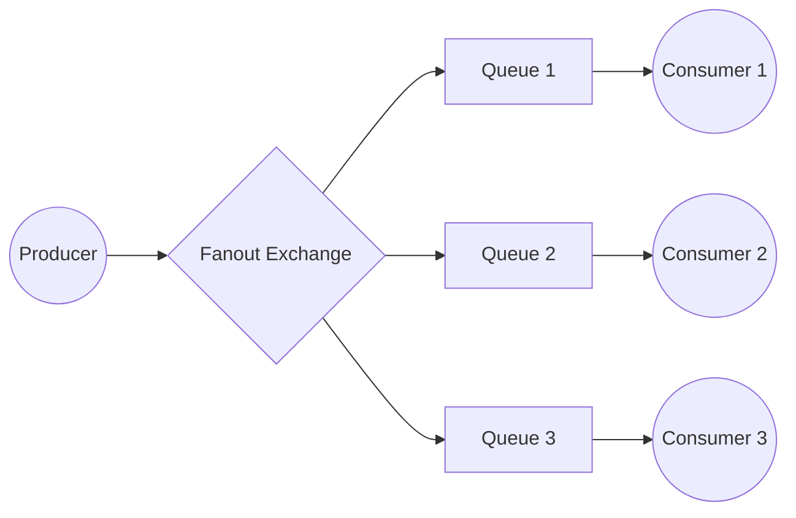
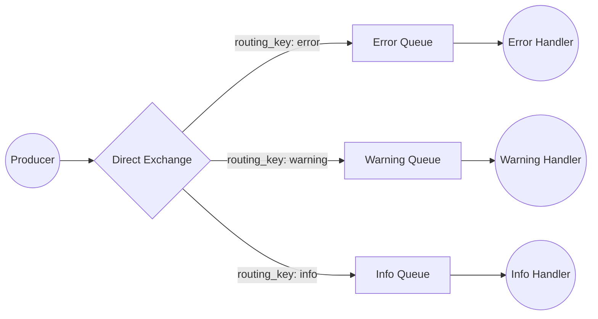
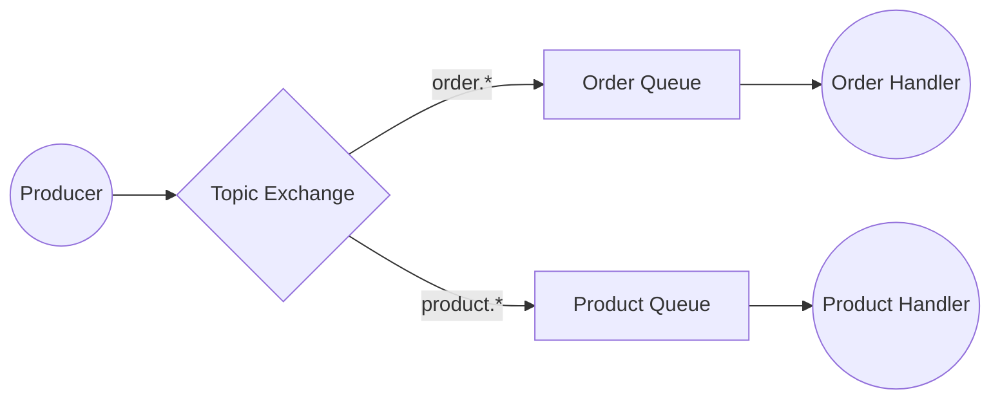
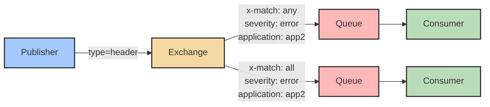
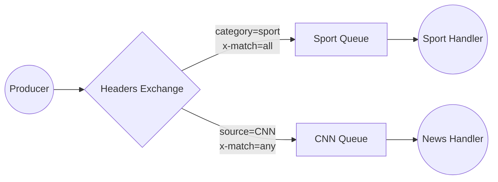

# Patterns

## Work Queue

**Use Cases:**
- Distributing time-consuming tasks among multiple workers/consumers
- Scaling infrastructure to handle variable loads

**Set up:** create multiple consumers read from the same queue simultaneously, enabling parallel processing and faster message consumption.

**Characteristics:**
- **Round-robin dispatching**: RabbitMQ sends messages sequentially to consumers by default
- **Single consumer guarantee**: Each message goes to only one consumer
- **Indefinite retry**: If clients die or negatively acknowledge with requeue=true, RabbitMQ keeps sending to other consumers (unless TTL or Dead Letter Exchange configured)
- **Monitor queue size**: If all workers are busy, queues fill up and slow down RabbitMQ
- **Batch processing** — RabbitMQ may send multiple messages to a consumer; each requires separate acknowledgement

## Pub-sub (fanout)

**Set up:** 
1. Create **multiple queues**, one queue per consumer
2. Create a **fanout exchange** that broadcasts messages to all bound queues
3. Create **bindings** to connect exchange to each queue
4. Send messages to exchange, which will distribute them to all queues

## Pub-sub (direct)

**Set up:**
1. Create **multiple queues**, one queue per consumer or consumer group
2. Create a **direct exchange** that routes messages based on routing key matching
3. Create **bindings** between exchange and queues, specifying binding keys that match routing keys
4. Publish messages to the exchange with a routing key; only queues with matching binding keys receive the message

## Pub-sub (topic)

**Set up:**
1. Create **multiple queues**, one queue per consumer or consumer group
2. Create a **topic exchange** that routes messages based on pattern matching
3. Create **bindings** between exchange and queues, specifying binding keys as patterns using wildcards
4. Publish messages to the exchange with a routing key following the defined patterns

## Pub-sub (headers)

**Set up:**
1. Create **multiple queues**, one queue per consumer or consumer group
2. Create a **headers exchange** that routes messages based on header attribute matching
3. Create **bindings** between exchange and queues, specifying header attributes and match logic via `x-match`
4. Publish messages to the exchange with headers containing the routing criteria (routing key is ignored)

