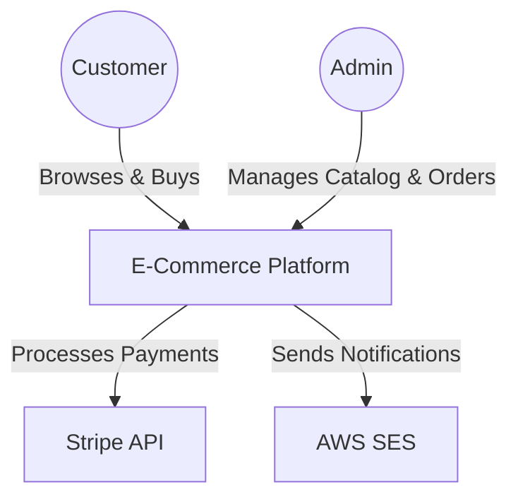
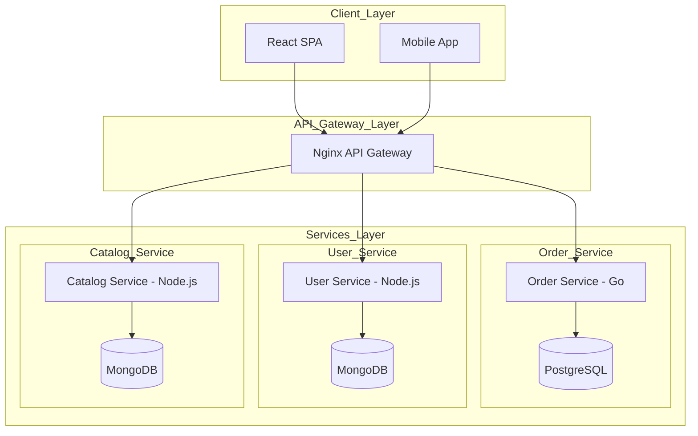
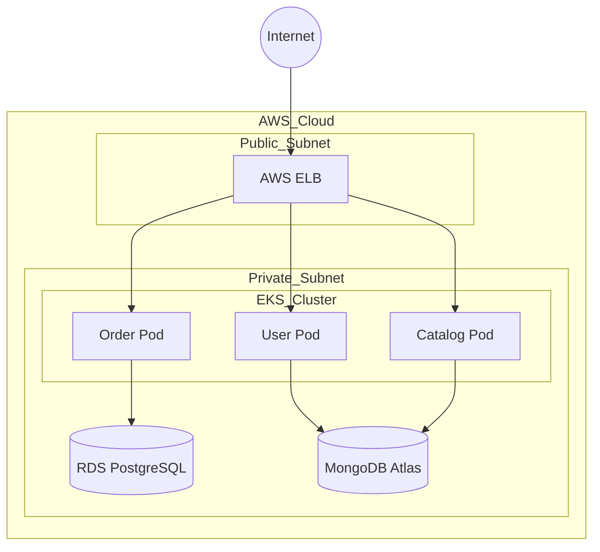

# Architecture Overview Document

Guide for writing Architecture Overview documents.

## Introduction

An Architecture Overview Document provides the "big picture" of a system, detailing its purpose, scope, and major components.

It serves as the definitive entry point for engineers and stakeholders to quickly grasp how the entire system operates.


## Document Structure

An Architecture Overview Document typically includes the following sections:

### Introduction

Provides readers with a quick understanding of why this system exists from both business and technical perspectives.

- **Purpose:** What problem does this system solve?
- **Scope:** What the system will do (**In-scope**) and, what it will **not** do (**Out-of-scope**).
- **Key Drivers & Constraints:** Core factors shaping the architecture (e.g., tight timelines, budget constraints, regulatory compliance, or mandatory corporate technical standards).

### Quality Attributes

Defines the non-functional requirements (NFRs) that drove the architectural choices.

Example:

| Attribute | Target | Key Architectural Strategy |
| --- | --- | --- |
| Scalability | Support 10k CCU | Microservices combined with Autoscaling |
| Availability | 99.9% Uptime | Multi-region deployment, Circuit Breaker pattern |
| Security | OWASP Top 10 Compliant | OAuth2/OIDC via API Gateway, Data Encryption |

### System Context (The Big Picture)

Positions the system within its environment. Who and what interacts with it?

Use **System Context Diagram** (C4 Level 1) to show the system as a "black box", along with the primary user personas (Actors) and external third-party integrations.

### High-Level Architecture (The Topology)

Peeks inside the system boundary to show how the major internal building blocks interact.

Use a **Container Diagram** (C4 Level 2) to break the system down into concrete, deployable units (like web apps, mobile apps, separate API backend services, and databases).

Include **Container Catalog**: A table defining each container's responsibility, tech stack, and deployment nature.

Use **Communication Patterns** to explicitly map out internal interaction types, split into Synchronous (HTTP/gRPC) and Asynchronous (Event-Driven/Queues) paths.


### Deployment Architecture

Outlines how the system is deployed onto physical or cloud infrastructure.

Use **Deployment Diagram** to show how software components are distributed across infrastructure components (e.g., Load Balancers, Servers, VPC subnets, etc.).


### Architecture Decision Records (ADR)

Preserves the history of major architectural choices so newcomers understand the "why" behind the design.

A typical ADR includes:
- **Context:** What is the current problem or technical requirement?
- **Decision:** The chosen solution (e.g., using Kafka instead of RabbitMQ).
- **Status:** The state of the decision (Proposed, Accepted, Superseded).
- **Consequences:** The trade-offs or impacts resulting from that decision.


## Best Practices

- **Prioritize Visuals**: A single well-crafted diagram is often more valuable than ten pages of text.
- **Consistency:** Follow standard notation (UML, C4 model).
- **Avoid Detailed Logic:** If necessary, provide hyperlinks to a separate Low-Level Design (LLD) document.
- **Living Document:** Update regularly as architecture evolves.
- **Balance:** Include both high-level views and critical technical details.


## Example

````markdown
# Global Retail System

Architecture overview of a Global Retail System.

## Introduction

**Purpose:** Provide a robust, scalable backend for a global retail platform that supports online ordering, customer management, and catalog operations.

**Scope:**
- **In-scope:** Global e-commerce ordering, customer account management, product catalog, payment integration, and notification delivery.
- **Out-of-scope:** Point-of-sale terminals, warehouse robotics, marketing personalization engine, and third-party marketplace integrations.

**Key Drivers & Constraints:**
- Cloud-native deployment using managed services.
- GDPR and regional data privacy compliance.
- High availability and low latency for checkout experiences.
- Independent release cadence for domain teams.


## Quality Attributes

Non-functional requirements that shape the architecture.

| Attribute | Target | Key Architectural Strategy |
| --- | --- | --- |
| Scalability | Support 10k concurrent users with burst capacity | Domain-aligned microservices, managed Kubernetes autoscaling |
| Availability | 99.9% uptime | Multi-AZ deployment, health checks, load balancing |
| Security | Data privacy, authenticated APIs | TLS 1.3, JWT auth, least-privilege service access |
| Performance | Responsive checkout and profile operations | API gateway, lightweight Go order service, optimized DB access |
| Maintainability | Independent delivery and service ownership | Clear service boundaries, ADRs, technology choice per domain |


## System Context

The Global Retail System is a core commerce backend that serves customers and internal administrators while integrating with payment and email providers.

### System Context Diagram (C4 Level 1)




## High-Level Architecture

Major internal building blocks, their responsibilities, and the communication patterns between them.

### Container Diagram (C4 Level 2)



### Container Catalog

| Container | Responsibility | Primary Technology |
| --- | --- | --- |
| Frontend | Customer-facing web and mobile UI | React |
| API Gateway | Request routing, authentication, rate limiting | Nginx |
| Order Service | Checkout, order validation, transaction processing | Go |
| User Service | Customer profile and account management | Node.js |
| Catalog Service | Product catalog and inventory access | Node.js |
| OrderDB | ACID order storage and transaction data | PostgreSQL |
| UserDB | Flexible profile storage | MongoDB |
| CatalogDB | Flexible product catalog storage | MongoDB |

### Communication Patterns

- Client requests travel through the API gateway to backend services over HTTP/REST.
- Order Service performs transactional operations against PostgreSQL for order creation.
- User and Catalog services query MongoDB for profile and product data.
- The system can emit domain events from the Order Service for downstream processing such as notifications or inventory synchronization.
- External providers like Stripe and SES are integrated asynchronously from the core user interaction path.


## Deployment View

The architecture is deployed on AWS using a managed EKS cluster, with a public load balancer in front of service pods and separate managed data stores for relational and document data.

### Deployment Diagram


## Architecture Decision Records

Key decisions made during the architecture design process.

| Decision | Context | Status | Consequences |
| --- | --- | --- | --- |
| Microservices | Need for independent scaling and team autonomy | Accepted | Better team velocity with higher operational complexity |
| Go for Order Service | Checkout requires low latency and high concurrency | Accepted | High performance at the cost of deeper Go expertise |
| Node.js for User Service | User APIs need rapid iteration and ecosystem support | Accepted | Fast delivery with caution for CPU-bound workloads |
| Node.js for Catalog Service | Catalog APIs need flexible development and schema evolution | Accepted | Good developer speed with limitations on aggregation joins |
| PostgreSQL for OrderDB | Orders need ACID transactions and relational integrity | Accepted | Strong data consistency; requires schema migrations |
| MongoDB for UserDB | Profile data is flexible and evolves rapidly | Accepted | Schema agility; less suitable for complex joins |
| MongoDB for CatalogDB | Product catalog schema varies by category | Accepted | Flexible model; careful design needed for query patterns |
````