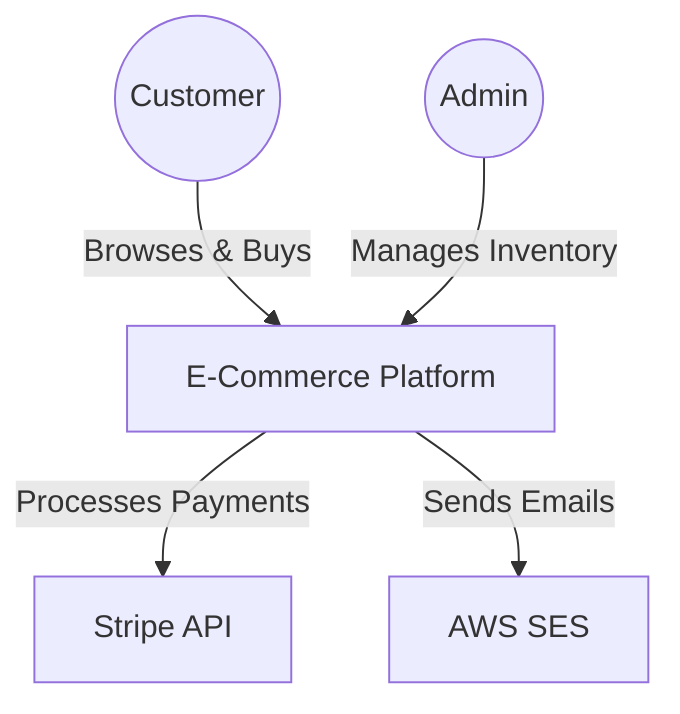
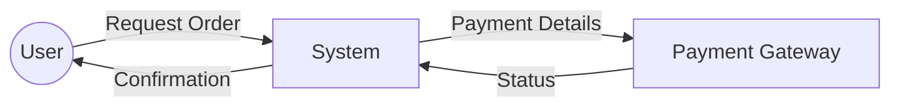
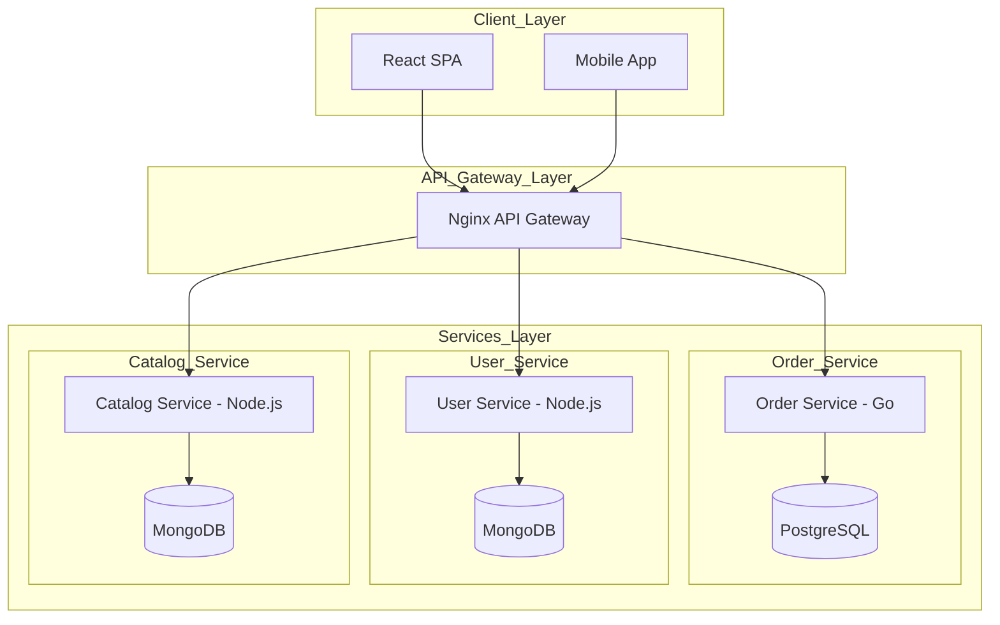
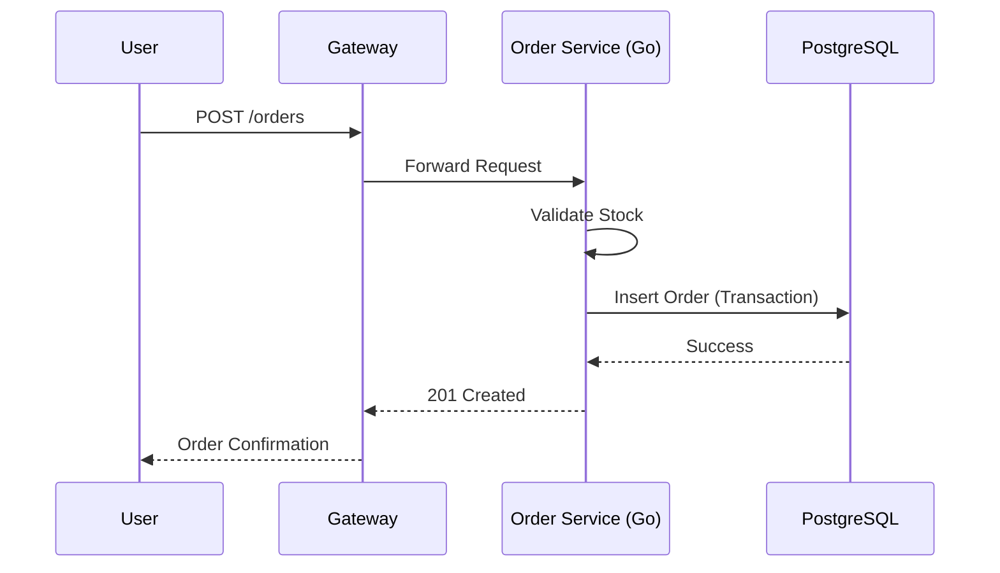
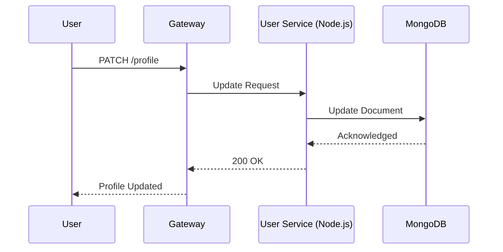
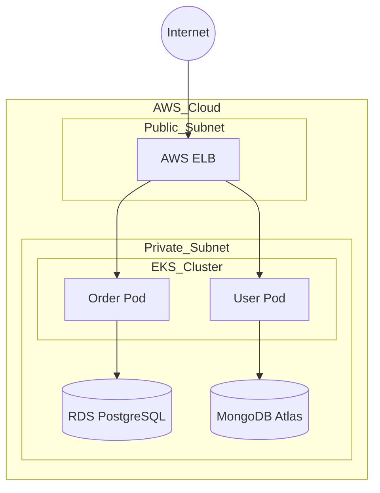

# System Architecture Document

Guidelines for writing a System Architecture Document.

## Introduction

A System Architecture Document provides the "big picture" so that readers understand the system's architecture without getting bogged down in code-level details or specific database schemas.

## Document Structure

A System Architecture Document typically includes the following sections:

### Introduction
- Purpose of the system.
- Business and technical objectives.
- Key constraints or assumptions.

### System Context
- High-level description of the system's purpose and capabilities
- Context Diagram (C4 Level 1) to show system boundaries and external actors
- Use a Data Flow Diagram (DFD) level 0 to illustrate the movement of data between the system and external entities.

## High-Level Architecture
Describes the internal structure but stays at the functional block level.

- Container Diagram (C4 Level 2) to show major applications/services/databases
- Define the architectural style (e.g., Microservices, Layered Architecture, or Event-driven).
- A summary table of key technologies (e.g., React, Node.js, PostgreSQL, AWS). Note: List only the primary technologies

## Key Data Flows
- Select the 2-3 most critical core business processes.
- Use a DFD level 1 or a High-level Sequence Diagram to describe how data moves from the User through the main components to complete a task

### Infrastructure & Deployment
- Specify the Deployment Model: Is it Cloud-based (AWS/Azure) or On-premise? Do you use Docker/Kubernetes?
- Identify main network zones (Public/Private Subnets) and Load Balancers.
- Use a Deployment Diagram to show how software components are distributed across infrastructure.

### Non-Functional Requirements (Quality Attributes)
- Performance requirements (response times, throughput).
- Scalability strategies (load balancing, caching).
- Security measures (authentication, encryption).
- Reliability and availability targets.

### Architecture Decision Records (ADR)
An ADR focuses on capturing the **why** behind a decision.

A typical ADR includes:
- **Context:** What is the current problem or technical requirement?
- **Decision:** The chosen solution (e.g., using Kafka instead of RabbitMQ).
- **Status:** The state of the decision (Proposed, Accepted, Superseded).
- **Consequences:** The trade-offs or impacts resulting from that decision.

### Risks & Mitigations
- Potential technical or business risks.
- Strategies to reduce or manage risks.

## Best Practices
- **Prioritize Visuals**: A single well-crafted diagram is often more valuable than ten pages of text.
- **Consistency:** Follow standard notation (UML, C4 model).
- **Avoid Detailed Logic:** If necessary, provide hyperlinks to a separate Low-Level Design (LLD) document.
- **Living Document:** Update regularly as architecture evolves.
- **Balance:** Include both high-level views and critical technical details.

## Examples

### E-Commerce Platform

````md title="system-architecture.md"
# System Architecture Document

## 1. Introduction
* **Purpose:** To provide a robust, scalable backend for a global retail platform.
* **Objectives:** Support 10k concurrent users, ensure 99.9% availability, and enable rapid feature deployment.
* **Constraints:** Must be cloud-native and compliant with regional data privacy laws (GDPR).

## 2. System Context
This section defines the boundaries of the system and how it interacts with external actors like Customers, Admins, and Payment Gateways.

### 2.1 Context Diagram (C4 Level 1)


### 2.2 Data Flow Diagram (Level 0)


## 3. High-Level Architecture
The system follows a **Microservices Architecture** to allow independent scaling and technology diversity across domains.

### 3.1 Container Diagram (C4 Level 2)


### 3.2 Technology Summary
| Component | Technology | Role |
| :--- | :--- | :--- |
| **Frontend** | React | Web Interface |
| **API Gateway** | Nginx | Routing & Rate Limiting |
| **Order Service** | Go | High-performance transaction processing |
| **User Service** | Node.js | Rapid API development |
| **Catalog Service** | Node.js | Rapid API development |
| **OrderDB** | PostgreSQL | Relational data for orders |
| **UserDB** | MongoDB | Flexible schema for user profiles |
| **CatalogDB** | MongoDB | Flexible schema for catalog data |

## 4. Key Data Flows
### 4.1 Order Placement Flow


### 4.2 User Profile Update


## 5. Infrastructure & Deployment
The system is deployed on **AWS** using a managed **Kubernetes (EKS)** cluster.

### 5.1 Deployment Diagram


## 6. Architecture Decision Records (ADR)
These records capture the "why" behind our critical technical choices.

| Decision | Context | Status | Consequences |
| :--- | :--- | :--- | :--- |
| **Microservices** | Need for independent scaling and team autonomy. | **Accepted** | Increased dev speed but higher operational complexity. |
| **Go for Order Svc** | Requires high concurrency and low latency for transactions. | **Accepted** | Excellent performance; steeper learning curve for JS devs. |
| **Node.js for User Svc** | High developer velocity and vast ecosystem for standard APIs. | **Accepted** | Fast prototyping; needs care with CPU-intensive tasks. |
| **Node.js for Catalog Svc** | High developer velocity and vast ecosystem for standard APIs. | **Accepted** | Fast prototyping; needs care with CPU-intensive tasks. |
| **PostgreSQL for OrderDB** | Orders require ACID compliance and complex relations. | **Accepted** | Data integrity guaranteed; requires schema migrations. |
| **MongoDB for UserDB** | User profiles have varied, evolving schemas. | **Accepted** | Flexible data model; lacks complex join support. |
| **MongoDB for CatalogDB** | Catalog data has varied, evolving schemas. | **Accepted** | Flexible data model; lacks complex join support. |

## 7. Non-Functional Requirements
* **Scalability:** Auto-scaling groups for EKS pods based on CPU/Memory usage.
* **Security:** JWT-based authentication and TLS 1.3 for all data in transit.
* **Reliability:** Multi-AZ deployment for RDS to ensure failover capability.
````
