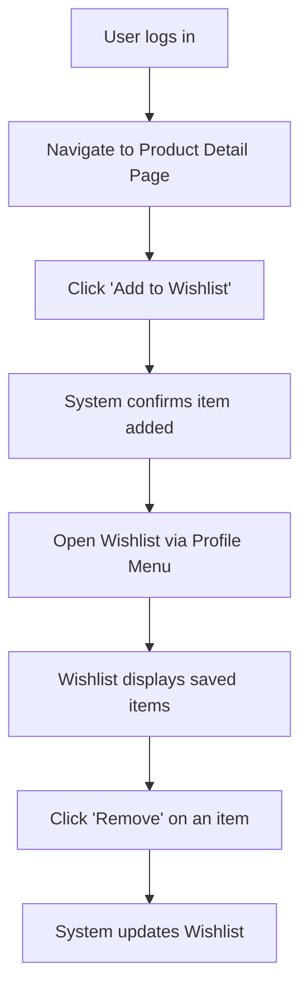

# Wishlist

## Introduction
- **Description:** The Wishlist feature allows users to save products they are interested in for future reference.  
- **User Goal:** Helps users track items they may want to purchase later without adding them to the cart immediately.  
- **Related Features:** Shopping cart, product detail page, user account management.

## User Story
- *As a registered shopper, I want to add products to my wishlist so that I can easily find and purchase them later.*

## Scope
- **Inclusions:**  
  - Add/remove items to/from wishlist.  
  - View wishlist items in a dedicated section.  
  - Persist wishlist across sessions (requires login).  
- **Exclusions:**  
  - Sharing wishlist with other users.  
  - Price alerts or notifications for wishlist items.  

## Dependencies
- Requires user authentication system.  
- Relies on product catalog API.  
- Integration with database storage.

## User Flow

## Acceptance Criteria
- Wishlist items persist after logout/login.  
- User can add/remove items with immediate feedback.  
- Wishlist displays accurate product details (name, price, image).  
- Maximum of 100 items can be stored per user.  

## Alternate Flows
- **Guest User:** If not logged in, system prompts user to sign in before saving.  
- **Out-of-Stock Item:** If item becomes unavailable, wishlist shows "Out of Stock" label.  
- **Deleted Product:** If product is removed from catalog, wishlist entry disappears with notification.  
- **Duplicate entries**: Prevent adding the same product twice.  
- **Invalid product ID**: System shows error message.  
- **Network timeout**: System retries request or shows "Unable to add item" message.  
