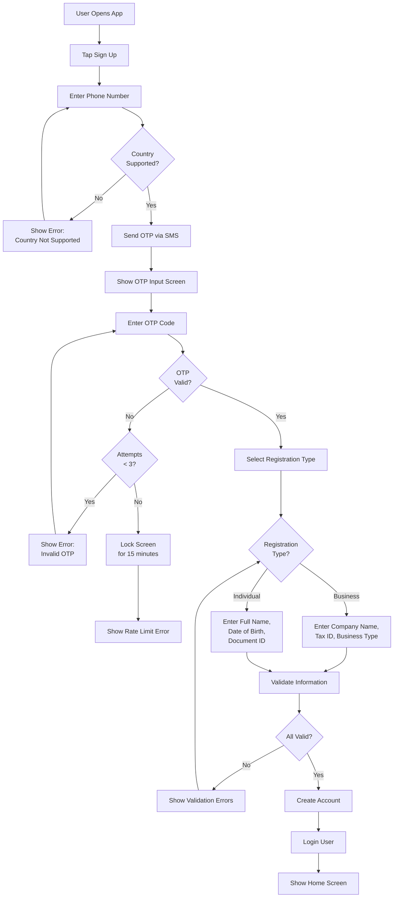

# Feature Specifications

## Overview

Feature specifications are documents that describe the functionality your software provides to users. They serve as a single source of truth and entry point for solution design.

Feature specification documents are stored inside the `docs/feature-specs/{module}` directory, where `{module}` represents the specific module or domain in the project.

Feature specification documents must be updated immediately whenever a feature or change is implemented, with all changes linked to related tasks, test cases, and release notes.


## Feature Specification Index

There's an index file that helps find feature specification documents.

It's located at `docs/feature-specs.md`. It lists all modules, their purpose, and related keywords for searching.

Example index file:
```md title="docs/feature-specs.md"
The `docs/feature-specs/` directory contains documents of all features implemented in the software, organized by module.

Below is the list of all modules and their purpose, along with keywords to help you find the relevant feature specifications:

| Module | Purpose | Keywords |
|--------|---------|----------|
| user | User management, authentication, authorization | RBAC, JWT, OAuth2, OIDC |
| catalog | Product catalog, inventory management | Search, filtering, stock levels |
| orders | Order processing and fulfillment | Cart, checkout, shipping |
| payments | Payment processing and transactions | Billing, invoicing, refunds |
```


## Feature Specification Document Structure

Each Feature Specification document file contains the following sections:

### Overview
- Brief description of the feature  
- Purpose and business value  
- Who benefits from it (end-user, client, internal team)

### Scope
- What is included in this feature  
- What is explicitly excluded (to avoid misunderstandings)

### User Story / Use Case
- High-level scenario describing how the user interacts with the feature  
- Example: *“As a registered user, I want to reset my password so that I can regain access to my account.”*

### Workflow
- Clear breakdown of the steps involved  
- Can be represented as:
  - Numbered steps  
  - Flowchart or diagram for visual clarity (e.g., using Mermaid syntax) 
  - Screenshots/mockups if applicable

### Functional Requirements
- Detailed explanation of what the system should do at each step  
- Inputs, outputs, validations, and expected behavior

### Non-Functional Requirements
- Performance expectations  
- Security considerations  
- Usability/accessibility notes

### Acceptance Criteria
- Conditions that must be met for the feature to be considered complete  
- Often written in *Given–When–Then* format (BDD style)

### Dependencies & Constraints
- Other features, systems, or APIs this feature relies on  
- Known limitations or restrictions

### Test Cases
- Link to test case files in `docs/testing/` to validate the feature  

### Assumptions & Open Questions
- Assumptions made during documentation
- Any unresolved issues that need clarification

### Glossary
- Definitions of technical terms for non-technical stakeholders


## Example

### User Registration Feature

````md title="docs/feature-specs/user/registration.md"
# User Registration Feature

## Overview

Allows new users to create an account in the mobile app by providing their phone number and verification through OTP. 

Users then select their registration type (Business or Individual) and enter corresponding details.

This feature is essential for onboarding and supports both business and individual user segments.

## Scope

**Included:**
- Phone number-based registration
- OTP verification via SMS
- Registration type selection (Business/Individual)
- Business information collection (company name, tax ID, business type)
- Individual information collection (full name, date of birth, document ID)
- Country validation for supported regions

**Excluded:**
- Social login (OAuth providers)
- Email-based registration
- Multi-factor authentication beyond OTP
- Admin user creation

## User Story / Use Case

*"As a new user in a supported country, I want to register using my phone number and verify via OTP so that I can choose whether to register as a business or individual and access personalized features."*

## Workflow


## Functional Requirements
- Accept phone numbers in international format: +{country_code}{phone_number}
- Validate phone number format using libphonenumber library
- Support countries: US, UK, Canada, Australia, India, Singapore (expand based on business needs)
- Reject phone numbers from unsupported countries with clear error message
- Send OTP via SMS within 3 seconds
- OTP code: 6 digits, expires after 10 minutes
- Maximum 3 OTP verification attempts, then rate limit for 15 minutes
- Business registration requires: company name, tax ID (format varies by country), business type (dropdown)
- Individual registration requires: full name (min 3 characters), date of birth (age 18+), document ID (passport/ID number)
- Prevent duplicate registrations using same phone number
- Real-time field validation with inline error messages

## Non-Functional Requirements
- Registration flow must complete in under 2 minutes
- Support 5000 concurrent registrations per minute
- SMS delivery within 99.5% uptime
- Handle network interruptions gracefully (resume from last step)
- Accessible via screen reader and voice navigation (WCAG 2.1 AA)
- Offline queue for OTP requests (sync when network available)
- Encrypted phone number storage (AES-256)
- GDPR and local data privacy compliance

## Dependencies & Constraints
- Depends on: SMS provider (Twilio/AWS SNS)
- Depends on: Phone number validation library (libphonenumber)
- Depends on: Document/ID verification service (for individual registration)
- Depends on: Country/Business type master data
- Constraint: Supported countries list must be maintained and kept in sync with operations team
- Constraint: Rate limiting: max 5 registration attempts per IP per day
- Constraint: Tax ID validation varies by country (requires regional service integration)

## Test Cases
- [User Registration Test Cases](!docs/testing/mobile-user-registration.md)

## Assumptions & Open Questions
- Assumption: Users have access to the phone number they're registering with
- Assumption: SMS service availability in all supported countries
- Should we support phone number changes after registration? (Under discussion)
- How strictly should we validate tax IDs for business registration? (Requires business team input)

## Change Log
- **v1.2** (2026-03-20): Added business vs individual registration types - PR #36
- **v1.1** (2026-03-15): Added country validation for unsupported regions - PR #35
- **v1.0** (2026-03-01): Initial mobile app registration with OTP - PR #32
````
