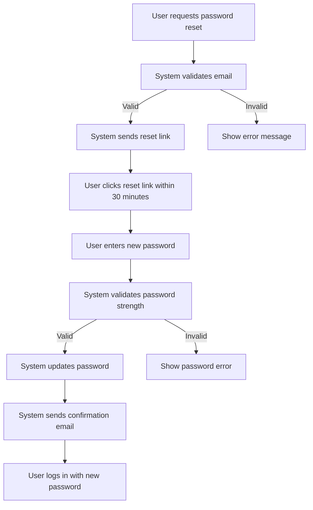

# Feature Specification

Guidelines for writing a Feature Specification document.

## Overview

A Feature Specification document describes the details of a single feature within a software system.

It outlines functionality, user stories, use cases, business workflows, and constraints, ensuring developers, testers, and stakeholders share a common understanding of how the feature should behave.

## Document Structure

A Feature Specification typically includes the following sections:

### Feature Overview
- Brief description of the feature.
- Business value and purpose.
- Dependencies or related features.

### User Stories
- Short, user-focused statements describing desired outcomes.
- Example format: *As a [user], I want [action] so that [benefit].*

### Functionality
- Detailed explanation of what the feature does.
- Inputs, outputs, and expected behavior.
- Edge cases and error handling.

### Business Workflows
- High-level business steps users follow to complete the feature.
- Represented with diagrams (flowcharts, activity diagrams, sequence diagrams).
- Focus on business logic, not technical implementation.

### Use Cases
- Step-by-step scenarios showing how users interact with the feature.
- Include preconditions, triggers, and postconditions.

### UI/UX Requirements

Describe how the feature should look and behave from the user’s perspective. Include:
- **Screen layouts or wireframes**: Mockups, sketches, or references to design files.
- **Interaction details**: What happens when users click, type, or navigate.
- **Accessibility standards**: Support for screen readers, keyboard navigation, color contrast.
- **Consistency rules**: Alignment with brand guidelines, design system, or style guide.
- **Error handling messages**: How errors are displayed to users in a clear, friendly way.

### Technical Requirements

Describe the technical constraints and integrations needed to implement the feature. Include:
- **APIs and integrations**: Which external services or internal APIs must be used.
- **Data models and storage**: What data is captured, how it’s structured, and where it’s stored.
- **Performance expectations**: Response times, concurrency limits, or throughput requirements.
- **Security requirements**: Authentication, authorization, encryption, compliance standards.
- **Infrastructure details**: Hosting environment, deployment tools, or cloud services.
- **Error logging and monitoring**: How issues should be tracked and reported.

### Acceptance Criteria
- Clear, testable conditions for feature completion.
- Define success metrics.

## Best Practices

- **User-centered:** Write from the perspective of end-users.
- **Clarity:** Avoid ambiguity; define terms and behaviors precisely.
- **Traceability:** Link user stories, workflows, and acceptance criteria.
- **Consistency:** Use standard formats for user stories, use cases, and workflows.
- **Conciseness:** Keep the document focused on one feature only.
- **Collaboration:** Validate with stakeholders before finalizing.

## Example

````md title="feature-spec.md"
# Feature Specification: Password Reset

## Feature Overview
- Description: Allow users to reset their password securely via email.
- Business Value: Improves user experience and reduces support requests.
- Dependencies: Email service integration, user authentication system.

## User Stories
- As a user, I want to reset my password if I forget it so that I can regain access to my account.
- As a user, I want confirmation that my password has been updated so that I feel secure.

## Functionality
- Users request a password reset by entering their email.
- System generates a secure, time-limited reset link.
- User sets a new password that meets security rules.
- Edge Cases: Invalid email, expired link, weak password.

## Business Workflows
**Workflow: Password Reset Process**



## Use Cases

### Use Case 1: Request Reset Link
- Preconditions: User has an existing account.
- Trigger: User clicks "Forgot Password."
- Steps:
  1. User enters email.
  2. System validates email.
  3. System sends reset link.
- Postconditions: User receives reset email.

### Use Case 2: Reset Password
- Preconditions: User has a valid reset link.
- Trigger: User clicks link.
- Steps:
  1. User enters new password.
  2. System validates password strength.
  3. System updates password.
- Postconditions: User can log in with new password.

## UI/UX Requirements
- Provide a simple form with an email input field and a dedicated password reset page.  
- Each step should include clear instructions; error messages must appear inline near the input field.  
- Ensure compatibility with screen readers, proper color contrast, and full keyboard navigation support.  
- Follow the product’s design system and brand style guide for buttons, fonts, and colors.  
- Use user-friendly messages such as "Invalid email address" or "Password too weak" to guide users.  

## Technical Requirements
- Connect with SMTP email service to send reset links.  
- Store secure tokens in the database with an expiration timestamp.  
- Reset link generation and email delivery must complete within 5 seconds.  
- Tokens must expire after 30 minutes; passwords must be hashed using industry-standard algorithms (e.g., bcrypt).  
- Host services on AWS EC2; monitor system health using CloudWatch.  
- Log failed reset attempts with user ID and timestamp for auditing and troubleshooting.  

## Acceptance Criteria
- Reset link expires after 30 minutes.
- Password must be at least 8 characters, include uppercase, lowercase, number, and symbol.
- User receives confirmation email after successful reset.
```
````
