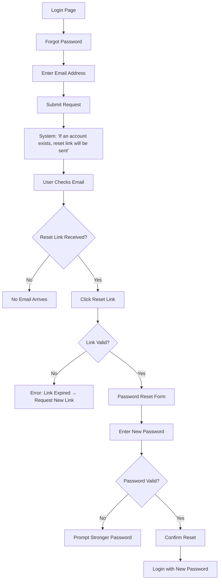

# Use Case Document

Guide for writing Use Case documents.

## Introduction

A Use Case document describes how a software feature works from the end-user's perspective.

It focuses on goals, interactions, actors involved, preconditions, and postconditions, and outcomes.

## Document Structure

A Use Case document typically includes the following sections:

### Overview
- Brief description of the use case.
- What goal the user is trying to achieve.
- Related features or use cases.

### Actors
- **Primary Actor:** The user or system initiating the use case.
- **Secondary Actors:** Other users or systems involved in the process.

### Preconditions
- State or requirements that must be true before the use case starts.
- Assumptions about the system or user state.

### Main Flow
- Step-by-step sequence of actions the user performs.
- Expected system responses at each step.
- Clear, numbered steps showing the happy path.

### Alternate Flows
- Variations or exceptions to the main flow.
- Different paths based on user choices or system states.
- Error conditions and recovery steps.

### Flowchart
- Visual representation using flowcharts or activity diagrams.
- Shows decision points, alternate paths, and outcomes.
- Helps stakeholders quickly understand the flow.

### Postconditions
- Final state after the use case completes successfully.
- Changes to system data or user state.

### Success Criteria
- Clear conditions that define success.
- Measurable outcomes or user satisfaction metrics.

## Best Practices

- **User-centered:** Write from the perspective of end-users and their goals.
- **Clarity:** Use simple, numbered steps; avoid technical jargon.
- **Completeness:** Include all main flows and significant alternate flows.
- **Specificity:** Define actors, preconditions, and postconditions precisely.
- **Visuals:** Include flowcharts or diagrams for complex interactions.
- **Traceability:** Link use cases to requirements and user stories.
- **Conciseness:** Keep each use case focused on a single user goal.

## Examples

### Password Reset Use Case

````md
# Use Case: Password Reset

## Overview

Users reset their account password when login fails. The process covers actions, expected results, and variations, with security maintained by hiding email registration status.

## Actors
- **Primary Actor:** Registered user who has forgotten their password.
- **Secondary Actor:** Web application (provides password reset functionality).

## Preconditions
- The user has an existing account.
- The user cannot log in with their current password.

## Main Flow
1. The user navigates to the login page.
2. The user selects the "Forgot Password" option.
3. The system prompts the user to enter their email address.
4. The user enters their email and submits the request.
5. The system displays a neutral message:  
   *"If an account is registered with this email, you will receive a password reset link."*
6. The user checks their email inbox.
7. If a reset link is received, the user clicks the link.
8. The system displays a password reset form.
9. The user enters a new password and confirms it.
10. The system validates the new password and confirms the reset.
11. The user logs in successfully with the new password.

## Alternate Flows
- **Unregistered Email:** The system always shows the neutral message, without confirming account existence.  
- **Expired Link:** If the reset link has expired, the system prompts the user to request a new one.  
- **Weak Password:** If the new password does not meet requirements, the system asks the user to choose a stronger password.  

## Flowchart



## Postconditions
- The user's password is updated (if the account exists).
- The user can log in with the new password.

## Success Criteria
- The user regains access to their account securely.
- The process is clear, simple, and user-friendly.
- The system does not disclose whether an email is registered.
````