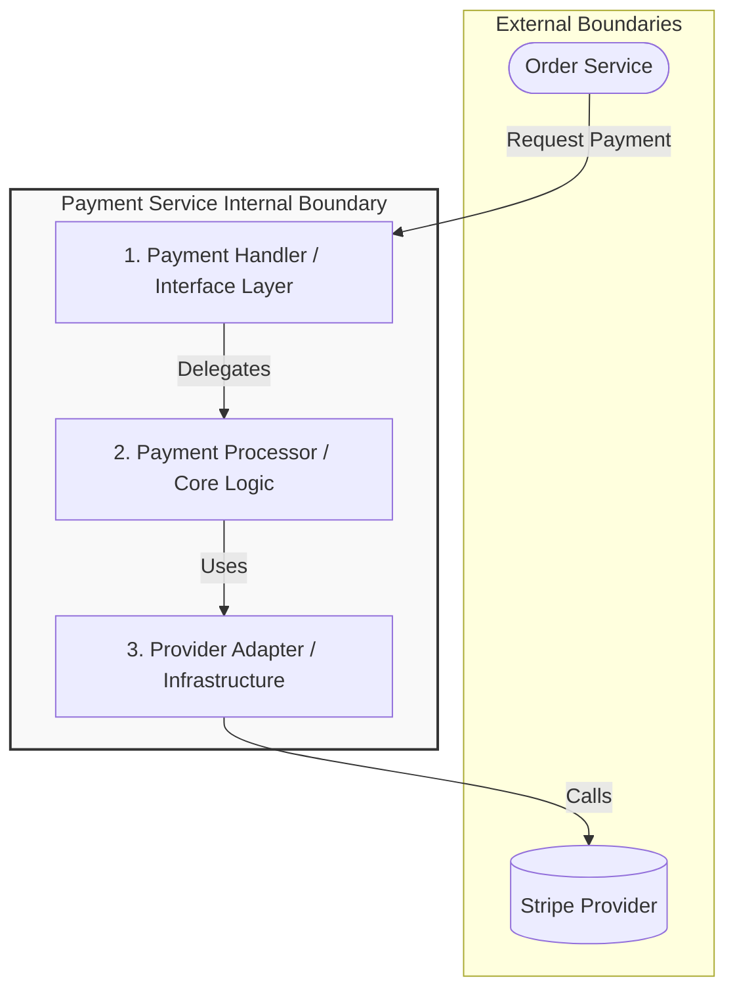

# Payment Service Component Design

Internal architecture of the Payment Service module.

## Overview

**Core Purpose:** The Payment Service isolates all payment processing logic, including transaction validation, provider integration, and settlement operations.

**Design Scope:**
- **In-scope:** Payment method validation, transaction processing, provider communication, refund handling, and transaction history storage.
- **Out-of-scope:** Fraud detection, subscription management, financial reporting, and currency conversion strategies (delegated to upstream services).

## Structural Architecture (C4 Level 3)

Visualizes how the Payment Service is internally organized.

### Component Catalog & Responsibilities

| Component | Responsibility | Constraints |
| --- | --- | --- |
| **Payment Handler** | Receives payment requests, validates input DTOs, maps to domain models. | Cannot contain payment logic; purely a gateway. |
| **Payment Processor** | Executes transaction workflows, coordinates validation, applies business rules, manages state transitions. | Must remain independent of provider-specific APIs. |
| **Provider Adapter** | Abstracts communication with external payment providers (Stripe, PayPal, etc.). | Implements provider-agnostic interface defined by Payment Processor. |

## Interfaces & Boundaries

### Provided Interfaces (Inbound)

**Interaction Model:** Synchronous gRPC method calls from Order Service.

**Entry Component:** PaymentHandler intercepts all inbound payment requests.

### Required Interfaces (Outbound Dependencies)

**Dependencies:**
- Stripe SDK (tight coupling for provider communication)
- PostgreSQL via Repository abstraction (tight coupling for transaction persistence)
- Event Bus (loose coupling for publishing payment completion events)

**Coupling Nature:** The Stripe integration is tightly coupled, while event publishing is loosely coupled.

## Key Design Decisions & Internal Patterns

**Architectural Pattern:** Hexagonal Architecture (Ports & Adapters) to keep provider-specific logic isolated.

**State & Execution Management:** Each payment transaction is processed as a discrete, stateless handler invocation. Complex workflows use the Saga pattern for distributed transactions.

**Dependency Injection Strategy:** Constructor-based injection using Spring's IoC container; all dependencies are injected at instantiation time.