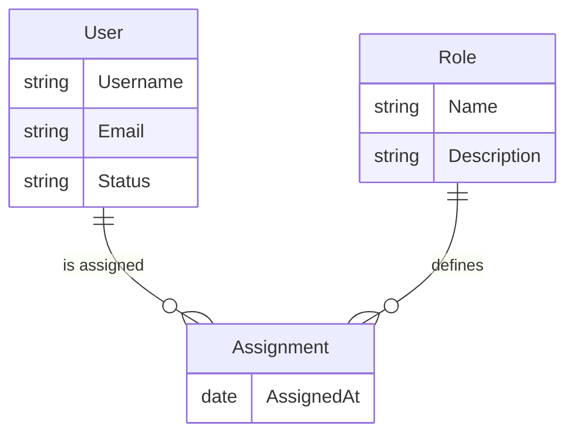

# User Management Database Design

## Introduction

This document describes the database design of the **User Management Module**.

## Logical Model



### User

Represents an individual registered in the system.

**Attributes:**

| Attribute Name | Type                     | Description                                  |
| -------------- | ------------------------ | -------------------------------------------- |
| UserId         | String                   | Unique identifier for the user (Primary Key) |
| Username       | String                   | Login name chosen by the user (Unique)       |
| Email          | String                   | User's email address                         |
| Status         | String (Active/Inactive) | Current account status                       |

**Relationships:**

| Related Entity | Type        | Cardinality | Description                               |
| -------------- | ----------- | ----------- | ----------------------------------------- |
| Assignment     | One-to-Many | 1..\*       | A user can have multiple role assignments |

### Role

Defines a set of permissions or responsibilities.

**Attributes:**

| Attribute Name | Type      | Description                                     |
| -------------- | --------- | ----------------------------------------------- |
| RoleId         | String    | Unique identifier for the role (Primary Key)    |
| Name           | String    | Name of the role (e.g., Admin, Editor) (Unique) |
| Description    | String    | Explanation of the role's purpose               |
| CreatedAt      | Timestamp | Role creation timestamp                         |

**Relationships:**

| Related Entity | Type        | Cardinality | Description                                  |
| -------------- | ----------- | ----------- | -------------------------------------------- |
| Assignment     | One-to-Many | 1..\*       | A role can be linked to multiple assignments |

### Assignment

Associative entity linking users and roles.

**Attributes:**

| Attribute Name | Type      | Description                                  |
| -------------- | --------- | -------------------------------------------- |
| UserId         | String    | Reference to User (Foreign Key, Primary Key) |
| RoleId         | String    | Reference to Role (Foreign Key, Primary Key) |
| AssignedAt     | Timestamp | Timestamp when the role was assigned         |

**Relationships:**

| Related Entity | Type        | Cardinality | Description                         |
| -------------- | ----------- | ----------- | ----------------------------------- |
| User           | Many-to-One | \*..1       | Each assignment belongs to one user |
| Role           | Many-to-One | \*..1       | Each assignment belongs to one role |

## Physical Model

### `users` collection

Stores user account documents.

| Field     | Data Type | Constraints                                       | Description                 |
| --------- | --------- | ------------------------------------------------- | --------------------------- |
| \_id      | ObjectId  | Primary key, auto-generated                       | Unique document identifier  |
| username  | String    | Unique, required                                  | Login username              |
| email     | String    | Unique, required                                  | User email address          |
| status    | String    | Allowed values: Active, Inactive; default: Active | Account status              |
| createdAt | Date      | Required, default `new Date()`                    | Creation timestamp          |
| updatedAt | Date      | Required, default `new Date()`                    | Last modification timestamp |

### `roles` collection

Stores role definitions.

| Field       | Data Type | Constraints                    | Description                 |
| ----------- | --------- | ------------------------------ | --------------------------- |
| \_id        | ObjectId  | Primary key, auto-generated    | Unique role identifier      |
| name        | String    | Unique, required               | Role name                   |
| description | String    | Optional                       | Role purpose or permissions |
| createdAt   | Date      | Required, default `new Date()` | Role creation timestamp     |

### `assignments` collection

Stores user-to-role membership records.

| Field      | Data Type | Constraints                    | Description                  |
| ---------- | --------- | ------------------------------ | ---------------------------- |
| \_id       | ObjectId  | Primary key, auto-generated    | Unique assignment identifier |
| userId     | ObjectId  | Required, indexed              | Reference to user document   |
| roleId     | ObjectId  | Required, indexed              | Reference to role document   |
| assignedAt | Date      | Required, default `new Date()` | Assignment timestamp         |

### Indexes

Performance optimization indexes:

| Collection  | Fields           | Type         | Purpose                                         |
| ----------- | ---------------- | ------------ | ----------------------------------------------- |
| users       | email            | UNIQUE       | Fast lookup by email during authentication      |
| users       | username         | UNIQUE       | Fast lookup by username                         |
| assignments | userId           | INDEX        | Efficient queries for a user's role assignments |
| assignments | roleId           | INDEX        | Efficient queries for a role's member list      |
| assignments | (userId, roleId) | UNIQUE INDEX | Prevent duplicate assignments                   |

### Storage Details

- **DBMS**: MongoDB
- **Storage Engine**: WiredTiger for efficient document storage and compression
- **Consistency**: Use a replica set for high availability and failover
- **Sharding**: none (for now)
- **Charset**: UTF-8/Unicode is supported for multilingual data
- **Retention**: Use TTL indexes for temporary assignment history or expired session data when needed

### Sample DDL

```javascript
// users collection with schema validation
db.createCollection("users", {
  validator: {
    $jsonSchema: {
      bsonType: "object",
      required: ["username", "email", "status", "createdAt", "updatedAt"],
      properties: {
        username: { bsonType: "string", minLength: 3 },
        email: { bsonType: "string", pattern: "^[^@]+@[^@]+\\.[^@]+$" },
        status: {
          bsonType: "string",
          enum: ["Active", "Inactive"],
        },
        createdAt: { bsonType: "date" },
        updatedAt: { bsonType: "date" },
      },
    },
  },
});

db.users.createIndex({ username: 1 }, { unique: true });
db.users.createIndex({ email: 1 }, { unique: true });

// roles collection
db.createCollection("roles");
db.roles.createIndex({ name: 1 }, { unique: true });

// assignments collection
db.createCollection("assignments");
db.assignments.createIndex({ userId: 1, roleId: 1 }, { unique: true });
db.assignments.createIndex({ userId: 1 });
db.assignments.createIndex({ roleId: 1 });

// Example document
db.users.insertOne({
  username: "alice",
  email: "alice@example.com",
  status: "Active",
  createdAt: new Date(),
  updatedAt: new Date(),
});
```

## Changelog

| Version | Date       | Changes                                                           |
| ------- | ---------- | ----------------------------------------------------------------- |
| 1.0     | 2026-08-12 | Initial conceptual draft with User, Role, and Assignment entities |
