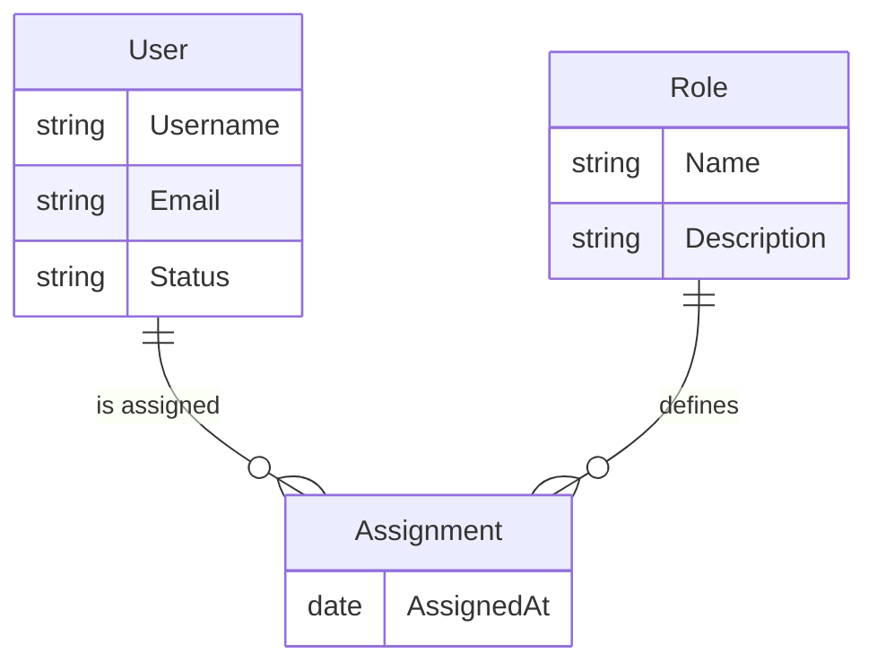

# User Management Database Design

## Introduction

This document describes the database schema, relationships, and implementation details of the **User Management Module**.

## ER Diagram



## `users` collection

**Description**: Stores user account documents for individuals registered in the system.

**Schema Definition**:

| Field       | Description                | Data Type | Constraints                                       |
| ----------- | -------------------------- | --------- | ------------------------------------------------- |
| `_id`       | Unique document identifier | ObjectId  | Primary key, auto-generated                       |
| `username`  | Login username             | String    | Unique, required                                  |
| `email`     | User email address         | String    | Unique, required                                  |
| `status`    | Account status             | String    | Allowed values: Active, Inactive; default: Active |
| `createdAt` | Creation timestamp         | Date      | Required, default `new Date()`                    |
| `updatedAt` | Last modification time     | Date      | Required, default `new Date()`                    |

**Relationships**:

| Related Collection | Type        | Cardinality | Description                               |
| ------------------ | ----------- | ----------- | ----------------------------------------- |
| `assignments`      | One-to-Many | 1..*        | A user can have multiple role assignments |

**Indexes**:

| Fields     | Type   | Purpose                                    |
| ---------- | ------ | ------------------------------------------ |
| `email`    | UNIQUE | Fast lookup by email during authentication |
| `username` | UNIQUE | Fast lookup by username                    |

**Storage Details**: 
- Stored in MongoDB using the WiredTiger storage engine.
- User documents use generated ObjectId values and support UTF-8/Unicode data.

## `roles` collection

**Description**: Stores role definitions that represent permissions or responsibilities.

**Schema Definition**:

| Field         | Description                 | Data Type | Constraints                    |
| ------------- | --------------------------- | --------- | ------------------------------ |
| `_id`         | Unique role identifier      | ObjectId  | Primary key, auto-generated    |
| `name`        | Role name                   | String    | Unique, required               |
| `description` | Role purpose or permissions | String    | Optional                       |
| `createdAt`   | Role creation timestamp     | Date      | Required, default `new Date()` |

**Relationships**:

| Related Collection | Type        | Cardinality | Description                                  |
| ------------------ | ----------- | ----------- | -------------------------------------------- |
| `assignments`      | One-to-Many | 1..*        | A role can be linked to multiple assignments |

**Indexes**:

| Fields | Type   | Purpose              |
| ------ | ------ | -------------------- |
| `name` | UNIQUE | Fast lookup by role name |

**Storage Details**:
- Stored in MongoDB using the WiredTiger storage engine.
- Role documents use generated ObjectId values and support UTF-8/Unicode data.

## `assignments` collection

**Description**: Stores user-to-role membership records. Each assignment links one user to one role.

**Schema Definition**:

| Field        | Description                  | Data Type | Constraints                    |
| ------------ | ---------------------------- | --------- | ------------------------------ |
| `_id`        | Unique assignment identifier | ObjectId  | Primary key, auto-generated    |
| `userId`     | Reference to user document   | ObjectId  | Required, indexed              |
| `roleId`     | Reference to role document   | ObjectId  | Required, indexed              |
| `assignedAt` | Assignment timestamp         | Date      | Required, default `new Date()` |

**Relationships**:

| Related Collection | Type        | Cardinality | Description                         |
| ------------------ | ----------- | ----------- | ----------------------------------- |
| `users`            | Many-to-One | *..1        | Each assignment belongs to one user |
| `roles`            | Many-to-One | *..1        | Each assignment belongs to one role |

**Indexes**:

| Fields               | Type         | Purpose                                          |
| -------------------- | ------------ | ------------------------------------------------ |
| `userId`             | INDEX        | Efficient queries for a user's role assignments |
| `roleId`             | INDEX        | Efficient queries for a role's member list      |
| (`userId`, `roleId`) | UNIQUE INDEX | Prevent duplicate assignments                    |

**Storage Details**:
- Stored in MongoDB using the WiredTiger storage engine.
- Use a replica set for high availability and failover.
- Sharding is not currently configured.
- TTL indexes may be added for temporary assignment history or expired session data when needed.

## Scripts

The following MongoDB scripts create the collections and indexes, validate user documents, and seed an initial user.

```javascript
// users collection with schema validation
db.createCollection("users", {
  validator: {
    $jsonSchema: {
      bsonType: "object",
      required: ["username", "email", "status", "createdAt", "updatedAt"],
      properties: {
        username: { bsonType: "string", minLength: 3 },
        email: { bsonType: "string", pattern: "^[^@]+@[^@]+\\.[^@]+$" },
        status: {
          bsonType: "string",
          enum: ["Active", "Inactive"],
        },
        createdAt: { bsonType: "date" },
        updatedAt: { bsonType: "date" },
      },
    },
  },
});

db.users.createIndex({ username: 1 }, { unique: true });
db.users.createIndex({ email: 1 }, { unique: true });

// roles collection
db.createCollection("roles");
db.roles.createIndex({ name: 1 }, { unique: true });

// assignments collection
db.createCollection("assignments");
db.assignments.createIndex({ userId: 1, roleId: 1 }, { unique: true });
db.assignments.createIndex({ userId: 1 });
db.assignments.createIndex({ roleId: 1 });

// Example document
db.users.insertOne({
  username: "alice",
  email: "alice@example.com",
  status: "Active",
  createdAt: new Date(),
  updatedAt: new Date(),
});
```

## Changelog

| Version | Date       | Changes                                                           |
| ------- | ---------- | ----------------------------------------------------------------- |
| 1.0     | 2026-08-12 | Initial conceptual draft with User, Role, and Assignment entities |
