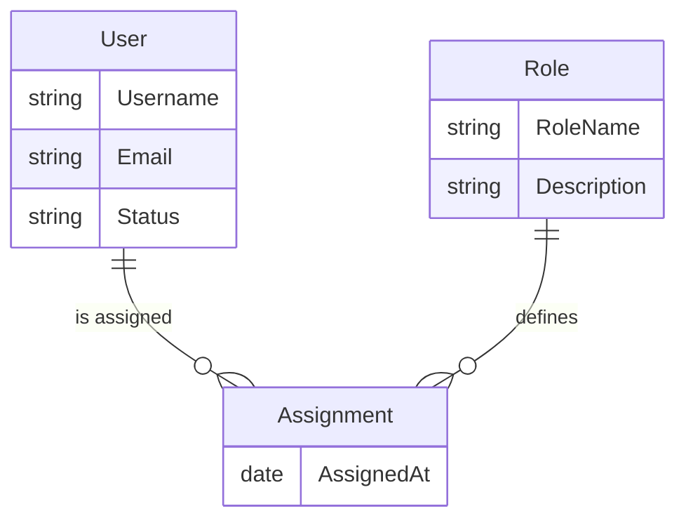

# User Management Data Model

## Introduction
This document describes the data model of the **User Management Module**.  

## Entities

### User

Represents an individual registered in the system.

**Attributes:**

| Attribute Name | Type | Description |
| --- | --- | --- |
| Username | String | Login name chosen by the user |
| Email | String | User’s email address |
| Status | String (Active/Inactive) | Current account status |

**Relationships:**

| Related Entity | Type | Cardinality | Description |
| --- | --- | --- | --- |
| Assignment | One-to-Many | 1..* | A user can have multiple role assignments |

### Role

Defines a set of permissions or responsibilities.

**Attributes:**
| Attribute Name | Type | Description |
| --- | --- | --- |
| RoleName | String | Name of the role (e.g., Admin, Editor) |
| Description | String | Explanation of the role’s purpose |

**Relationships:**
| Related Entity | Type | Cardinality | Description |
| --- | --- | --- | --- |
| Assignment | One-to-Many | 1..* | A role can be linked to multiple assignments |

### Assignment

Associative entity linking users and roles.

**Attributes:**
| Attribute Name | Type | Description |
| --- | --- | --- |
| AssignedAt | Date | Timestamp when the role was assigned |

**Relationships:**
| Related Entity | Type | Cardinality | Description |
| --- | --- | --- | --- |
| User | Many-to-One | *..1 | Each assignment belongs to one user |
| Role | Many-to-One | *..1 | Each assignment belongs to one role |

## Changelog

| Version | Date | Changes |
| --- | --- | --- |
| 1.0 | 2026-08-12 | Initial conceptual draft with User, Role, and Assignment entities |
| 1.1 | 2026-09-01 | Added `Status` attribute to User entity |
| 1.2 | 2026-10-15 | Refactored `UserRole` junction table into conceptual `Assignment` associative entity |