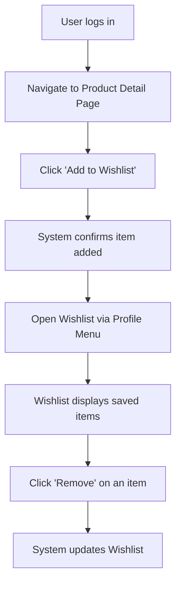

# Wishlist

## Introduction
- **Description:** The Wishlist feature allows users to save products they are interested in for future reference.  
- **User Goal:** Helps users track items they may want to purchase later without adding them to the cart immediately.  
- **Related Features:** Shopping cart, product detail page, user account management.

## User Story
- *As a registered shopper, I want to add products to my wishlist so that I can easily find and purchase them later.*

## Scope
- **Inclusions:**  
  - Add/remove items to/from wishlist.  
  - View wishlist items in a dedicated section.  
  - Persist wishlist across sessions (requires login).  
- **Exclusions:**  
  - Sharing wishlist with other users.  
  - Price alerts or notifications for wishlist items.  

## Dependencies
- Requires user authentication system.  
- Relies on product catalog API.  
- Integration with database storage.

## User Flow
1. User logs into their account.  
2. User navigates to a product detail page.  
3. User clicks "Add to Wishlist" button.  
4. System confirms item is added (toast notification).  
5. User can access wishlist via profile menu.  
6. Wishlist displays all saved items with product details.  
7. User can remove items by clicking "Remove" next to each product.  

## Acceptance Criteria
- Wishlist items persist after logout/login.  
- User can add/remove items with immediate feedback.  
- Wishlist displays accurate product details (name, price, image).  
- Maximum of 100 items can be stored per user.  

## Postconditions
- Wishlist data is stored in the user’s account.  
- System reflects updated wishlist across all devices.  

## Success Metrics
- Increase in repeat visits by 15%.  
- Higher conversion rate from wishlist to purchase (target: 20%).  
- Improved user satisfaction scores in post-purchase surveys.  

## Alternate Flows
- **Guest User:** If not logged in, system prompts user to sign in before saving.  
- **Out-of-Stock Item:** If item becomes unavailable, wishlist shows "Out of Stock" label.  
- **Deleted Product:** If product is removed from catalog, wishlist entry disappears with notification.  

## Edge Cases
- Duplicate entries: Prevent adding the same product twice.  
- Invalid product ID: System shows error message.  
- Network timeout: System retries request or shows "Unable to add item" message.  
