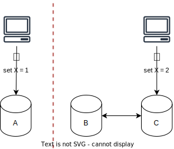
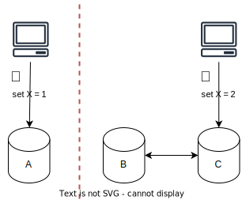

# CAP Theorem

## Overview

The CAP Theorem (aka Brewer’s Theorem) states that "when **network partitioning** occurs, a system cannot be both consistent (C) and available (A)".

It helps engineers understand the trade-offs when designing distributed systems.

> [!NOTE]
> A **Network Partition** refers to a break in the network that prevents communication between nodes in a distributed system.

**CAP** stands for:
1. **Consistency** (C): every read receives the most recent write (all nodes have the same data at any time)
2. **Availability** (A): every request receives a response (may not be the most recent data)
3. **Partition Tolerance** (P): system continues to operate even if communication between nodes is lost or delayed

## Sacrificing Consistency (AP)

Sacrifice strong consistency during a partition to ensure the system always responds.

The system continues to accept requests, but nodes cannot synchronize due to a network partition.

Some nodes may serve outdated data because they haven't received the latest updates.

If the system keeps accepting writes, they have to be resynchronized in the future. The longer the partition lasts, the more difficult this resynchronization can become.

> [!NOTE]
> In real life, because of network latency, replication is not instantaneous, meaning some users may still see old data even no network failure.

## Sacrificing Availability (CP)

Sacrifice availability during a partition to ensure all accessible data is consistent.

That means rejecting requests to remains consistent and partition tolerant (CP).

## How about AC system?

In theory, an AC system assumes that network partitions never happen, which is impossible in a distributed system. So CA systems are impossible.

> [!CAUTION]
> Some explanations tell you that you must pick two among Consistency, Availability, and Partition Tolerance. However, they are incorrect. In fact, in the theorem, Network Partitioning is assumed as a given condition you must accept, and your choice is only between consistency and availability.

## Example

Let's say we have a distributed system with three nodes: A, B, and C.

When a network partition occurs at node A, it cannot connect with the others.

Now, there are two requests sent to nodes A and C that update the same record with different values.

**Sacrificing Availability**: if the system favors consistency, it will fail both requests, putting the cluster in read-only mode.

**Sacrificing Consistency**: if the system favors availability, it will allow the updates, resulting in an inconsistent state.

When the network partition is resolved, we must address the conflict between nodes. Some strategies include:
- **Majority-based**: The record with the majority value is propagated to all nodes.
- **Timestamp-based**: The record with the latest timestamp is chosen.

## AP or CP?

The right choice depends on the business impact of temporary inconsistencies.

A system can mix AP and CP components depending on business requirements.

For example, in an E-commerce system:
- Listing products: Stale product listings are acceptable
- Inventory management: Selling an item that is out of stock would cause problems

Inventory System:
- If an inventory record is outdated by five minutes, is that acceptable?
- If yes, then an AP system might be the best choice. Users can still browse products, even if stock levels are slightly delayed.

Banking System:
- If a customer’s account balance is outdated, is that acceptable?
- No, because financial transactions require strict consistency. A CP system is necessary to ensure accurate balances, even if some requests fail during a partition.
