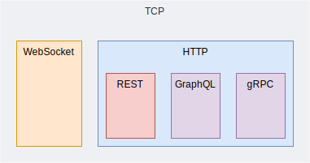

# TCP

## Overview

Transmission Control Protocol (TCP) is a network protocol used for transferring data across the internet.

TCP establishes a connection between the sender and receiver before data transmission begins. The process is known as **three-way handshake**.

TCP operates at the transport layer of the OSI model, working alongside the Internet Protocol (IP) to facilitate end-to-end communication over the internet.

TCP breaks down large data messages into smaller segments for transmission and reassembles them at the destination. For every packet sent, if the receiver doesn't acknowledge the packet, sender will transmit it again.

It’s widely used for applications like web browsing, email, and file transfers.

Pros:
- Reliable: data is delivered accurately
- Ordered: data is delivered in the correct sequence
- Error-checked: Each packet includes a checksum to inform the receiver if the packet is corrupted.

Cons:
- Slower than other protocols (e.g., UDP)
