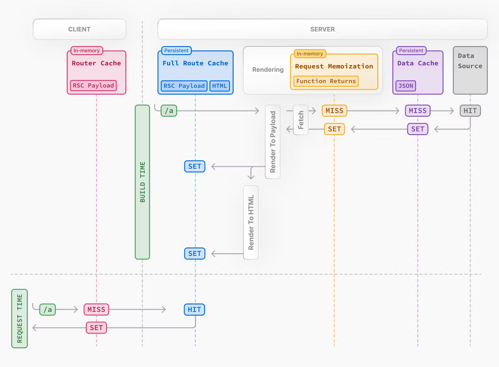

# Caching in Next.js

Next.js improves your application's performance and reduces 
costs by caching rendering work and data requests.

Most of Next.js' caching heuristics are determined by your API 
usage and have defaults for the best performance with zero or 
minimal configuration.

Here's a high-level overview of the different caching 
mechanisms and their purpose:

| Mechanism                                   | What                       | Where  | Purpose                                         | Duration                        |
| ----------------- | -------------------------- | ------ | ----------------------------------------------- | ------------------------------- |
| Request Memoization | Return values of functions | Server | Re-use data in a React Component tree           | Per-request lifecycle           |
| Data Cache          | Data                       | Server | Store data across user requests and deployments | Persistent (can be revalidated) |
| Full Route Cache   | HTML and RSC payload       | Server | Reduce rendering cost and improve performance   | Persistent (can be revalidated) |
| Router Cache     | RSC Payload                | Client | Reduce server requests on navigation            | User session or time-based      |

By default, Next.js will cache as much as possible, routes are 
statically rendered and data requests are cached unless you opt 
out.

