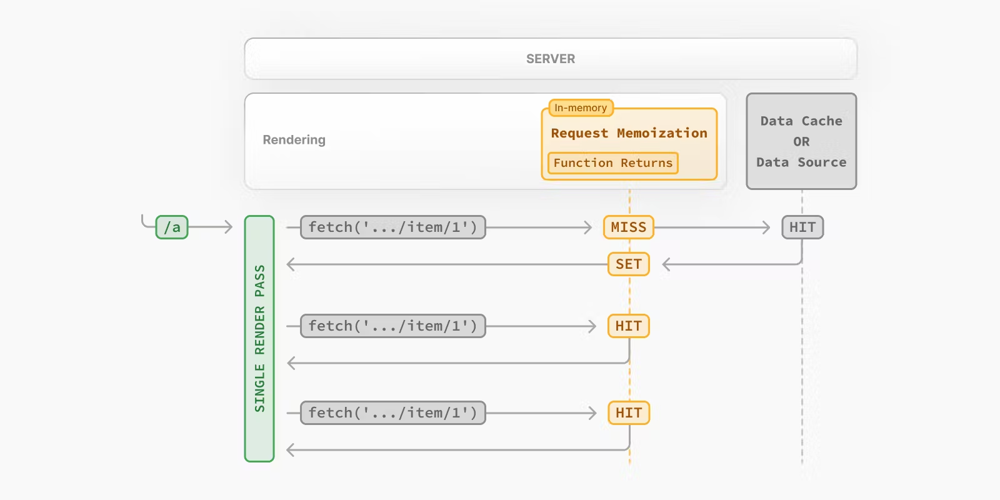

# Request Memoization

*In summary, cache result of concurrent `fetch` requests.*

React extends the `fetch` API to automatically memoize requests that have the same URL and options.

If you need to use the same data across a route, you can fetch data in the components that need it without worrying about the performance implications of making multiple requests across the network for the same data.

## How Request Memoization Works



- While rendering a route, the first time a particular request 
is called, its result will not be in memory and it'll be a 
cache `MISS`.
- Therefore, the function will be executed, and the data will 
be fetched from the external source, and the result will be 
stored in memory.
- Subsequent function calls of the request **in the same render 
pass** will be a cache `HIT`, and the data will be returned from 
memory without executing the function.
- Once the route has been rendered and the rendering pass is 
complete, memory is "reset" and all request memoization entries 
are cleared.

**Good to know:**

- Request memoization is a React feature, not a Next.js feature
- Memoization only applies to the `GET` method in `fetch` requests.
- Memoization only applies to the React Component tree, this means:
  - It applies to `fetch` requests in `generateMetadata`, `generateStaticParams`, `Layouts`, `Pages`, and other Server Components.
  - It doesn't apply to fetch requests in Route Handlers as they are not a part of the React component tree.
- For cases where `fetch` is not suitable (e.g. some database clients, CMS clients, or GraphQL clients), you can use the React `cache` function to memoize functions.

## Duration

The cache lasts the lifetime of a server request until the React component tree has finished rendering.

## Revalidating

Since the memoization is not shared across server requests and only applies during rendering, there is no need to revalidate it.

## Opting out

To opt out of memoization in `fetch` requests, you can pass an `AbortController` `signal` to the request.

```js filename="app/example.js"
const { signal } = new AbortController()
fetch(url, { signal })
```
