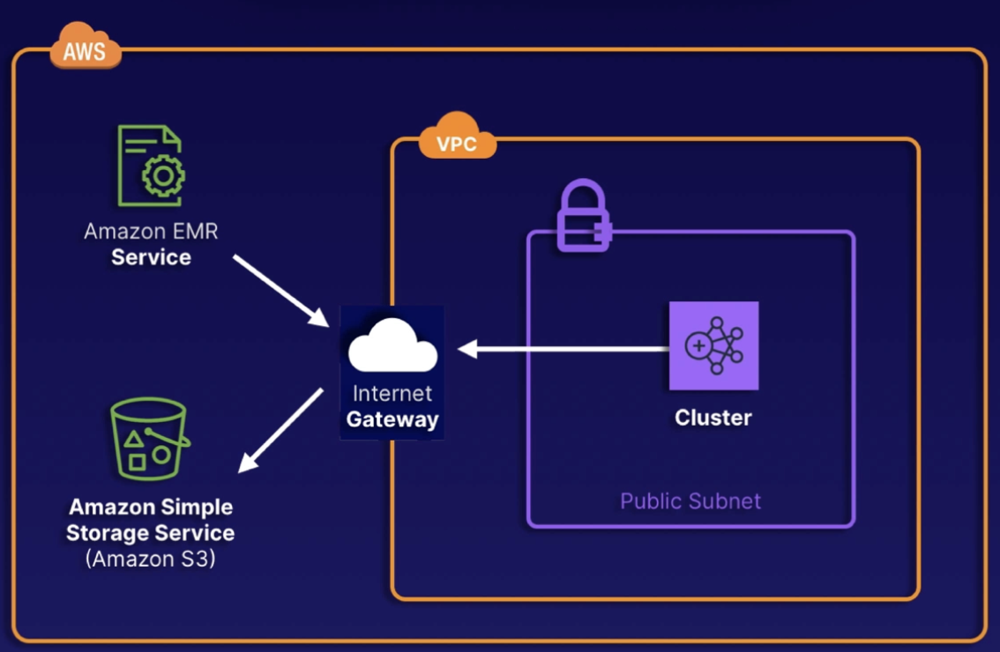

# Amazon EMR

## Overview

Amazon EMR is an AWS service to help with **ETL processing**.

EMR is a managed big data platform that allows you to process vast amounts of data using open-source tools, such as Spark, Hive, HBase, Flink, Hudi, and Presto.

EMR is made up of EC2 instances. You can employ EC2 instance cost-saving measures.

EMR requires a learning curve to operate the open-source frameworks that it uses.

## Use cases

- Large dataset processing (ETL)
- Web indexing
- Machine learning training
- Large-scale genomics
- Extract data from various sources, process it at scale, and make the data available for applications and users.
- Analyze events from streaming data sources in real time to create long-running, highly available, and fault-tolerant streaming data pipelines.
- Analyze data using open-source ML frameworks, such as Apache Spark MLlib, TensorFlow, and Apache MXNet.
- Connect to Amazon SageMaker Studio for large-scale model training, analysis, and reporting.

## EMR Storage

There are three different types of storage options within Amazon EMR:

- **Hadoop Distributed File System (HDFS)**: Distributed, scalable file system for Hadoop that distributes stored data across instances. 
Used for caching results during processing.
- **EMR File System (EMRES)**: Extends Hadoop to add the ability to directly access data stored in Amazon S3 as if it were a part of HDFS. 
S3 is typically used to store input and output data, not intermediate data.
- **Local file system**: Locally connected disk created with each EC2 instance. 
Instance store volumes only remain during the lifecycle of the Amazon EC2 instance.

## Clusters and Nodes

Clusters are groups of EC2 instances within Amazon EMR. Each instance is a node.

- **Primary Node**: manages the cluster, coordinates distribution of data and tasks, tracks health statuses.
- **Core Node**: runs tasks and stores data in Hadoop Distributed File System. For long-running tasks.
- **Task Node** (optional): ONLY run one tasks, with no storage on the system. Typically get ran using Spot instances.

Clusters can be either long-running, or they can be transient (a.k.a. temporary).

## Purchasing Options

The same EC2 purchasing options apply that are available for normal instances.

- **On-Demand**: Most reliable purchase option. Will not be terminated. Most expensive choice.
- **Reserved**: Just like other reserved instances. Minimum of 1 year. Offers great cost savings. Typically used for primary nodes and core nodes.
- **Spot**: Cheapest option available. Can be terminated with little warning. Typically used for task nodes.

## Sample architecture diagram

We have our cluster in our VPC and our subnet.

These clusters need access to the EMR service.

It is necessary for the cluster to have internet access or VPC endpoint access for proper management. The same connectivity requirements apply for using S3 via EMRFS.

Using internet access could result in high data transfer costs, so the article suggests using VPC endpoint whenever possible.

