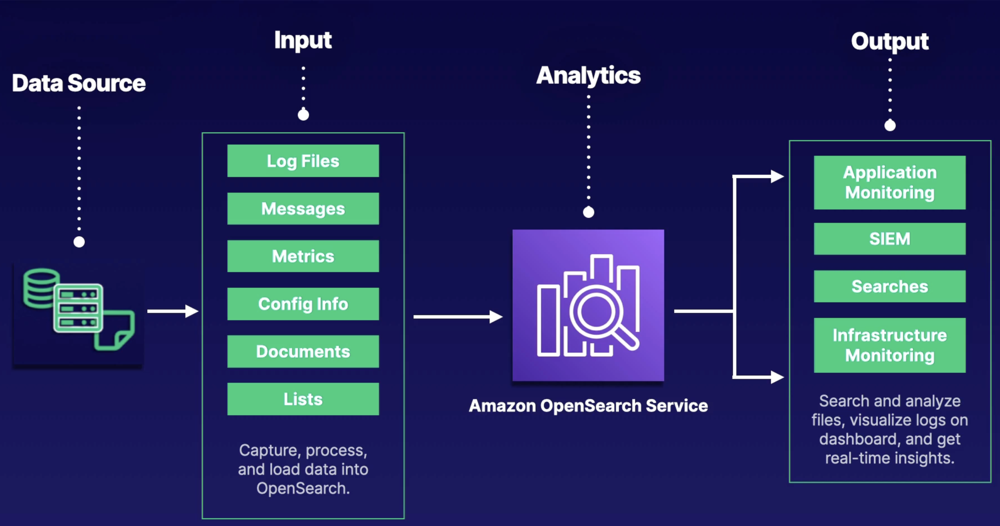

# Amazon OpenSearch

## Overview

OpenSearch is a managed service allowing you to run s**earch and analytics engines** for various use cases.

Primarily used for **analyzing log files** and various documents, especially within an ETL process.

Easily integrate with Amazon CloudWatch, AWS Cloud Trail, Amazon S3, and Amazon Kinesis.

Successor to Amazon Elasticsearch Service.

**Scalable**. You can easily scale cluster infrastructure running the open-source OpenSearch services.

**Secure**. It leverages IAM for access control, VPC security groups, encryption at rest and in transit, and field-level security.

**Stability**. It's multi-AZ-capable with several master nodes and automated snapshots.

**Flexible**. Allows for SQL support for business intelligence (BI) apps.

## Example Diagram

We have our data sources. They can be anything from logs, servers,

The we have input. After all of that data is semi-normalized,
we have our log files, our metrics, documents, configs,
whatever you want to capture, process, and load
into Amazon OpenSearch.

With that input, we have our analytics. Analytics are actually completed
in our OpenSearch service.

After we normalize or perform whatever analytics we want
we can output data for different things
like application monitoring,
we can search and analyze files and logs. Output can be passed to seam applications like Splunk or used for infrastructure monitoring.

## Tips

**OpenSearch ♥️ Logs**. If you're given a scenario on the exam that talks about creating a logging solution involving visualization of log file analytics or BI reports, there's a good chance OpenSearch will be included.
