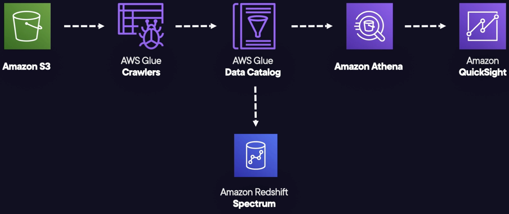

# Amazon QuickSight

## Overview

Amazon QuickSight is a fully managed, serverless business intelligence (BI) **data visualization** service.

It allows you to easily create dashboards and share them with specific users and groups.

Useful for business data visualizations, ad-hoc data analytics, and obtaining important data-based business insights

## Features

Integrates with Amazon RDS, Amazon Aurora, Athena, S3, and many more

Use SPICE: Robust in-memory engine used to perform advanced calculations and boost data analysis efficiency.

Enterprise offering lets you implement Column-Level Security (CLS), which is going to allow for better safeguarding of specific sensitive data.

Pricing is on a per-session and per-user basis!

You can create users for accessing QuickSight. Enterprise version allows you to also create groups. Users and groups only exist in QuickSight, not AWS.

Dashboards allow for stored configurations and filtering. Each user can have their own dashboard.

You can share dashboards and analysis results with specific users and groups. This enhances collaboration and information sharing. Shared dashboard users can see the underlying data.

## Architecture diagram

We have an S3 bucket with data for business intelligence needs.

Glue crawlers create data catalogs based on the crawl data.

We use Redshift Spectrum and Athena to catalog and query the data without loading it into a database.

QuickSight integrates with Athena, allowing us to build dashboards based on Athena queries.

