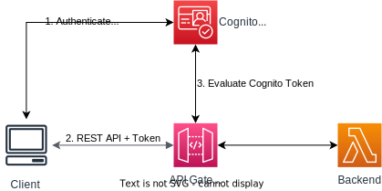
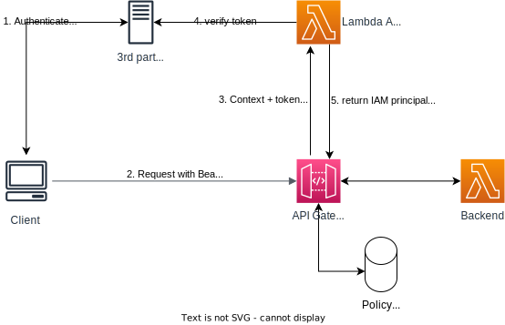

# Identity and Access Management

## Overview

There are several mechanisms for controlling access to an API:
- IAM Roles and Policies: useful for internal application
- Resource-based policies
- Cognito User Pools: identity for external users
- Lambda authorizers: custom logic
- IAM Tags
- Endpoint policies for interface VPC endpoints
- STS credentials

## IAM Identity-Based Policies

You need to create IAM policies and attach to users / roles.

This handle both authentication (by IAM) and authorization (by IAM policy).

This's an optimal way to protect your API if it's being accessed within your AWS account (EC2 instances, Lambda, IAM users, ...).

To pass IAM credentials to API Gateway, they need to be signed using AWS Signature Version 4 (SigV4) then placed into headers.

## Resource-Based Policies

JSON policy documents that you attach to an API to control who and what can access you API.

Use cases:
- Cross account access
- Allow access for IP address ranges or CIDR blocks
- Allow only for a VPC endpoints (in any account)

You can use resource policies for all API endpoint types in API Gateway: private, edge-optimized, and Regional.

## Cognito User Pools

Steps:
- The client authenticates with Cognito User Pools to obtain a connection token.
- The client includes this token in the API call to API Gateway.
- API Gateway verifies the token with Cognito User Pools to determine if backend access is permitted.

Cognito manages users, token expiration, authentication. No need to write custom code.

Authorization is handled in the backend.

## Lambda Authorizer (Custom Authorizer)

Use AWS Lambda to validate the bearer token passed in the header (JWT or Oauth).

On success, Lambda must return an IAM policy for the user (flexible), result policy is cached.

Lambda function handles authentication and authorization.

You still pay per Lambda invocation, result is cached..

Good for using OAuth, SAML or 3rd party authentication system.

