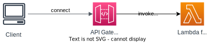

# API Types

## HTTP API

- Simple, low-latency, cost-effective
- Support Lambda proxy, HTTP proxy APIs and private integration (no data mapping)
- Support OIDC and OAuth 2.0 authorization, and built-in support for CORS
- No usage plans and API keys, resource policy
- Cheaper than REST APIs.


## REST API

- REST API is a collection of HTTP resources and methods that are integrated with backend HTTP endpoints, Lambda functions, or other AWS services.
- This collection can be deployed in one or more stages.
- Support all features (except Native OpenID Connect / OAuth 2.0)

You can find the differences between HTTP APIs and REST APIs at the [AWS official doc](https://docs.aws.amazon.com/apigateway/latest/developerguide/http-api-vs-rest.html).


## WebSocket API

WebSocket API enables two-way interactive communication between a user's browser and a server.

A WebSocket API is made up of routes, each identified by a route key, and integrated with a backend such as HTTP endpoints, Lambda functions, or other AWS services.

Here's how it work:
1. Client connects to WebSocket API through a WebSocket URL and establish a persistent connection, 
2. API Gateway receives the connection request and routes it to the `$connect` route and call integrated the Lambda function.
3. If the connection is successful, API Gateway establishes a WebSocket connection with the client and assigns a unique connection ID.
4. The client can now send messages to the WebSocket API.
5. API Gateway routes the messages to the appropriate Lambda functions or other backend services based on the route configuration.
6. The server can also send messages to the client using the connection ID.
7. When the client disconnects, API Gateway routes the disconnection event to the `$disconnect` route, where another Lambda function can handle cleanup tasks.



WebSocket URL Format:
```
wss://{unique-id}.execute-api.{region}.amazonaws.com/{stage}
```

### For Server

For server to send messages to client, it need to make a POST request (signed using IAM Sig v4) to the `@connections` endpoint:
```
https://{api-id}.execute-api.{region}.amazonaws.com/{stage}/@connections/{connection_id}
```

Other HTTP methods can also be used to interact with the `@connections` endpoint:
- `GET`: Get the latest connection status of the connected WS Client
- `DELETE`: Disconnect client


### Routing

Incoming JSON messages are routed to different backend.

If no routes are defined => sent to `$default` route

You can use a **route selection expression** to determine the destination route based on a field value from a JSON message. For example:
1. Route Selection Expression: `$request.body.action`
2. Example JSON Message:
   ```json
   {
     "action": "joinRoom",
     "data": {
       "roomId": "1234"
     }
   }
   ```
3. Routing Table:
   - `joinRoom`: Route to `joinRoomLambda`
   - `leaveRoom`: Route to `leaveRoomLambda`
   - `$default`: Route to `defaultHandler`
4. The message will be routed to `joinRoomLambda` Lambda function

• The result is evaluated against the route keys available in your API Gateway
• The route is then connected to the backend you've setup through API Gateway