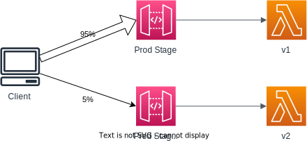

# Canary Deployment

## Overview

Canary deployment allows you to test new API versions by routing a small percentage of traffic to the new version while the rest goes to the existing version. This allow performing blue/green deployment for your API.

Canary deployments can be enabled for any stage (usually prod).

You can change the % of traffic the canary channel receives.

You can override stage variables for canary.

Metrics & Logs for canary are separated.

## Promoting a canary release

Once we're confident, you can promote the canary release to replace the current stage settings.

To disable a canary, you must remove the canary settings on the stage.

## Example

For example, our API Gateway routes to a backend Lambda function.

Currently, the PROD stage points to version 1. 

Our client wants to test a new version, so we'll create a canary deployment for version 2 in the PROD stage.

We will direct 5% of the traffic to the canary while 95% continues to go to the existing, stable PROD stage. This allows for testing the new version in a real-world environment while minimizing risk. If there are any issues with the new version, they will only affect a small portion of users. This approach helps in identifying and resolving potential problems before a full rollout. 

## Usage

To create a Canary release:
1. Go to the API Gateway console
2. Create and deploy the first version of your API
3. Select a stage, choose the **Canary** tab, click **Create canary**
4. Enter the percentage of traffic to be diverted to the canary and Save
5. With the canary release active, next time you deploy, a small percentage of your traffic will be routed to the new API version
6. Once you're satisfied with the canary release, you can promote it to production