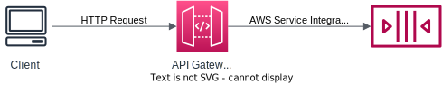
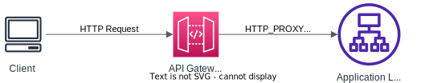

# Integration Types

## Overview

You can integrate API Gateway with your backend in different ways:
- MOCK Integration: for testing
- HTTP Integration: for HTTP endpoints or AWS Services
- AWS_PROXY Integration (Lambda proxy): for AWS Lambda

## MOCK Integration

API Gateway return a response without sending the request to the backend.

Useful for API development and testing.

## HTTP Integration

API Gateway allow to modify the request (to) and response (from) to the backend.

You must configure both the integration request and integration response.

You can set up data mappings using mapping templates to change the request & response.

### Mapping templates

Mapping templates can be used to modify request / responses:
- Rename / Modify query parameters.
- Modify body content.
- Add headers.
- Uses Velocity Template Language (VTL): for loop, if...
- Filter output results (remove unnecessary data).

To set the mapping templates you must set the `Content-Type` to `application/json` or `application/xml`

An example use case for Mapping templates is mapping JSON to XML to integrate client with SOAP API.

## AWS_PROXY Integration

The request from client will become the input to Lambda function.

Doesn't allow to modify request or response (proxy only).

The integrated Lambda function takes the input in a specified [input format](https://docs.aws.amazon.com/apigateway/latest/developerguide/set-up-lambda-proxy-integrations.html#api-gateway-simple-proxy-for-lambda-input-format) and return result follow the [output format](https://docs.aws.amazon.com/apigateway/latest/developerguide/set-up-lambda-proxy-integrations.html#api-gateway-simple-proxy-for-lambda-output-format).

## HTTP_PROXY Integration

API Gateway passes the incoming request from the client to the HTTP endpoint and passes the outgoing response from the HTTP endpoint to the client.

Doesn't allow to modify request or response (proxy only).

You can add HTTP headers.

