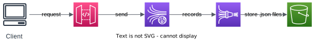
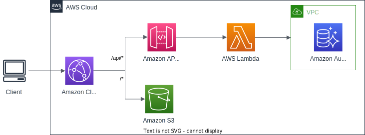
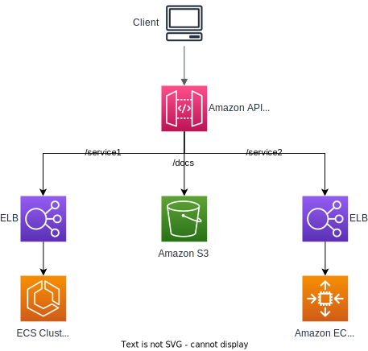

# Scenarios

Some examples of how API Gateway can be used.

## Sending data to Kinesis Data Streams

We want to have people send data into a Kinesis Data Streams in a secure way,

To do that, the clients will send HTTP request into the API Gateway. And it's been configured to then send the messages into a Kinesis Data Streams (we don't have to manage any servers).

Then from Kinesis Data Stream, we can send the records into a Kinesis Data Firehose and eventually put them into an Amazon S3 bucket in the JSON format.

## Serving static and dynamic content

Build a backend that serves static and dynamic content using serverless technology.

The HTTP request is sent from client to Amazon CloudFront. 

The CloudFront distribution leverages different backend services such as API Gateway and Amazon S3 for specific path patterns.

API Gateway is deployed and published to many different AWS Lambda functions that perform various functions including reaching into an Amazon Aurora database.

This allows for API Gateway to front internal private services and interact with those services that live within things like a VPC and a private subnet.

## Microservices

Create a single interface for all the microservices in your system.

You can set up an API with a single domain name and SSL certificates, seamlessly connecting it to various resources, all while keeping the underlying complexity hidden from your clients.

