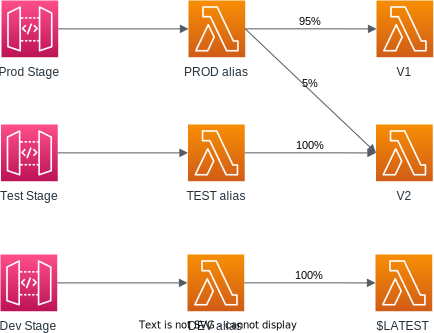
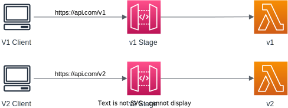

# Deployment Stages


## Stages

When we make changes in API Gateway, they were not effective until we do a deployment.

Changes are deployed to "Stages" (`dev`, `test`, `v1`, `v2`, ...).

Each stage has its own configuration parameters.

Stages can be rolled back since the history of deployments for each stage is kept.


A stage is a logical reference to a lifecycle state of your REST or WebSocket API (for example, ‘dev’, ‘prod’, ‘beta’, ‘v2’).

API stages are identified by API ID and stage name.


## Stage variables

Stage variables are like environment variables for API Gateway.

They are used to change configuration values withour re-deploying your API.

Stage variables can be referenced in:
- Lambda function ARN.
- HTTP endpoint.
- Parameter mapping templates.

The format to access stage variable: `${stageVariables.variableName}`.

Use cases:
- Dynamically configure HTTP endpoints your stages talk to (dev, test, prod etc.).
- Dynamically point to the right Lambda function.
- Pass configuration parameters to AWS Lambda through mapping templates.

Stage variables are passed to the "context" object in AWS Lambda.

### State Variables & Lambda Alias

We can create a stage variable to indicate the corresponding Lambda alias that will be invoked.

We have an API with different stages. Each stage points to the right alias and each alias will be redirecting to the right Lambda function version.



To do this:
1. When creating an API method, we specify the Lambda ARN with a stage variable refering to the Lambda function alias:
    ```
    arn:aws:lambda:<region>:<account_id>:function:<function_name>:${stageVariables.lambdaAlias}
    ```
2. Then assign appropriate policy to all function aliases. The command will be provided when you do the first step.


## Stage Configurations

When editing a stage, you can:
- Enable API cache to cache your endpoint's responses
- Enable API Throttling to limit the number of API call users can make
- Configure the firewall to protect your API
- Select the client certificate to verify HTTP requests are from API Gateway
- Set up logging with CloudWatch logs for errors, info, or full request and response logs (may display sensitive data)


## Breaking Changes

Handling API breaking changes with Stage.

We have the `v1` stage, and clients access our API through the `v1` URL.

We are developing a new version for the API that doesn't follow the `v1` format. Deploying changes to `v1` would break existing clients.

So we create a new stage: `v2`, with a new URL. Clients
can updated to `v2` by using the new URL, and we can maintain compatibility.

So for a while, the `v1` and `v2` can coexist together as two different stages.

We can migrate clients from `v1` to `v2` and eventually shut down `v1` when it's no longer in use.

