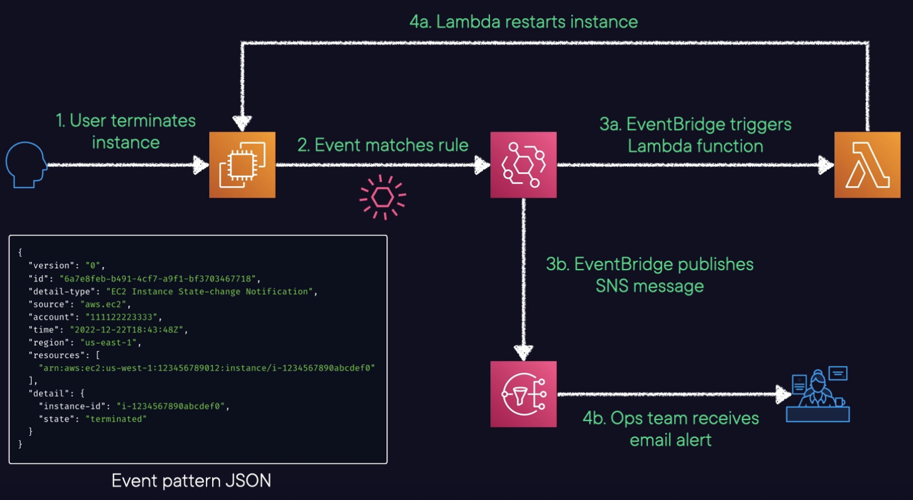

# Amazon EventBridge

## Overview

EventBridge is a **event bus** service that you can use to connect your applications with data from various sources. 

It's an extension of **CloudWatch Events**.

Allows you to **pass events from a source to an endpoint**.

It has a typical latency of about half a second.

It has limited throughput at launch, can be increased on request. 

It's the only event-based service that integrates directly with third-party SaaS AWS Partners.

It's the fastest way to respond to things happening in your environment.

## Features

Automatically ingests events from over 90 AWS services.

Can be used to schedule automated actions that self-trigger at certain times using cron or rate expressions.

Can match events and route them to one or more target functions or streams.

Support event transformation 

Support archive/replay and error handling/retry built in.

## Use cases

Applications that react to events from SaaS applications or AWS services.

Triggering Lambda functions when an AWS API call happens.

EventBridge is used by most AWS systems, which will send events to the default event bus that is in all AWS accounts.

## How it works

- Events are published to an event bus
- Rules are run on the events to find targets
- A target is a resource or endpoint that events are sent to

## Supported Targets

- HTTP endpoints
- Amazon SNS topics.
- Amazon SQS queues.
- Streams in Amazon Kinesis Data Streams.
- Delivery streams in Amazon Kinesis Data Firehose.
- AWS Lambda functions.
- Step Functions state machines.
- Amazon EC2 instances.
- AWS Batch jobs.
- Log groups in Amazon CloudWatch Logs.
- Amazon ECS tasks.
- Systems Manager Run Command.
- Systems Manager Automation.
- Pipelines in CodePipeline.
- CodeBuild projects.
- Amazon Inspector assessment templates.

## Concepts

**Events**: A recorded change in an AWS environment, SaaS partner, or one of your own configured applications/services. This also includes scheduled events.

**Rules**: Criteria used to match incoming events and send them to the appropriate targets. Based on either event patterns or schedules.

**Event Bus**: A router that receives events and delivers them to targets (destinations). Every account has a default bus, and you can create other custom buses for cross-account access.

## Rule Triggers

In EventBridge, you can set up rules to trigger actions
or workflows based on two primary types of rule triggers.

### Event Pattern

Define an event source and event pattern that will trigger your rule.

*Example: a trigger via an EC2 termination event. When the specified event pattern matches incoming events, the rule gets triggered. And then with that, any associated actions get executed.*

### Scheduled

Set up a recurring schedule for triggering your rule.

There're two types of scheduled rules:
- Rate-based: trigger at a fixed rate. Define using rate expression: `rate(1 hour)`
- Cron-based: You can specify precise dates, times,
and intervals for your rule triggers using cron expression. `cron(0 12 * * ? *)`

## Example

In the following example, an EC2 instance changes state (terminated) and the event is sent to EventBridge which forwards the event to the target (SQS queue).

## Example architecture

In this example we've configured an EventBridge rule that looks for EC2 termination event (the JSON event pattern look like below).

We set up this rule to trigger a Lambda function as well as send a message to an SNS topic containing specific information from this event.

The Lambda function may either restart the instance (or create a brand new one using the same AMI).

Our operations team receive an alert via an email that contains the details necessary for them
to go ahead and investigate.

