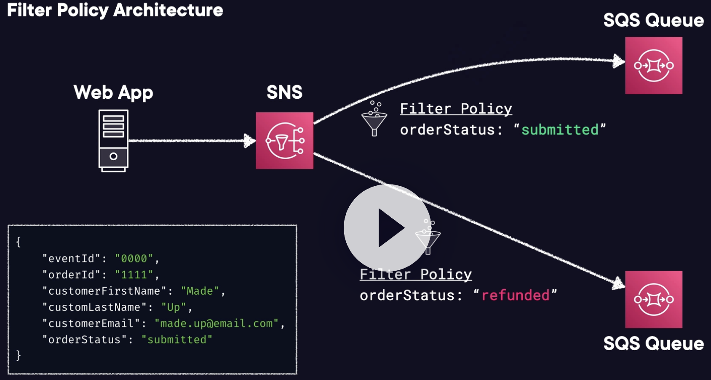

# Amazon Simple Notification Service (Amazon SNS)

## Overview

SNS is a fully managed **messaging service** for both application-to-application (A2A) and application-to-person (A2P) communication.

SNS is used for sending notifications between distributed systems, microservices, and event-driven serverless applications.

SNS is **push-based**: messages sent by a producer and arrives at a SNS Topic will immediately be sent to all consumers.

It can send notifications via SMS text message, email, SQS queues or to any HTTP endpoint.

It can also trigger Lambda functions.

Pricing follow pay-as-you-go model with no upfront costs.

SNS uses a pub-sub model whereby users or applications subscribe to SNS topics.

## Use cases

Recommended for applications that need to react to high throughput or low-latency messages.

Offers nearly unlimited throughput, ideal for scenarios with high message volumes.

Can be used for applications requiring high fan-out (sending messages to thousands or millions of endpoints).

## SNS Topics

A topic is an "access point" for allowing recipients to dynamically subscribe for identical copies of the same notification.

One topic can support deliveries to multiple endpoint types.

All messages are stored redundantly across multiple availability zones.

Provides instantaneous, push-based delivery.

Flexible message delivery is provided over multiple transport protocols.

## SNS Subscribers

When subscribing to an SNS topic the following endpoint types are supported:

- HTTP/HTTPS.
- AWS Lambda.
- Amazon SQS.
- Email/Email-JSON.
- SMS.
- Amazon Kinesis Data Firehose.
- Platform application endpoint (mobile push).

## SNS Fanout

Messages published to SNS topic are replicated to multiple endpoint subscriptions (including Amazon SQS queues, AWS Lambda functions, HTTPS endpoints, Amazon Kinesis Data Firehose). 

It allows for fully decoupled parallel asynchronous processing.

You can subscribe one or more SQS queues to a SNS topic. SQS manages the subscription and any necessary permissions. When you publish a message to a topic, Amazon SNS sends the message to every subscribed queue.

## Features

- **Message size**. Can be up to **256 KB**.
- **DLQ Support**. Messages that fail to delivered can be stored in an SQS DLQ.
- **Support FIFO or Standard**. FIFO only support SQS FIFO queues as a subscriber.
- **Encryption**. Messages are encrypted in transit by default, can enable "at-rest" via AWS KMS.
- **Access Policies**. define who can publish/subcribe to a topic, useful for cross account access.
- **Large Message Payloads**: It's a SNS Extended Library allows for sending messages up to 2 GB in size. The payload is stored in Amazon S3, then SNS publishes a reference to the object.
- **Delivery policy**: You can use a delivery policy to define how Amazon SNS retries the delivery of messages when server-side errors occur. **Only HTTP/S supports custom policies**.
- **Message Filtering**: allow defining JSON policies to define which messages get sent to specific subscribers based on contents and attributes of messages.

## Architectures for SNS Fanout

The Fanout scenario is when a message published to an SNS topic is replicated and pushed to multiple endpoints, such as Kinesis Data Firehose delivery streams, Amazon SQS queues, HTTP(S) endpoints, and Lambda functions. This allows for parallel asynchronous processing.

*For example, you can develop an application that publishes a message to an SNS topic whenever an order is placed for a product.*

*Then, SQS queues that are subscribed to the SNS topic receive identical notifications for the new order.*

*An EC2 instance attached to one of the SQS queues can handle the processing or fulfillment of the order. And you can attach another EC2 instance to a data warehouse for analysis of all orders received.*

## SQS vs. SNS vs. Kinesis

Check this [document](../app-integration/sqs.md#sqs-vs-sns-vs-kinesis-vs-mq).
