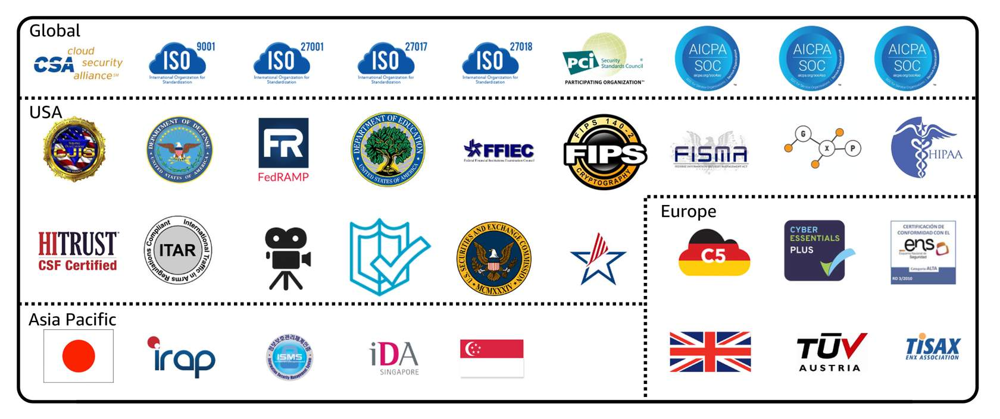

# AWS Artifact

## Overview

Artifact is a single source you can visit to **get the compliance-related information**, such as AWS security and compliance reports or select online agreements.

There are a huge number of **compliance reports** available, such as AWS Service Organization Control (SOC) reports, Payment Card Industry (PCI) reports, and GDPR reports, as well as other certifications (including ISO reports, HIPAA, and more).

Keywords: audits and the need for compliance reports

AWS Artifact consists of two main sections: AWS Artifact Agreements and AWS Artifact Reports.

## AWS Artifact Agreements

Suppose that your company needs to sign an agreement with AWS regarding your use of certain types of information throughout AWS services. You can do this through AWS Artifact Agreements. 

In AWS Artifact Agreements, you can **review, accept, and manage agreements** for an individual account and for all your accounts in AWS Organizations. Different types of agreements are offered to address the needs of customers who are subject to specific regulations, such as the Health Insurance Portability and Accountability Act (HIPAA).

## AWS Artifact Reports

Suppose that a member of your company's development team is building an application and needs more information about their responsibility for complying with certain regulatory standards. You can advise them to access this information in AWS Artifact Reports. 

AWS Artifact Reports provide compliance reports from third-party auditors. These auditors have tested and verified that AWS is compliant with a variety of global, regional, and industry-specific security standards and regulations.

The following are some of the compliance reports and regulations that you can find within AWS Artifact:

