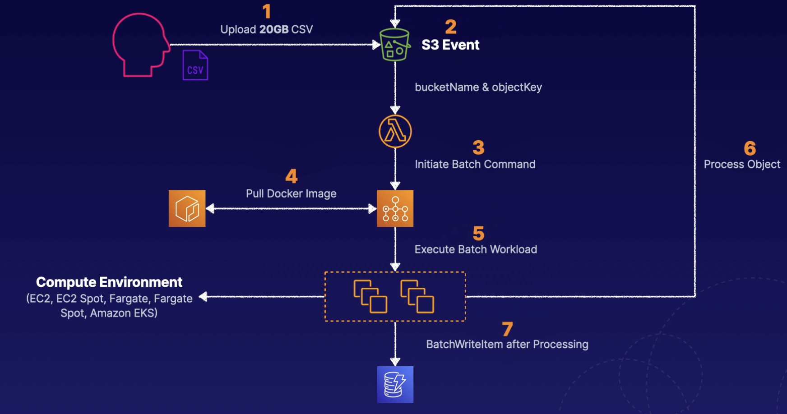

# AWS Batch

## Overview

AWS Batch is a managed service that allows you to run batch computing workload (on EC2 or Fargate).

AWS Batch dynamically provisions the optimal quantity and type of compute resources (e.g., CPU or memory optimized instances) based on the volume and specific resource requirements of the batch jobs submitted.

With AWS Batch, you simply package the code for your batch jobs, specify their dependencies, and submit your batch job.

Integrate with a broad range of popular batch computing workflow engines and languages (e.g., Pegasus WMS, Luigi, and AWS Step Functions).

## Components

**Jobs**: Units of work that are submitted to
AWS Batch (e.g., shell scripts, executables, and Docker images).

**Job Definitions**: Specify how your jobs are to be run (essentially, the blueprint for the resources in the job)

**Job Queues**: Jobs get submitted to specific queues and reside there until scheduled to run in a compute environment

**Compute Environment**: Set of managed or unmanaged compute
resources used to run your jobs

## Fargate vs EC2 (for compute environment)

### Fargate

- Recommended approach for MOST workloads
- Require fast start times (< 30 seconds)
- Require 16 vCPU or less
- Require no GPUs
- Require 120 GiB of memory or less

### EC2

- Need more control over instance selection
- Require GPUs
- Require Elastic Fabric Adapter
- Require custom AMIs
- High levels of concurrency
- Require access to Linux Parameters

## AWS Batch vs AWS Lambda

- **Time Limits**: Lambda currently has a 15-minute execution time limit. Batch does not have this.
- **Disk Space**: AWS Lambda has limited disk space. If use EFS, it requires functions live within a VPC.
- **Run time**: Lambda has limited runtimes. Batch uses Docker, so any runtime can be used.

## Architecture example

An S3 event is triggered when a user uploads a large CSV file that needs to be processed within the application.

The S3 event is configured to trigger a Lambda function, which submits a job to a queue within the batch service.

The batch compute environment and the job can pull a custom Docker image required to process the large document.

The compute environment can reference the object and the bucket using the job configuration that was sent and process data in different steps.

Once complete, the Batch service can run a batch write item command to store the processed data in a DynamoDB table.

