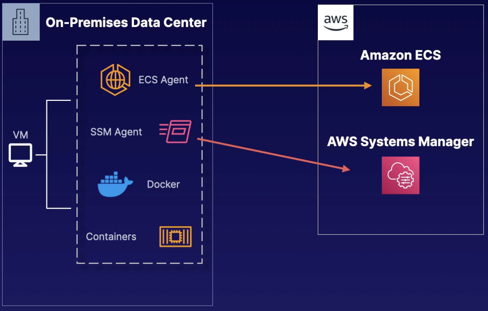

# Amazon ECS Anywhere

## Overview

It's a feature of ECS that enable you to run
and manage your container applications on-premises,
including your own VMs and bare-metal servers.

No need to install and operate local container orchestration software, meaning more operational efficiency.

You can utilize the same ECS APIs, cluster management, workload scheduling, and monitoring for all your container-based applications, ensuring a consistent operator experience. You can manage ECS cluster within the console, but all the hardware is running on-premises.

No ELB support for inbound traffic, that has to be handled separately.

It's known as the **EXTERNAL** launch type for creating your services or running tasks on your external instances.

## Requirements

You must have the SSM Agent, ECS agent, and Docker installed

You must first register external instances as SSM Managed Instances, by creating an installation script within the ECS console

You run these scripts on your external instances and servers. The scripts contain SSM activation keys and commands for installing required software above

After all, you deploy containers using the **EXTERNAL** launch type.

## Example architecture

We have on-premises data center with our VM, where we run ECS cluster.

First we install all of the agents: ECS Agent, SSM Agent, Docker. We configure those agents to communicate with our AWS accounts.

The ECS agent talk to Amazon ECS in our account, it' keeps track of what version you're on, your cluster status, etc.,

The SSM Agent is communicating with Systems Manager, which allows you to run your scripts and see them as managed instances within the console.

