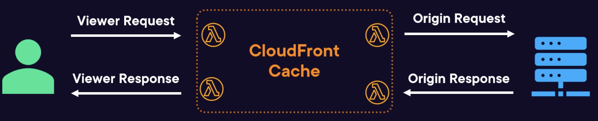

# AWS Lambda

## Overview

AWS Lambda lets you run code without provisioning or managing servers. Your application runs on servers that are managed by AWS.

You upload the function code in many supported programming languages. AWS Lambda then runs function code in response to events.

You can also set the required performance, concurrency limits, link directly to event sources, ...

Lambda is an example of Function-as-a-Service.

## Features

- Intergrates with numerous AWS services, including S3, DynamoDB, EventBridge, SQS/SNS, Kinesis.
- Bult-in monitoring. Logging and monitoring using CloudWatch.
- Memory requirement can be set up to **10,240 MB**.
- Support popular programming languages: Python, Golang, Java, Node.js, ...

## Use cases

Ideal for functions whose execution time is very low (under 100ms)

Data transformation: perform transformation on streaming data (data from Kinesis,...).

File processing: perform processing against a file when it is uploaded to an S3 bucket.

Website backend logic: using Lambda as a microservice
for the business logic of the app. A function can be invoked over HTTPS using Amazon API Gateway.

Processing IoT data: when IoT data is received, Lambda can be used to perform some analysis on the data and store them.

Scheduled tasks.

Handle events from AWS services, for example:
- Configure CloudWatch Events to invoke your function on a timer
- Configure Amazon S3 to invoke your function when an object is created
- Generating reports based on DynamoDB item changes (using DynamoDB streams to trigger).

On-demand Lambda function invocation using custom applications (mobile, web apps, clients) and AWS SDKs, AWS Mobile SDKs, and the AWS Mobile SDK for Android.

## When not to use Lambda?

Lambda isn't supposed to be a long running process. Maximum execution time is 15 minutes.

Constant workloads are also a bad fit (such as an API
receives thousands of requests a second at a constant rate, it's also not taking advantage of scaling of the Lambda service).

Extra large code base. The larger the code base, the longer time to load function's code.

Stateful applications. Lambda functions are stateless, you'll need to store the state externally.

## Anti-patterns

### Monolithic function

Where a Lambda combines a lot of different functionality (such as being responsible for a full e-commerce solution).

**Performance**: it increases the package size of a code base. The function takes longer to load and execute, which can impact performance and cost.

**Security**: difficult to enforce least privilege permissions. A single function handling multiple tasks require more permissions. This can potentially lead to security issues.

**Upgrades**:
- Difficult to change without affecting many code parts.
- Higher risk of introducing errors.
- Complicates deployment process.

**Maintenance**:
- Large codebases are challenging to manage.
- Understanding dependencies and interactions is tough.

**Testing**:
- Complexity hinders easy testing.
- Writing and maintaining tests is cumbersome and time-consuming.

**Best practices**:
create smaller focused functions each responsible for a single specific task.

### Recursion

A Lambda function is unintentionally triggered multiple times due to its own output.

**Best practices**:
Implementing safeguards in your code to check if the event that triggered the function was generated by the function itself.

### Orchestration

When a Lambda function implement complex workflow logic and perform orchestration task.

Complex workflows in a Lambda function make it harder to understand and maintain the code. It ties your Lambda function with other systems, making it difficult to change or upgrade individual components.

Complex workflows typically require retries and error handling, lead to further complexity, increase the chances of bugs.

**Best practices**:
Consider using services like AWSs step functions. This is designed to manage cross service workflows
enabling you to break your logic
into smaller and more manageable pieces
and improving overall maintainability and resilience.

### Chaining

When one lambda function invokes another synchronously. The first function is now waiting for the response from the next in the chain.

Increased latency and increased cost, cause each function invocation
is billed separately and each function is waiting on the next.

Increased potential for failure: one of the functions fails, the whole chain will fail.

**Best practices**:
Consider using asynchronous patterns, using services such as Amazon Event Bridge,
or Simple Queue Service. This can help reduce latency and improve fault tolerance
and make it much easier to maintain and debug your application.

## Lambda Function

The Lambda Function is the definition that will be initialized and called by the Lambda service, including:
- The function code
- Configuration of how to execute the code: RAM, CPU, permissions, ...

## Lambda Service

The Lambda service:
- Initializing and calling Lambda functions
- Handling inputs and outputs

It sits between the world and your code.

## Lambda@Edge

Lambda@Edge runs on Amazon CloudFront.

Amazon CloudFront serves content from hundreds of locations around the world. It hepls reduce latency by bringing content and processing closer to the users.

CloudFront supports simple JavaScript CloudFront Functions
and Lambda functions.

CloudFront Lambda functions:
- support Node.js and Python.
- can use more memory, longer compute time, network access and file access.
- have access to the request body.

### Use Cases
- Custom user Authentication and Authorization
- Analytics
- Dynamic Content, such as resized images
- Custom Routing and Redirection
- Request Normalization, can be used to increase cache hit ratio.

### How it work

When a request comes from the user (**Viewer Request**), the cache is checked.

If no object is found, an **origin request** is made to the origin web server.

The **Origin's response** is cached based on configuration before being returned to the viewer (**Viewer Response**).

Lambda@Edge functions can run on these request types.

### Usage
To use Lambda@Edge:
- Publish a version of a Lambda function in the `us-east-1` region.
- Add a function association to a distribution behavior, specifying the Lambda function and type of events to be triggered from.
- The function version will be distributed to the edge locations by CloudFront.

## S3 Object Lambda

Lambda can be used in S3 to modify objects as they're requested.

Use cases:
- Data format conversion: convert XML file to a JSON file
- Compression/decompression
- Sensitive data redaction
- Data augmentation: combining object data with data from elsewhere

S3 object Lambdas uses standard Lambda functions.

They can get invoked from GET, HEAD or LIST S3 requests.

They work by linking an S3 access point to a function. Clients need to use that new access point, which will start to invoke the function on each request.

## IoT Greengrass

If you are working with IoT devices and need local processing, then it's worth checking out.

This is a technology to bridge the gap between local Internet of Things devices and AWS services.

It can enable running logic closer to the IOT devices by using local Lambda functions. Including:
- Run machine learning inference locally from cloud-trained models.
- Carry on working even with poor Internet connectivity.
- Process sensitive data locally (no need to send to the cloud).

Lambda functions can be deployed to loT Greengrass. Functions run in a local containerized Lambda runtime on the device.

Functions need to be ported from the AWS Lambda service to Greengrass:
- The runtime must be supported and installed.
- Minimal changes need to be made to the code.

Two lifecycles are supported:
- On-demand (default)
- Long-lived: they are invoked when Greengrass starts. Can use for preparing data.

## Lambda on Snowball Edge

On a Snowball Edge device, you have the ability to run Lambda functions.

It's powered by AWS IoT Greengrass.

Use cases: processing and analyzing data locally, saving space, time and cost.

## References

- [AWS Lambda Deep Dive](https://learn.acloud.guru/course/e12e634c-c8bc-4721-ac6b-ea6da2509d49/)