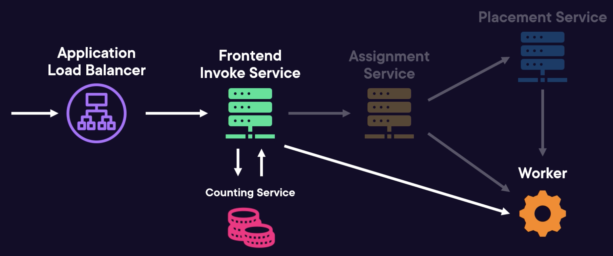
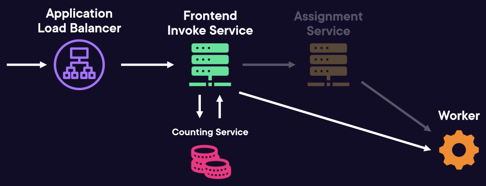
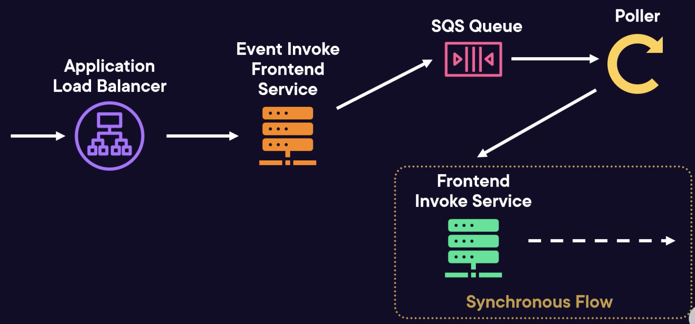

# Lambda Service Architecture

## Synchronous Invocation Flow

When an a synchronous invocation request is sent to AWS Lambda, it follows this path:

1. Hits an Application Load Balancer.
2. Routed to **Frontend Invoke Service** for:
   - Validation
   - Authentication and authorization
3. Interact with Counting Service to check quotas aren't being reached 
4. Passed to the Assignment Service to route invocation to an execution environment and function handler

For a new invocation:
1. Assignment Service contacts Placement Service to place new execution environment on a worker server
2. Worker sets up a new execution environment for the invocation
3. Assignment Service initialize the runtime and function
4. Frontend Invoke Service sends invocation to the handler

For subsequent invocations:
1. If an environment exists, Assignment service return the environment to the Frontend Invoke service
2. The Frontend Invoke service sends the invocation directly to the handler on the warm environment.

## Asynchronous Invocation Flow

For asynchronous AWS Lambda requests:

1. Request is received by the Application Load Balancer.
2. Directed to the Event Invoke Frontend Service for:
   - Validation
   - Authorization and authentication
3. Event is placed on an SQS Queue.
4. Pollers retrieve events from the queue.
5. Events go through the Frontend Invoke service to follow synchronous flow.
6. Response from invocations can be:
   - Re-queued for a retry
   - Sent to a predefined destination if configured.

## Frontend Service

Responsibilities:
- Validate requests.
- Perform authentication and authorization.
- Interact with the Counting Service to track concurrency quotas.
- Route requests using the Assignment Service or to SQS
Queues.

## Assignment Service

Responsibilities:
- Routes requests to workers
- Tracking running environments with an external distributed journal shared among different assignment services.
- Calls Placement Service to claim a worker for new execution environments
- Assigns requests to workers
- Return assignment back to the Frontend service

## Placement Service

- Finds optimal locations to place workloads using Machine
Learning models
- Provisions execution environments on workers and returns them to the Assignment Service

## Worker

The worker is the service that runs the functions.

Responsibilities:
- Creating execution environments
- Managing runtimes
- Managing resources like memory and virtual CPU

## Poller

- Consume events from queues and streams (internal queues, event source mappings).
- Trigger synchronous invocations through the frontend invoke service.
- Route results to Event Destinations.

## Firecracker

Firecracker is an open-source virtualization technology that uses micro virtual machines.

Has higher isolation and security compared to normal virtual machines.

Has the speed and efficiency of containers.

Allows workloads from multiple customers to run on the same underlying hardware.

Lambda used separate EC2 instances per customer.

A worker is a bare metal EC2 instance running many microVMs.
- A single server can host thousands of micro VMs.
- A microVM can be created in milliseconds.

The Firecracker microVM contains the Lambda sandbox (execution environment), which contains the function.