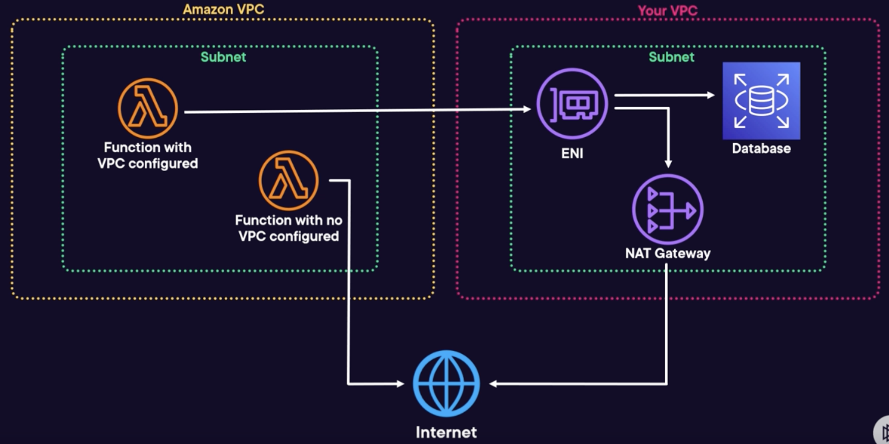

# Networking

## Lambda and Amazon VPC

Lambda functions by default cannot access resources within a VPC.

A Lambda function can be configured to route through a VPC.

To connect a Lambda to a VPC:
- Configure it in the **VPC configuration** section.
- Choose the VPC, Subnets and Security the Lambda should run across.
- If you don't select subnets spanning multiple AZs, the function won't achieve HA.

You can only connect a Lambda function to a single VPC.

Only connect to a VPC if you need to, as it can slow down function execution.

## Internet access

Lambda functions that is connected to a VPC will not have access to the Internet by default, because its network traffic is routed through your VPC now.

For this to work, a type of **elastic network interface** called Hyperplane ENI needs to exist within the VPC. This is created and managed by AWS with different subnets than the Lambda function.

Requests can be rooted to the ENI, then can be rooted to a NAT device, which act as a gateway to the internet.

If the VPC has no internet gateway or NAT device, then the Lambda won't have access to the internet.

Because this ENI is situated within the VPC, it can access other resources in the VPC, such as the database.

Note: for functions that don't need Internet, use VPC endpoints to access resources.

## Permissions

Lambda uses your function’s permissions to create and manage network interfaces.

To connect to a VPC, your function’s execution role must have the following permissions:
- `ec2:CreateNetworkInterface`
- `ec2:DescribeNetworkInterfaces`
- `ec2:DeleteNetworkInterface`

These permissions are included in the `AWSLambdaVPCAccessExecutionRole` managed policy.

## Performance

An ENI is created for each unique security group and subnet combination. They will be shared by multiple functions.

As this is a specific resource that needs to exist
in the subnet, it can take several minutes to provision
when the function is created.

After several weeks of inactivity, an ENI might be removed but it will be dynamically recreated after an invocation occurs.

Because it can take several minutes to be created, then invocations will fail until that recreation has completed.