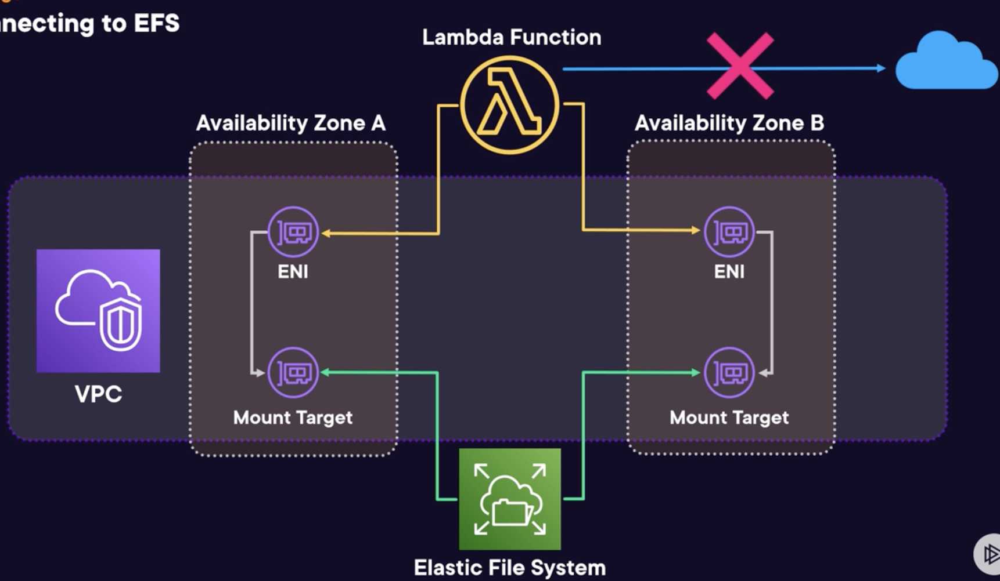

# Storage

## Directories

Within a Lambda function there are a few directories that are worth knowing about:
- `/var/task`: contains the Lambda package itself
- `/tmp`: for temporary storage, the only directory with write access
- `/opt`: contains files from attached Lambda layer

Some storage options for Lambda:

## Ephemeral storage 

Also known as temporary storage.

Available under the `/tmp` directory.

Size: 512 MB (default) to 10,240 MB. Costs are incurred for size above 512 MB.

Only persists during execution.

Can be configured under **General Configuration** section.

Use cases: transient data.

## EFS

Persistent, serverless, scalable file storage. No upfront size set up.

Uses network file system protocol for access.

Pay for the used storage.

Many performance and throughput mode can be chosen.

Strong data consistency and file locking.

Supports concurrent access.

Need to be mounted to a VPC through **Mount Target** Elastic Network interfaces.

To connect a function to EFS:
- The function need to be connected through a VPC. Since Lambda is connected to a VPC through Hyperplane **Elastic Network interfaces**. If both interfaces are in the same network, each having a local IP address, the connection can now be made.
- The function's execution role must also have
the correct permissions: `elasticfilesystem:ClientMount` and `elasticfilesystem:ClientWrite`

Use cases: shared storage persistently.

## S3

Persistent, object based storage, cost-effective.

Accessed by an API, typically through an SDK.

Doesn't require a VPC.

Use cases: used combination with the ephemeral storage to download and store processed files