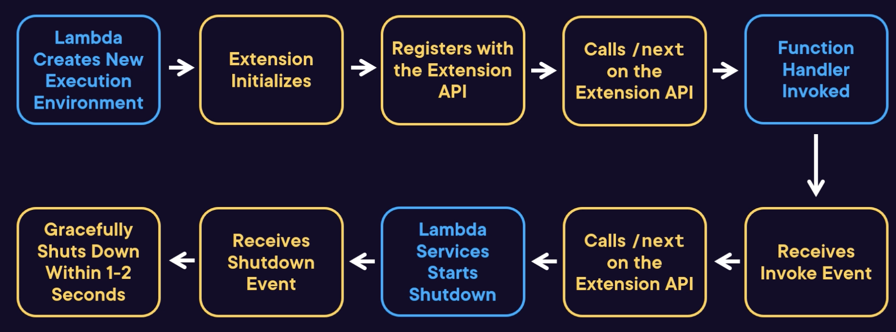

# Extensions

## Overview

It's a self-contained executable that runs outside of a function to add additional capabilities, usually reserved for long-running processes (Observability, Security, ...).

An extension can be deployed as a Lambda Layer, or included in the Dockerfile for container deployments.

It runs in the same environment as the function (execution role, CPU, memory, disk resources).

Any extensions within the `/opt/extensions` directory are started, if they are executable.

They can impact duration of the function.

Log output is sent to CloudWatch Logs.

There're two types:
- External: runs in the same execution environment but as a separate process to the runtime
- Internal: runs within the runtime process as a separate thread

## Example Extensions

- CloudWatch Lambda Insights: gathers system level metrics from the environment
- AWS Parameters and Secrets: for accessing systems manager's parameters.
- Amazon CodeGuru Profiler: offers profiling of your Lambda function code.
- Sentry: add error and performance monitoring to functions (third party)
- Datadog: similar solution for monitoring
- HashiCorp Vault: accessing HashiCorp Vault secrets.

## Extensions API

API that is exposed in the execution environment for extensions to integrate with.

It run as a HTTP API exposed on a local IP that is advertised as an environment variable:
- `http://${AWS_LAMBDA_RUNTIME_API}/2020-01-01/extension/`
- The date is the version of the API being used

The extension will receive invoke and shutdown events once registered.

API methods:
- `Register`: All extensions must register using this endpoint, passing the extension name and list of events to register for.
- `Next`: Used to advertise the fact that the extension is ready to handle a new event, the response will contain the next event details.
- `Initialization error`: Used to report that the extension initialization failed. Should include the reason for the error.
- `Exit error`: Used to report that the extension failed unexpectedly after initialization. Should include the reason for the error.

## Lifecycle

**Initialization Phase**:

1. **Execution Environment Creation**: Starts with Lambda creating a new environment upon invocation.
2. **Extension Execution**: The extension executable is located and executed, initiating the process.
3. **Registration**: The extension must register using the extension API.

**Ready State**:

4. **API Interaction**: After registration, the extension calls the `next` method on the API to signal readiness.

**Invocation Handling**:

5. **Function Handler Invocation**: Lambda invokes the function handler with the event.
6. **Event Receipt**: The extension receives the invoke event as a response to its previous `next` method call.
7. **Processing**: Any necessary processing is performed by the extension.

**Post-Invocation**:

8. **Ready for Next**: The extension calls the `next` method on the API again to prepare for possible further invocations.

**Shutdown Phase**:

9. **Idle Period**: If no further invocations occur after some time, Lambda begins shutting down the environment.
10. **Shutdown Event**: The extension receives a shutdown event.
11. **Graceful Termination**: Within 1-2 seconds, the extension should gracefully shut down, which may include flushing data to an external store.

**Extension Failures**: If an extension fails during initialization or invocation, then the Lambda service resets the execution environment.

## Telemetry API

The telemetry API is a separate API that can be used by extensions.

Can be subscribe to receive logs, metrics, or traces, by specifying one or more types they wish to subscribe to:
- Platform telemetry
- Extension logs
- Function logs

Data can be sent to the extension in either of two protocols:
- As an array of records in JSON via HTTP
- Newline delimited JSON via TCP

Buffering can be configured to control how often, and in what size, the batched data is received

Great for building extensions to gather telemetry data and send it to custom locations.

If the telemetry API is used then the extension needs to:
- Register the extension with the Extensions API.
- Start the listener, either the HTTP server or TCP listener.
- Subscribe to the type(s) using the Telemetry API.
- The listener receives telemetry data. It can then be processed.
