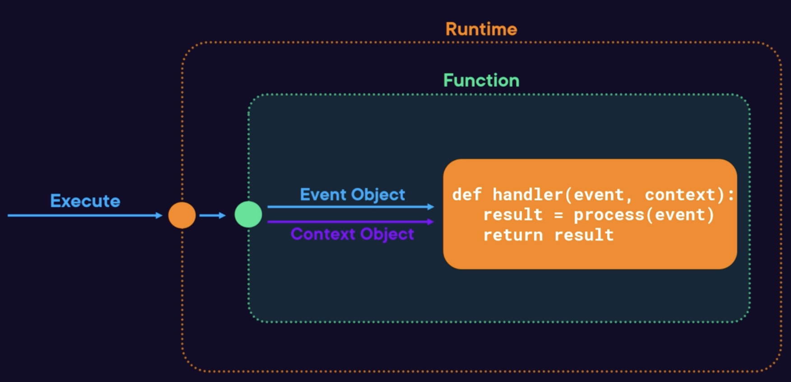

# Lambda Handler

## What is the Handler?

The function handler refers to the method
in your code responsible for processing events.

When the Lambda service invokes your function
it calls the handler to process the incoming event.



A handler in JavaScript:
```js
export const handler = async (event, context) => {
  console. log ('Event', event);
  const × = event.X;
  const y = event.y;
  return x*y;
}:
```
- You define the method to be executed in function configuration
- The method will be past the event object and the context object as arguments
- Any console output will be stored in a CloudWatch log group
- Within the body, input values from the given event can be accessed
- A value can be returned, back to the calling application, or a configured destination (if called asynchronous).


## Event Object

This is the data passed to the function when executed.

Format depends on the triggering system:
- From API Gateway, it includes headers, body, ...
- From SQS, it includes an array of records from the queue
- Can be custom if called directly

An example S3 object created event:
```json
{
  "Records": [
    {
      "eventSource": "aws:s3",
      "eventName": "ObjectCreated:Put",
      "s3": {
        "bucket": {
          "name": "makit-bucket",
          "arn": "arn:aws:s3:::makit-bucket"
        },
        "object": {
          "key": "myobject",
          "size": 512
        }
      }
    }
  ]
}
```


## Context Object

It provides information:

- Function name and version
- The Amazon CloudWatch log group and stream name
- Memory limit allocated to the function
- Mobile application context, such as the authenticated Cognito identity
- A function that can be called to get the remaining time left (milliseconds) until the Lambda times out

Example of a context object:
```json
{
  "functionVersion": "$LATEST",
  "functionName":  "example",
  "memoryLimitInMB": "128",
  "logGroupName": "/aws/lambda/example",
  "logStreamName": "2023/05/02/[$LATEST]b8a626fe483468d86eb11798061d4",
  "invokedFunctionArn": "arn:aws:lambda:us-east-1:901952209192:function:example",
  "awsRequestId": "c285ccd7-24ef-4d58-899b-37dc4ccc62"
}
```


## Return values

A return value is optional.

For synchronous executions:
- The result is returned to the calling application.
- Some runtimes support response streaming.

For asynchronous executions:
- The result is sent to a configured destination.
- If no destination is configured, then it is lost.


## Outside the Handler

Outside the handler method can be very important for initialization.

Step one:
- When a function is executed for the first time
- Modules are imported, class constructors are ran, global variables are initialized
- Allows you to create any dependent resources: database connections, secrets, ...

Step two:
- the handler is now executed
- it can make use of the resources constructed in step one: make call
to the database using the initialized connection

Step three:
- Lambda can reuse environment environment for next invocations
- Resources constructed outside of the handler in step one can still be available
- Be really careful with this