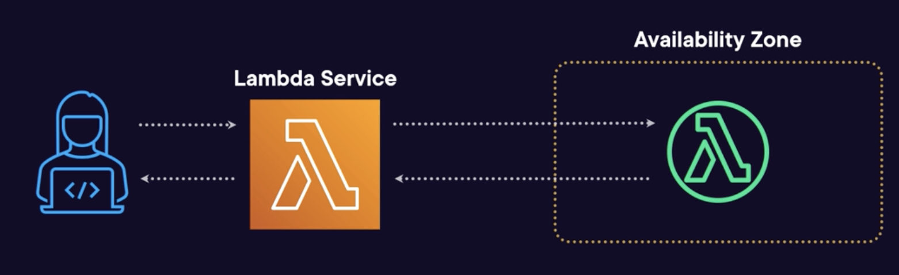
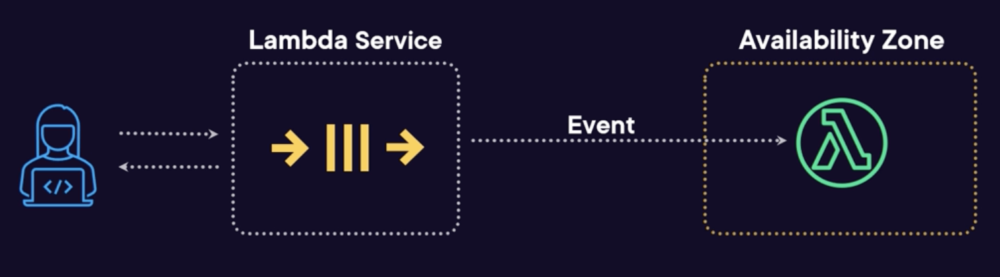
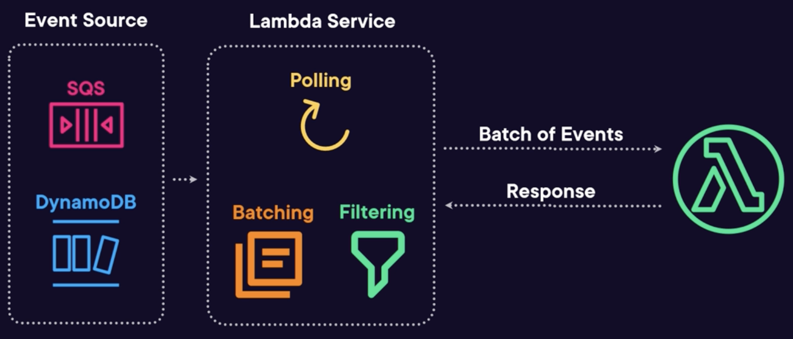

# Invoking Lambda Function

Invocation models are the different ways a function can be called.

## Synchronous invoke

The calling code pauses and waits until a Lambda function returns a result.

Examples: invoke a function through the console.

### Invocation flow
- The invocation request is sent to the Lambda service
- The service initializes the function within an AZ, passing the event for it to handle
- The response from the function is returned to the service
- The service packages up response with information about the invocation and then return it to the calling code

### Invocation Result
- Status Code: 200 for a successful invocation
- Executed Version: Version of the function that was executed
- Log Result: Last 4 KB of the execution log in base64 encoding
- Function Error: If present, then an error occurred
- Response Body: Response payload from the function, or error object

There're two types of error to be aware of:
- Invocation errors:
  - errors from the Lambda service (function isn't invoked yet)
  - Errors when the invocation is rejected
  - Permissions, throttling, or invalid JSON input
  - Returns a 4xx or 5×x status code
- Function erros:
  - invocation occurred, but the function failed.
  - Errors when the function or runtime returns an error
  - Code errors, timeouts, or invalid JSON output

### Integrations
Services that use synchronous invocation pattern:
- Amazon Cognito: use Lambda to do custom validation on authentication or signup activities
- API gateway: Lambda can handle requests or performing custom authentication
- Amazon CloudFront: customize content at edge locations
- Application Load Balancer: handling HTTP requests
- AWS Batch: run batch processing jobs against S3 objects
- Amazon Kinesis Data Firehose: perform data transformation using Lambda

### Function URLs
Function URLs is a native way to invoke a Lambda via HTTP.

These are a HTTP/HTTPS endpoint that points to the `$LATEST` function or an alias.

Support IAM authentication natively or publicly.

Has CORS options that can be configured to allow requests
from different origins.

Can not be used in a private VPC.

No extra cost! Great for simple microservices with no need for API Gateway.

Can be set up under **Function URL** configuration section.

## Asynchronous invoke

### Invocation flow
- The request is sent to the Lambda service
- The service store that request in an internal SQS queue and return an immediate response and the calling code can continue
- Lambda service pull the queue and initialize the function
within an AZ, passing the event for it to handle.
- The result can be sent to a configured destination on a failure or success

Supported destinations:
- Simple Notification Service topics
- Simple Queue Service queues
- Lambda functions
- EventBridge event buses

### Destinations

You can route asynchronous function results as an **execution record** to a destination resource without writing additional code.

An execution record contains details about the request and response in JSON format, including:
- version
- timestamp
- request context
- request payload
- response context
- response payload.

For each execution status such as **Success** or **Failure** you can choose one of four destinations:
- SNS
- SQS
- EventBridge
- another Lambda function

Lambda can also be configured to route different execution results to different destinations.

On-Success:
- When a function is invoked successfully, Lambda routes the record to the destination resource for every successful invocation.
- You can use this to monitor the health of your serverless applications via execution status or build workflows based on the invocation result.

On-Failure:
- Destinations gives you the ability to handle the Failure of function invocations along with their Success.
- When a function invocation fails, such as when retries are exhausted or the event age has been exceeded (hitting its TTL),
- Destinations routes the record to the destination resource for every failed invocation for further investigation or processing.
- Destinations provide more useful capabilities than Dead Letter Queues (DLQs) by passing additional function execution information, including code exception stack traces, to more destination services.
- Destinations and DLQs can be used together and at the same time although Destinations should be considered a more preferred solution.

### Integrations

Services that use asynchronous invocation pattern:
- Amazon S3: a Lambda function can be invoked when an item is added to a bucket
- Amazon SNS: a Lambda function can be subscribed to a topic
and handle messages when they're published.
- AWS Config: a Lambda function can be invoked when a resource is changed
- AWS IoT: invoke a Lambda function with the IoT data when it's received.
- Amazon Simple Email Service: where a received email can trigger a Lambda function with the email details
- Amazon EventBridge: a Lambda function can be invoked
when matching events go through an event bus.

### Event Source Mappings

Event source mappings connect events from certain services to Lambda functions.

A way to run Lambda function against events from sources without needing to write custom polling code.

- An event source is configured in the Lambda service
- The Lambda service will:  
  - Read events from the sources
  - Perform batching of the events together
  - Filter events based on your configuration
  - Initialize functions and invoke them with the events as an input.
  - Retry failures
- Response of these executions can then be rooted
to an output service (SNS topic, SQS Queue, ...)

#### Sources
The following services use event source mappings to invoke Lambda functions:
- Amazon DynamoDB
- Amazon Kinesis
- Amazon MQ
- Amazon MSK
- Amazon SQS
- Amazon DocumentDB

#### Batching

Items from the source are sent to the function in a batch. This can be configured by:

Batch size:
- The maximum number of records in a batch
- Between 1 and 10,000 (10 for FIFO queue)
- Default is between 10 and 100, depends on the source
- Batch payload can be up to 6 MB

Batching window:
- Maximum amount of time to gather records for the batch
- Between 0 and 300 seconds (5 minutes)
- Could optimize the processing quite a lot, to save on processing many small batches in a short space of time.

#### Filtering

Filtering controls which records are sent to the
Lambda function.

By default, 5 filters are supported, but the
quota can be increased to 10.

Filter patterns are expressed as JSON.

If an event doesn't match the filter, it won't be sent to the function.

Supports null/empty/exists checks, equals, and/or/not, range and prefix checks.

Rules are case-sensitive, numbers are treated like strings.

#### Permission

Lambda service needs permissions to access the source:
- SQS: `ReceiveMessage`, `DeleteMessage`, and `GetQueueAttributes`
- DynamoDB Streams: `DescribeStream`, `GetRecords`, `GetShardIterator` and `ListStreams`

## Invocation Issues

If you are having invocation issues, check the permissions on the role or account which is doing that invocation:
- Ensure they have `lambda:InvokeFunction` permission.
- Also check if there is a resource-based policy
on the function.

Try using AWS CloudTrail to see the API calls being made. It's a great way to find permission-related problems.

Watch out for concurrency limits. These can be account or function quotas and that includes burst concurrency. In that cases, try slowing down the events into the function by using a queue or a stream.