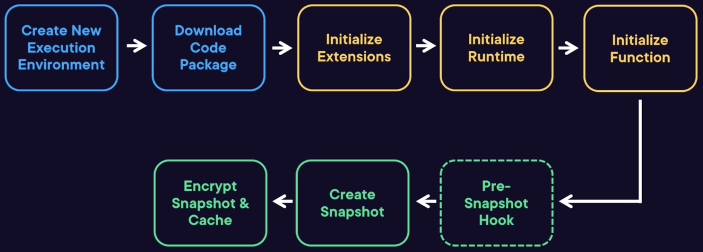

# Lifecycle

## Overview

When the Lambda service first invoke your function, it will:
1. Create new execution environment (micro VM)
2. Download code package and layers
3. Initialize Extension
4. Initialize Runtime
5. Initialize Function: code outside of the handler, static variables, constructors, ...
6. Invoke Function Handler
7. Freeze environment: pause any background processes, persist values in memory and ephemeral storage

If an invocation occurs soon after, the Lambda service will:
1. Thaw (unfrozen) environment
2. Invoke Function Handler again

Until the function is not invoked in a while (or ...):
1. Shutdown Runtime
2. Shutdown Extension

## Function Errors Lifecycle

If the handler error:
1. Reset runtime: initialized variables will be lost
2. Shutdown Extension
3. Freeze environment

For the next invocation:
1. Thaw environment: environment will be unfrozen
2. Initialize Extension: initialization will occur again
3. Initialize Runtime
4. Initialize Function
5. Invoke Function Handler

## Initialization process

No billing occurs for the first 10 seconds of the initialization process.

Initialization happens:
- Immediately after publish for provisioned concurrency functions
- On invocation when no environments are available (cold start)
- Proactively by the Lambda service

Lambda will keep initialized environments ready to handle more requests.

## Freezing and Thawing

After invocation, the environment is frozen, waiting to be used again. Callbacks/threaded tasks are paused.

When environment is unfrozen, callback and and background tasks will resume.

## Shutdown phase

The runtime is terminated. If it doesn't respond, it is forced to immediately terminate.

Extensions are sent a `Shutdown` event to allow them to shut down cleanly.

For functions with external extensions, the shutdown phase must complete in two seconds. For functions with only internal extensions, it's 500 milliseconds.

## Cold and Warm starts

Cold starts is an invocation when the service must initialize a new execution environment.

Cold starts can be slow for large functions and certain runtimes.

Warm starts is an invocation when the service can thaw an existing execution environment (no downloading of code, no running of initialization).

Cold starts include a set of stages in the lifecycle:
1. Create new execution environment
2. Download code package and layers
3. Initialize Extension
4. Initialize Runtime
5. Initialize Function

Warm starts include:
1. Thaw an existing environment
2. Invoke Function Handler

Typically, more than 99% of invocations are warm starts in a production environment.

### Best practices

To make the most of warm starts, getting as much work done as possible in the initialization process:
- Load external libraries.
- open databaso connections
- Load configuration and secrets.
- Use the ephemeral storage (`/tmp` directory) as a local cache for files, static assets.
- initialize SDK clients and database connections outside of the function handler

Reduce package size: Less dependencies and smaller, more targeted functions can help.

Always use local scoped variables unless this is desired behavior (caching global values such as configuration).

Don't use the execution environment to store user data, events, or other information with security implications.

Careful of using anything scoped outside of the handler.

You can also try lazy-loading configuration values, secrets, and database connections instead of loading during initialization.

## SnapStart

SnapStart is a feature of Lambda that causes Lambda initializes the function at publish, rather than during cold-start invocation

After The function is initialized, a snapshot is created of the memory and disk state. This is encrypted and cached.

When a cold-start invocation occurs, the environment is restored.

No extra cost.

If the function is not invoked for 14 days then snapshots are deleted.

### Reasons
Reasons why this feature exist?
- Java initialization is slow
- Improve Cold Start Time: cold start invocations could be up to 10x quicker

### Limitations
- Only supports Java 11 (and later) runtimes.
- Supports limited ephemeral storage
- Cannot be used with provisioned concurrency

### Lifecycle

- After initialization, a pre-snapshot hook (`beforeCheckpoint`) is run for any extra initialization
- All initialized state is frozen and stored in a snapshot
- Snapshot can be encrypted and cached in the Lambda service for retrieval

Invocation Lifecycle:

- When an invocation occurs, snapshot can be retrieved and restored into a new environment
- Post-snapshot hooks (`afterRestore`) can be run to re-initializing out of date values
- Event can be sent to the handler

SnapStart is enabled under the **General** configuration.

### Best practices

Make sure that any network connections that might have been opened
during initialization are reestablished:
- They could be closed by the time the snapshot is restored
- This can be done with a hook or normal code

Ensure that all preloading is done sensibly:
- Preloading may speed up invocation, but snapshots might be out of date for functions that aren't released often
- For example, a secret from Secrets Manager has been rotated or a feature flag has been flipped

Be careful with uniqueness:
- The restored state is identical for each invoked function
- For example, pseudo random number generation, generated identifiers