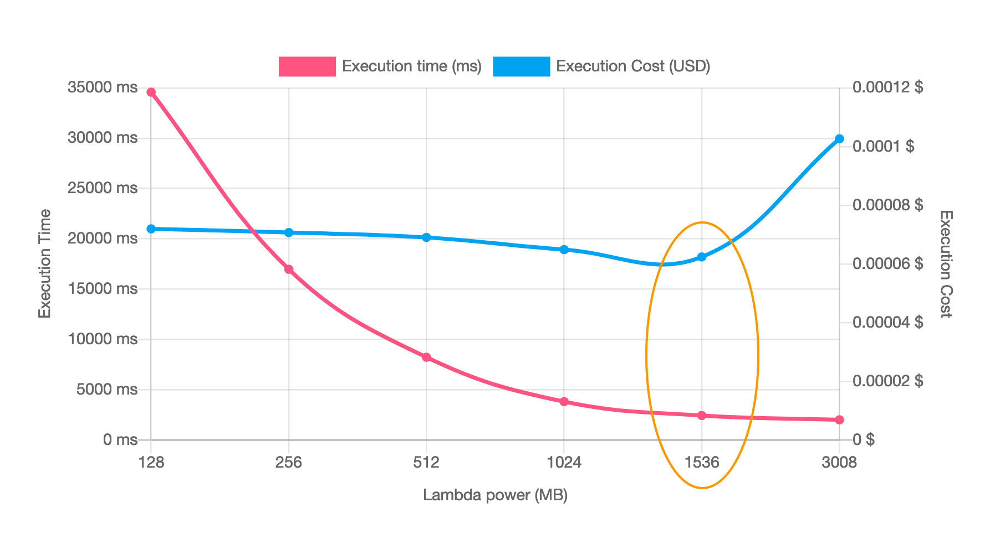

# Pricing

## What are charged?

### Number of requests & Duration

Pay per calls.
- First 1 million requests are free
- \$0.2 per 1 million requests thereafter ($0.0000002 per request)

Pay per duration (in increments of 100ms):
- 400,000 GB-seconds of compute time per month FREE:
  - = 400,000 seconds if function is 1 GB RAM
  - = 3,200,000 seconds if function is 128 MB RAM
- After that, $1.0 for 600,000 GB-seconds

ARM architecture costs less than x86.

### Ephemeral storage

Pay for amount used above the default 512 MB

Every 1 MB above 512 MB is charged for every GB-second of duration (on top of the normal duration costs).

### Provisioned concurrency

Cost for having environments provisioned and waiting to handle requests

Charged for the time between when it is enabled and disabled but rounded up to the nearest five minutes.

Price is based on the amount of memory allocated, and architecture (ARM is cheaper).

Invocation duration is charged at a smaller rate than standard, unless the concurrency is exceeded.

The free tier includes no provisioned concurrency.

### Response streaming

Charged per gigabyte written to the response stream.

A small amount is included in the free tier. The first 6 MB has no additional cost either.

### Data transfer (in general)

Data transfer between Lambda and certain services within the same region are free:
- Includes S3, DynamoDB, SQS, SNS, and more
- Outside of the specific services, data transfer in the region is charged at a set rate

Data transfer out to the Internet is charged based on tiers:
- Includes a free tier
- After that, the price decreases at higher TB levels
Data transfer out to other regions is charged depending on the region.

### Indirect costs

**Amazon CloudWatch Logs** that store console output of Lambda function. It's always worth setting up a TTL in CloudWatch,
so these aren't kept indefinitely.

**VPC resources**: NAT gateway, VPC peering...

**Monitoring Tools**: AWS X-Ray, Amazon CloudWatch Metrics, etc.

**Requests to other services**: SQS polling, DynamoDB, S3, etc.

## Estimate your cost

You can use the AWS Lambda Pricing Calculator to get a detailed [estimate](https://aws.amazon.com/lambda/pricing/#AWS_Lambda_Pricing).

Example pricing for a personal application:
- Region: Asia Pacific (Singapore)
- Include Free Tier
- Architecture: Arm64
- Number of requests per month: 500
- Duration of each request: 9 seconds
- Memory: 256 MB
- Ephemeral storage: 512 MB
- **Monthly compute charges: 0.00 USD**
- **Monthly request charges: 0 USD**
- **Monthly ephemeral storage charges: 0 USD**
- **Lambda costs - With Free Tier (monthly): 0.00 USD**

## Cost Monitoring

Tag resources appropriately and use AWS Cost Explorer to drill down and find where costs are.

Set up a CloudWatch dashboard with graphs of Lambda metrics, tracking duration, invocations, ...

CloudWatch alarms can be added to key metrics for email alerts.

Track cost at an account level: Use billing alarms, set up budgets, and try Cost Anomaly Detection to keep cost under control.

## Optimize cost

You can save on AWS Lambda costs by signing up for a Compute Savings Plan. A Compute Savings Plan offers lower compute costs in exchange for committing to a consistent amount of usage over a 1-year or 3-year term.

### Guide

Choose an appropriate **memory configuration** to minimize duration. More doesn't always mean faster, and less doesn't always mean cheaper.

AWS **Lambda Power Tuning** can be used to test different configurations.

The **AWS Compute Optimizer** can make recommendations.

Choose an appropriate **ephemeral storage** amount. The default amount is available at no extra cost.

**Initialize outside the handler** as much as possible. Initialization is free up to 10 seconds, and quicker handlers mean less cost.

Use **asynchronous code** when waiting, avoid blocking, and run tasks concurrently.

Try **ARM and x86**. ARM is cheaper per GB-second, but one of the architectures may be quicker for the workload.

If using **event source mappings**:
- Test different batch sizes. Balance it with concurrency limits and acceptable processing times
- Use filtering to avoid needless invocations.

*It's probably not a good idea to run a function with a batch of one item if another few will arrive in a couple of seconds*

Use keep-alives on **persistent connections** and consider RDS proxy for databases.

For API Gateway sources, utilize **caching and rate limits**. Add AWS Web Application Firewall (WAF) to resist abuse.

If using **provisioned concurrenc**y, then use Application Auto Scaling to keep the provisioning at the correct level.

Try **SnapStart** if initialization is slow. It may even be able to replace provisioned concurrency.

Set up **concurrency limits** to ensure they don't ramp up too high.

Use **Compute Savings Plans** for applications that have fairly consistent invocation traffic.

### AWS Lambda Power Tuning

AWS Lambda Power Tuning is an open-source tool that helps find the most optimal memory and CPU allocation for your lambda functions.

It runs in your own AWS account, and it supports three optimization strategies: cost, speed, and balanced.

To work with AWS Lambda Power Turning, you provide a Lambda function Amazon Resource Name (ARN) as input. It then invokes that function with multiple power configurations. Then, it analyzes all the execution logs and suggests the best power configuration to minimize cost or maximize performance.

AWS Lambda Power Turning also supports cross-Region invocations, and you can enable parallel execution to generate results in a few seconds.

> For example, the following diagram shows results for two CPU-intensive functions, which become both cheaper and faster with more power.

### AWS Lambda Powertools

AWS Lambda Powertools helps you optimize your Lambda functions and use best practices. 

It's a suite of utilities for AWS Lambda functions that is designed to make it easier to adopt best practices such as tracing, structured logging, custom metrics, idempotency, batching, and more. 

## References

- https://aws.amazon.com/lambda/pricing/