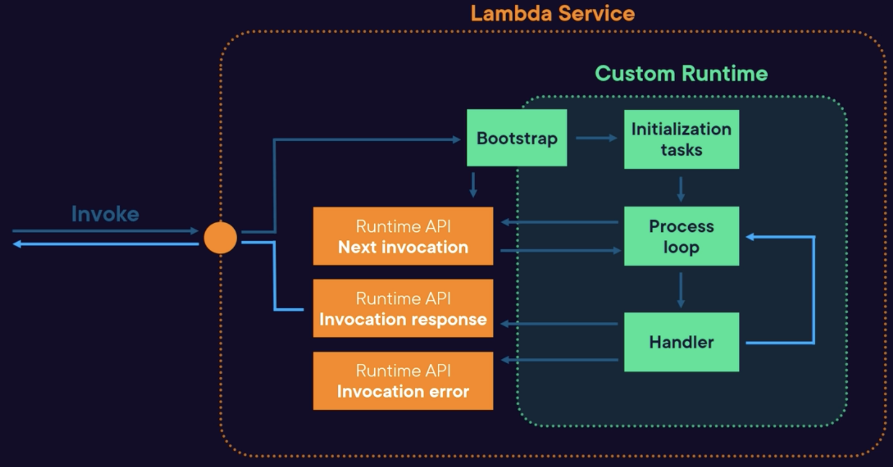

# Runtime

## Overview
A runtime is an execution environment that provides the necessary resources for your Lambda function to execute successfully.

When a request is sent to the Lambda Service, it creates a runtime instance which contains your Lambda function.

The runtime acts as an interface between your function code and the Lambda service, interpreting and executing your code whenever the function is triggered.

The runtime is responsible for passing the **Event** and **Context Objects** to your function.

The runtime includes:
- Programming language: Node.js, Python, Java, .NET, Go, and Ruby
- Software libraries and frameworks that are commonly used with the programming language
- The AWS SDK: major version is guaranteed, minor versions can change at any time.
- Operating system: managed by AWS, which handles aspects such as updates and patches.

## Runtime Updates

AWS offers various approaches to updating your Lambda function's runtime:

**Auto (default mode)**: the runtime will be automatically updated to the most recent version supported by AWS.

**Function Update**: the runtime only when changes are made to your Lambda function. It allows for testing with new runtimes before deployment, reducing risks from automatic updates, but requires manual maintenance for regular updates.

**Manual mode**: lets you select the runtime version in your Lambda function's configuration, providing full control over updates. You must monitor and manually update to new runtime versions as needed.

## Runtime Deprecation

When runtimes get deprecated, no new functions can be created.

Around a month later, updating of lambdas with the deprecated runtime is no longer allowed.

At around 60 days before deprecation, AWS will send emails to any customer using this specific runtime.

## Runtime Modifications

### Using Environment variables

Some environment variables can be configured for certain runtimes.

For example:
- `JAVA_TOOL_OPTIONS`: could be used to set options
for the Java runtime, such as injecting a Java Agent
for a Telemetry.
- `NODE_OPTIONS`: applicable to the Node.js runtime.
For instance, you can enable trace-warnings
to display a full trace for each warning.
- `DOTNET_STARTUP_HOOKS`: provide a path to an assembly
that injects custom functionality into .NET Lambda function.

### Using Wrapper Script

A Wrapper Script in Lambda lets you execute custom logic before the runtime starts by configuring it to run prior to the **native runtime**, along with the original arguments.

It allows customization of startup behavior, argument injection, error and metrics capture, and execution of shell commands or binaries.

To configure a wrapper script, configure
the `AWS_LAMBDA_EXEC_WRAPPER` environment variable
to point to your executable script or binary.

### Custom runtime

You can create your own runtime.

Use cases:
- support for other languages
- improve performance for specific use cases
- work around limitations with the native runtimes

To use a custom runtime:
- Configured the Lambda to use the `provided.al2` runtime (Amazon Linux 2 operating system)
- Include an executable file called `bootstrap` in the function (in the function package or within a Lambda layer)
- The bootstrap file initialize the functions (using the provided environment variables)
- The runtime call the Lambda Runtime API to retrieve events and process them
- The runtime call the Runtime API return responses or errors

Workflow:
1. An invocation request hits the Lambda Service to execute a function.
2. The Lambda Service load the function package and run the bootstrap executable.
3. The initialization tasks within the runtime starts a process loop
4. The process loop call a Runtime API to get the invocation request, pass it to the **handler** code that process the event, then return response/errors to the Runtime API
5. The Lambda Service return the result to the application or configured destination
6. The process loop continues

